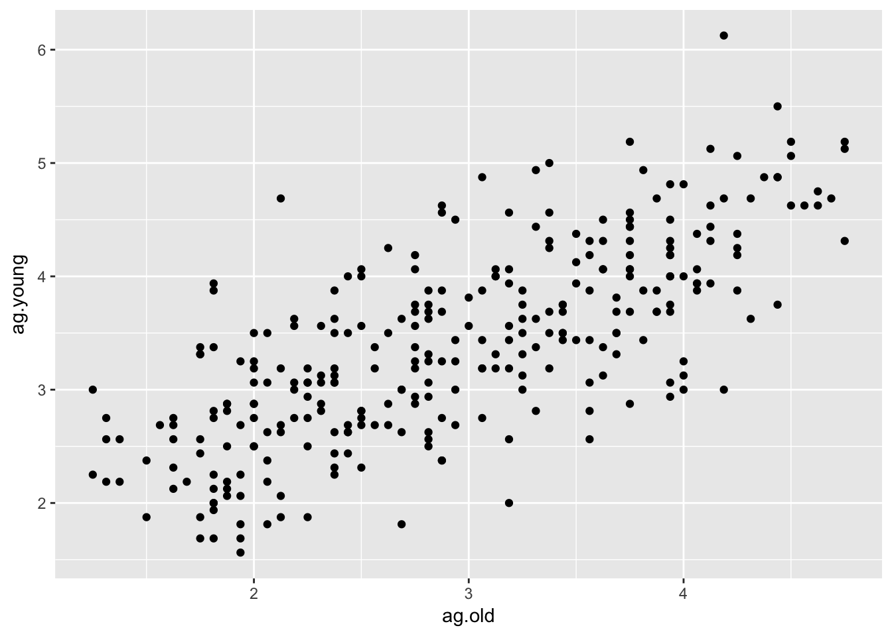
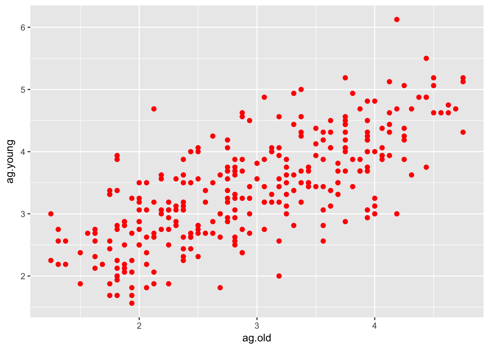
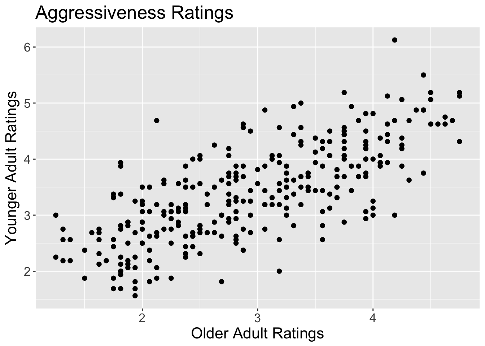

#Interactive Assignment 4: Graphs with ggplot


After completing this lab, you should be able to do the following:

1. Know how to use the ggplot function to create plots in R
2. Know how to use ggplot to create a scatter plot and to fit a line of best fit to the scatter plot
3. Know how to use functions in ggplot to change the appearance of a plot
4. Know how to add functions to plots to change the labels on the plots

This assignment will discuss some of the basics about creating a plot with ggplot. GGplot is very powerful but it can be very complicated. Before doing this assignment, you should read through [Chapter 3 of R for Data Science](http://r4ds.had.co.nz/data-visualisation.html).

The first thing we have to do is to install the ggplot package and to load it. So type the following into R:


```r
install.packages(ggplot2)
library(ggplot2)
```

The data for these assignments are available as a download on Canvas as the file IA4graph.csv (Files are also available at github )

These data are a series of face ratings and were used in several studies looking at how older adult (older than 65 years) and younger adult (18-30) 
raters perceive older and younger adult faces. The raters rated the faces on 6 characteristics: aggressiveness, attractiveness, babyfaceness, competence, health, and untrustworthiness. The ratings were on a 7 point scale with 1 indicating very low and 7 indicating very high.

Each row represnts a different face. The variables (columns) are as follows:

* FaceSex - the sex of each face rated (F for female, M for male)

* FaceAgeGroup - the age group of each face rated (OA for older adult faces, YA for younger adult faces)

* FaceAgeNumber - the numeric age of the individual rated

* ag.old and ag.young - ratings of aggressiveness by older adult and younger adult raters respectively

* at.old and at.young - ratings of attractiveness by older adult and younger adult raters respectively
* ba.old and ba.young - ratings of babyfaceness by older adult and younger adult raters respectively
* co.old and co.young - ratings of competence by older adult and younger adult raters respectively
* he.old and he.young - ratings of health by older adult and younger adult raters respectively
* un.old and un.young - ratings of untrustworthiness by older adult and younger adult raters respectively

Load the file into the dataset face by typing the following command and selecting the .csv file when the file select dialog appears


```r
face = read.csv(file.choose())
```

If you look in the environment window on the top left part of the screen, you should see that the data.frame "face" is loaded. Let's look at the data by typing `View(face)`

In this study, the authors were interested in testing whether older adult raters would agree with younger adult raters when rating a face. To test this question, the authors would look at whether there was a correlation between older adult ratings for a trait and younger adult ratings of a trait. To calculate a correlation test, we can use the `cor.test()` function like mentioned in Interactive Assignment 2.

Before doing this, we would like to look at the descriptives of our data in order to see whether there are any outliers and what the means are for each rating. To do this, we can load the `psych` library and use the `describe` command.

1. Load the psych library and use the describe command to calculate the mean and the standard deviation of the ag.old, ag.young, at.old, at.young, ba.old, ba.young, co.old, co.young, he.old, he.young, un.old, and un.young variables. Use this to fill out the following table:

|Rating|Mean|SD|
|:-----|:---|:-|
|ag.old|    |  |
|ag.young|   |   |
|at.old|   |   |
|at.young|   |   |
|ba.old|   |   |
|ba.young|   |   |
|co.old|   |   |
|co.young|  |  |
|he.old|   |   |
|he.young|   |   |
|un.old|   |   |
|un.young|  |  |


2. Based on these means, what pattern do you see? Which traits do older adults rate more highly on average? Which traits do younger adults rate more highly, on average?

&nbsp;

&nbsp;

&nbsp;

&nbsp;

&nbsp;

&nbsp;

&nbsp;

&nbsp;


3. Many researchers have speculated older adults show a *positivity bias* where they tend to rate events as being more positive than younger adults. Given that these were the same faces rated by older adults and younger adults, do you think there's evidence of the positivity bias here?

&nbsp;

&nbsp;

&nbsp;

&nbsp;

&nbsp;

&nbsp;

&nbsp;

&nbsp;

##Using ggplot to create histograms

Now we are going to use ggplot to visualize our data. The first thing we are going to do is to describe the parts of ggplot. When generating each plot, the plot command has three parts:

1. The `ggplot()` command, which tells us our data frame and the data we are going to plot
2. **Geoms**, which are elements that we plot on the main plot. A geom might be a line graph, a bar graph, or any other graphic element we put on the plot
3. **Aesthetics** which are elements used to modify the plot. These are extra commands which can modify the plot or geoms (like saying how thick a line is)

GGplot uses several different functions which are all technically one command. To make it easier to read, many people put the different commands on different lines and separate each line with a \+ (plus sign) at the end of each line. When a line ends with a \+, R knows that the command is not complete and that there are more functions to add. Note that when we type the commands for ggplot, we end each line with a \+, except for the last line.

The first thing we are going to do is to build a histogram of each rating. We will start with ag.old to create a simple histogram. Type the command below.


```r
ggplot(data = face) + 
  geom_histogram(aes(x = ag.old)) 
```


This is one command split across two lines. In the first line, I indicated the data by using the `ggplot()` command. The first argument is the data frame, the `data = face`.  

The second part is the *geom* we want, which is the type of graph we have. In ggplot, we can put many geoms on the same plot, like layers on top of one another. However, in this case, we just have one layer, which is a histogram. 

In `geom_histogram()`, I want to tell ggplot which data to graph. To do this, I have to use an aesthetic. This is why I type `aes(x = ag.old)`.

When you type this command, you should see a plot appear in the bottom left window in RStudio, under the "Plots" tab. 

When calculating a histogram, sometimes we want to set how many bars or **bins** we have in the histogram. GGplot sets 30 as a default. We can change that by adding an option to the `geom_histogram()` part. Try typing the following:


```r
ggplot(data = face) + 
  geom_histogram(aes(x = ag.old), bins = 10) 
```

You might also want to edit the graph as well. We can feed some options to `geom_histogram()` in order to edit the graph:


```r
ggplot(data = face) + 
  geom_histogram(aes(x = ag.old), bins = 10, color = 'red', fill = 'darkblue') 
```


Here I used the `color` argument to set the color of the lines and the `fill` argument to set the color of the bars. There are a lot of colors built into R and to see all your options, you can type `colors()`.

4. Using and modifying what is written above, make a histogram with 15 bars with each bar having a black outline and a gray fill. (You can pick what shade of gray you'd like). It should look like this. Note below what code you would use to write this:


&nbsp;

&nbsp;

&nbsp;

&nbsp;

&nbsp;

&nbsp;

&nbsp;

&nbsp;

5. Using what is written above, make histograms for all the other variables (ag.young, at.old, at.young, ba.old, ba.young, co.old, co.young, he.old, he.young, un.old, and un.young). Do they look like they are normally distributed? Do any seem to have any strange patterns or outliers?


&nbsp;

&nbsp;

&nbsp;

&nbsp;

&nbsp;

&nbsp;

&nbsp;

&nbsp;

###Creating scatterplots using ggplot

A histogram graphs the distribution of one variable whereas a scatterplot graphs the relationship of two variables. This allows us to look at whether two variables are associated or correlated and whether there are any outliers or other anomalies in our data.

In this study, the researchers were examining whether the ratings by older adults and the ratings by younger adults would be correlated, indicating that they agreed on which faces were high in aggressiveness, competence, and so forth.

To create a scatterplot, we will use the `geom_point()` option, but most of the rest of the commands will be similar. The only other difference is that I have to give the `geom_point()` argument two variables, rather than one.


```r
ggplot(data = face) + 
  geom_point(aes(x = ag.old, y = ag.young)) 
```



This plot has all the information we need, but it looks very simple. To make the plot look nicer, we can add options to the `geom_point()` function. Here are some options you can use to make it look nicer:

*size: sets the default size of the points (default is 1)
*shape: a number which sets the shape of the points (you can find which points are associated with which shapes [here](http://sape.inf.usi.ch/quick-reference/ggplot2/shape))
*color: sets the color of the outside of the point


Here, I use each of the options to change the plot:


```r
ggplot(data = face) + 
  geom_point(aes(x = ag.old, y = ag.young), size = 3, shape = 20, color = 'red') 
```




6. Using what is written above, make a scatterplot looking at the association between  he.old and he.young. Try out using a different color and a different type of point. Does the relationship look like the ratings are correlated?


&nbsp;

&nbsp;

&nbsp;

&nbsp;

&nbsp;

&nbsp;

&nbsp;

&nbsp;

###Editing other plot elements

In ggplot, we can also edit the other elements of a plot which are on the outside using different options. We can use the `labs()` option to set the labels of the plot and change the ones that ggplot gives us by default. For instance, we may want to change the labels of the plot above


```r
ggplot(data = face) + 
  geom_point(aes(x = ag.old, y = ag.young), size = 5, shape = 20) +
  labs(title='Older and younger adult ratings of aggressiveness', x = "Older Adult Ratings", y = "Younger Adult Ratings")
```


Finally, we can use the `theme()` function to change a lot of other options in our plot. In this example below, I'll change the size and the type of the text:


```r
ggplot(data = face) + 
  geom_point(aes(x = ag.old, y = ag.young), size = 3, shape = 20) +
  labs(title='Older and younger adult ratings of aggressiveness', x = "Older Adult Ratings", y = "Younger Adult Ratings") +
  theme(text=element_text(size=16, family="Arial"))
```



As you can see in the examples, you can keep adding options to the plot to change different elements to make the plot look nicer. There are options to change each of the elements, such as changing the size of the x axis font, the y axis font, the x label font, the y label font, etc.

7. Using what is written above, make a scatterplot looking at the association between  co.old and co.young. Change the title and the labels for the plot, x-axis, and the y-axis to something else and use the `theme()` option to change the size of the font to something different. Write or paste your code below:

&nbsp;

&nbsp;

&nbsp;

&nbsp;

&nbsp;

&nbsp;

&nbsp;

&nbsp;

###Outputting your plot

When you create a plot in ggplot, you may also want to take that plot and use it in a paper or presentation. To do this, there are several ways to get the plot you should see. In the "Plots" window in RStudio, there is a button which says "Export". If you click this, you have the option to save the current plot as an image or as a pdf file. I usually save plots as an image and then insert them into a paper or presentation. You can also copy the plot to your clipboard and then paste it into another program.
