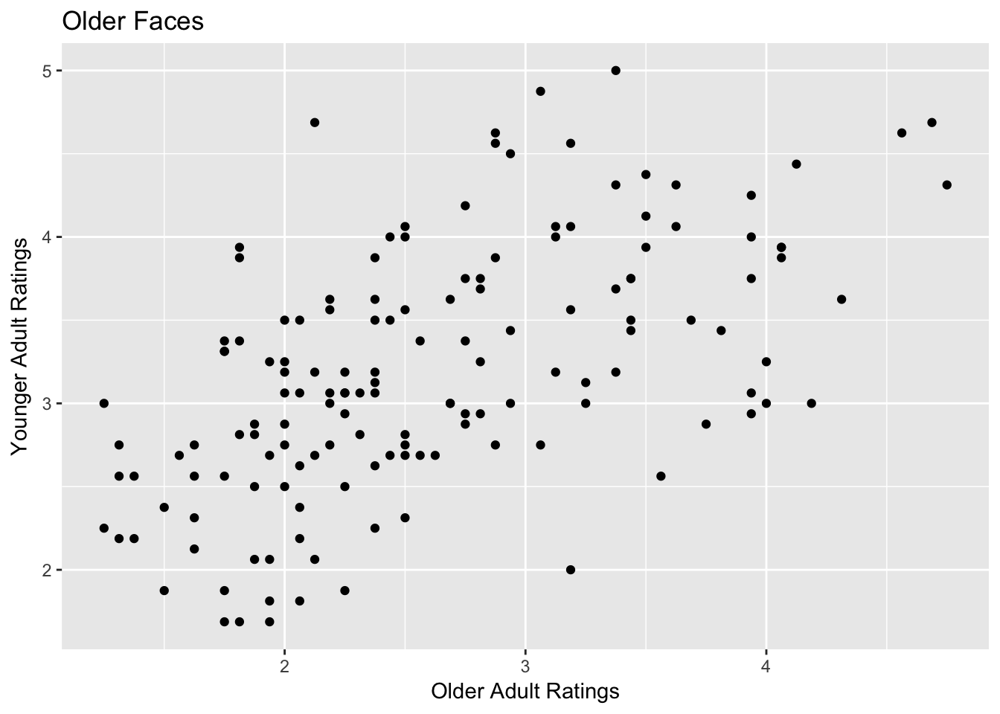

#Free Assignment 2: Using the Tidyverse and graphs with ggplot

This assignment will build on a lot of the work in Interactive Assignments 3 and 4. We will use the same data that we used in Interactive Assignment 4 where we examined how older and younger adults rated the facial appearance of older and younger faces.

In this assignment, we will need the `tidyverse` and `ggplot` libraries. Fortunately, ggplot is part of the `tidyverse` so all we have to load is the `tidyverse` package. 

**Step 1**: Go ahead and load the tidyverse package.

 

**Step 2**: Now we should load the data that was used in Interactive Assignment 4. Go ahead and load the file named IA4graph.csv as the data.frame `face`, just like you did for Interactive Assignment 4.

As a reminder from Interactive Assignment 4, these data are a series of face ratings and were used in several studies looking at how older adult (older than 65 years) and younger adult (18-30) 
raters perceive older and younger adult faces. The variables are as follows:

*FaceSex - the sex of each face rated (F for female, M for male)

*FaceAgeGroup - the age group of each face rated (OA for older adult faces, YA for younger adult faces)

*FaceAgeNumber - the numeric age of the individual rated

*ag.old and ag.young - ratings of aggressiveness by older adult and younger adult raters respectively

*at.old and at.young - ratings of attractiveness by older adult and younger adult raters respectively
*ba.old and ba.young - ratings of babyfaceness by older adult and younger adult raters respectively
*co.old and co.young - ratings of competence by older adult and younger adult raters respectively
*he.old and he.young - ratings of health by older adult and younger adult raters respectively
*un.old and un.young - ratings of untrustworthiness by older adult and younger adult raters respectively

In this assignment, we are going to look at differences between older faces and younger faces. The first step is to create two new data frames. One data frame will be for older faces and one data frame will be for younger faces. As we discussed in Interactive Assignment 3, you can use the `filter()` command to create a data frame that contains only rows that fit a certain condition.

**Step 3**: Use the `filter()` command to create a new data frame called "face.of" which only contains older faces, or those faces where the variable FaceAgeGroup is equal to "OA".

**Step 4**: Use the `filter()` command to create a new data frame called "face.ya" which only contains younger faces, or faces where the variable FaceAgeGroup is equal to "YA".

1. How would you use the `filter()` command to select only faces that are younger adult and males? How would you select older adult females? For this question, you do not need to type the code into R, but just write down the answer below.

&nbsp;

&nbsp;

&nbsp;

&nbsp;

&nbsp;

&nbsp;

2. How would you use the `filter()` command to select only those faces that are above the median in younger adult attractiveness ratings and above the median in older adult attractiveness ratings. Write the command you would type in below.

&nbsp;

&nbsp;

&nbsp;

&nbsp;

&nbsp;

&nbsp;

**Step 5** Using ggplot, create a histogram for the aggressiveness rating variables for older faces using the variables ag.old and ag.young for the dataframe face.of. Make your histogram have 10 bins, have bars that have black lines and dark red fill. 

Your histogram for ag.old should look like this:

3. What pattern do you see with the two histograms? Do the ratings appear to be normally distributed?

&nbsp;

&nbsp;

&nbsp;

&nbsp;

&nbsp;

&nbsp;

&nbsp;

&nbsp;

&nbsp;

**Step 6** Now create two histograms for the aggressiveness variables for the younger faces. The only difference is that instead of using the data frame "face.of", you should use the data frame "face.yf".

4. What pattern do you see with the two histograms of younger adult faces? Do the ratings appear to be similar to the ratings for older adult faces?

&nbsp;

&nbsp;

&nbsp;

&nbsp;

&nbsp;

&nbsp;

&nbsp;

&nbsp;

&nbsp;

Now we are going to create a scatterplot, looking at the correlation between aggressiveness ratings by older raters and aggressiveness ratings by younger raters. We want to see whether the correlation is stronger for older faces or is it stronger for younger faces. That is, do older and younger adults agree more when rating how aggressive older faces are or do they agree more when rating how aggressive younger faces are?

**Step 7** Create a scatterplot looking at the relationship between ag.old and ag.young for older faces. When making your scatterplot, make sure that you have the following features:

* Your plot title should say "Older Faces" so that we know that this plot is for older faces only
* Your x axis label and y axis label should say "Older Adult Raters" and "Younger Adult Raters" on the correct axis, depending on which one you plot on the x axis and which one you plot on the y axis.

You can change the other elements such as the type of points and colors to anything you want. Your plot should look like the plot below:

**Step 8** Create the same plot you did in Step 6 only instead using younger faces. Make sure you change the title, but everything else can be the same.

5. Compare the plot for older faces and younger faces. Does it look like the correlation is stronger for older faces or younger faces? Does it look like it is the same?

&nbsp;

&nbsp;

&nbsp;

&nbsp;

&nbsp;

&nbsp;

One concept we will talk about later in this class is the idea of a **moderator**. A moderator is a third variable that affects or *moderates* the relationship between two variables. In this case, the age of the face may be a moderator, since the relationship between the two variables ag.old and ag.young is different for different values of the moderator.

**Step 8** Use the `cor.test()` function to see whether the correlation between ag.old and ag.young is different for the older faces versus the younger faces. 

6. What are the correlations? Do the results support your answer for Question 5?

&nbsp;

&nbsp;

&nbsp;

&nbsp;

&nbsp;

&nbsp;

Question 7: Repeat steps 5 - 8 for the competence ratings (the variables co.old and co.young), producing a histogram, a scatterplot, and the correlations for the competence ratings. What patterns do you see and what do you conclude? Are the results similar or different from the results for aggressiveness?

&nbsp;

&nbsp;

&nbsp;

&nbsp;

&nbsp;

&nbsp;

&nbsp;

&nbsp;

&nbsp;
