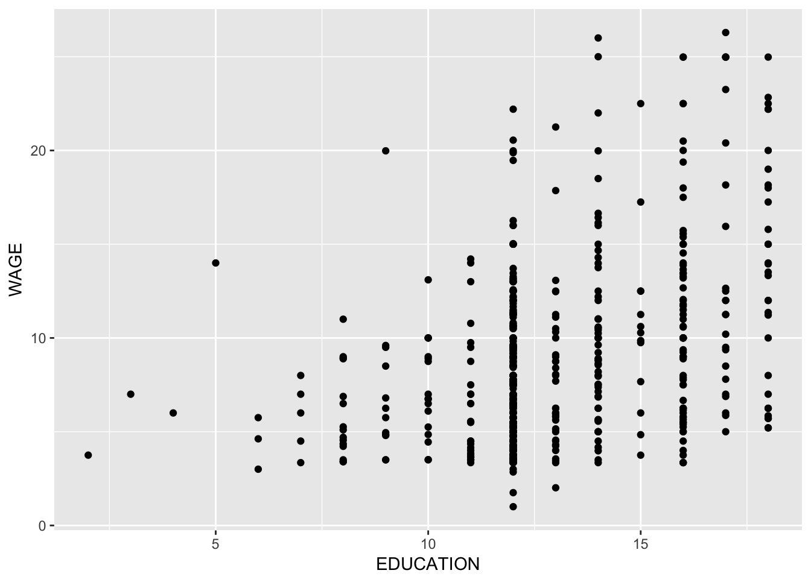
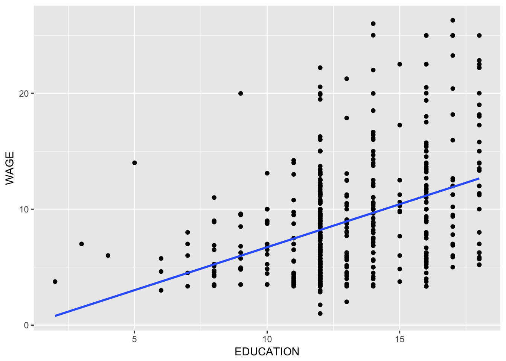

#Interactive Assignment 5 - Regression in R

This lab will examine how to do regression in R. In this case, we will look at how to enter a basic linear regresison in R, how to interpret the output, and how to add other control variables.

If you need a primer on how to do regression, you can find one here in the [regression chapter](https://aupsychology.github.io/statsbook/association-claims-1.html#using-linear-regression) of *Statistics: The Story of Numbers*. 

This lab will cover the following topics:

1. What is regression and what is it used for? Also, you should know what the predictor and outcome variables are.
2. What is the idea of a control variable and why we would use it.
3. How to interpret regressions, by creating a regression line and using that equation to predict a value for the outcome variable, given the equation.

The data for this assignment are a set of data examining how various factors predict a person's wage. 

These data are from 1985, from the [Economics Web Institute](www.economicswebinstitute.org/data/wagesmicrodata.xls) surveying people on various attributes including how much they make. Many researchers have found convincing evidence that women make less money than men do. However, it is much more controversial why this is the case. It could be that men are more likely than women to work higher-paying jobs. It could be that men are more likely to have other factors which increase pay, such as higher education or experience. It could be that men are paid more due to discrimination. 

In this dataset, we are going to explore how regression can help us answer the question.

The variables are as follows:

* ID: person ID
* WAGE: wage (dollars per hour)
* OCCUPATION: occupation(1=Management,   2=Sales, 3=Clerical , 4=Service, 5=Professional, 6=Other)
* SECTOR: sector of employment(0= other, 1=Manufacturing, 2=Construction)
* UNION: Union membership (1=yes, 0=no)
* EDUCATION: Years of education (12 = high school diploma, 16= completed college, etc.)
* EXPERIENCE: Years of work experience
* AGE: Age in years
* SEX: Sex (0 – male, 1 – female)
* MARR: Married (0 – no, 1 – yes)
* RACE: Race (0 – other, 1 – white, 2 – Hispanic)
* SOUTH:Southern region (1 – yes, 0 – no)

The dataset is saved as the file "IA5WageData.csv" and is available on Canvas. Download this file into a folder on your computer named "IA5" and then open up a new R Script. This will contain the commands you enter in while you analyze these data. Save this script in the same folder as your csv file and then change your working directory to this folder by going to Session -> Set Working Directory. When you are done with this assignment, you need to send me this script as part of the assignment.

**Step 1**: Load this file into your R workspace as the data frame "income". The first line of your script should look like this:


Also, load the tidyverse package because we will use it later in the lab:


```r
library(tidyverse)
```


Make sure that the file read into R correctly. If you type `View(income)` you should get a data frame with 533 observations of 12 variables. The variables are the same ones listed above.

The first thing we want to do is to make a histogram of our dependent variable. Since we are intereseted in money, WAGE is the dependent variable.

**Step 2**: Make a histogram of WAGE, using the ggplot code we leanred about in Interactive Assignment 4.


```r
ggplot(data = income) + 
  geom_histogram(aes(x = WAGE), bins = 15, color = 'black', fill = 'gray') 
```


1. Does WAGE look normally distributed? Why do you think that it has the type of shape that it has? (Even if it’s not, we are going to go ahead and continue with the lab as if it is).


&nbsp;

&nbsp;

&nbsp;

&nbsp;

&nbsp;

&nbsp;

&nbsp;

&nbsp;

##Simple Regression

Now let’s look at a simple regression. We want to see how education predicts wages. To summarize, what we are doing here is creating a regression object in R, named x. This object contains all the regression information. Then we want a basic summary of this object, so we type the summary(x) command. This will give us the regression output.

Type in the following:


```r
x = lm(WAGE~EDUCATION, data = income)
summary(x)
```

```
## 
## Call:
## lm(formula = WAGE ~ EDUCATION, data = income)
## 
## Residuals:
##     Min      1Q  Median      3Q     Max 
## -7.8183 -3.2039 -0.7039  2.3050 16.3139 
## 
## Coefficients:
##             Estimate Std. Error t value Pr(>|t|)    
## (Intercept) -0.68919    0.99244  -0.694    0.488    
## EDUCATION    0.74109    0.07475   9.914   <2e-16 ***
## ---
## Signif. codes:  0 '***' 0.001 '**' 0.01 '*' 0.05 '.' 0.1 ' ' 1
## 
## Residual standard error: 4.513 on 531 degrees of freedom
## Multiple R-squared:  0.1562,	Adjusted R-squared:  0.1546 
## F-statistic: 98.29 on 1 and 531 DF,  p-value: < 2.2e-16
```

Once you type the `summary(x)` part, you will see the regression output. The regression output has a lot of sections.

A. Residuals. This is a summary of the residuals of the regression. Residuals are  the error in the regression equation, or how far the line of best fit is from the actual data. This gives you the quartiles for residuals, or the minimum, first quartile, median, third quartile, and maximum. 

B. Coefficients: these tell us the regression equation for the intercept and the predictor variable. They have four columns. The first column, titled Estimate, gives us the values for the intercept (which would be alpha or a in our equation) and the b coefficient for each predictor. Remember, a linear regression equation is as follows:

$$y = a + bx$$

So in this case, the regression equation would be:

$$y = -.69 + .74x$$

The b coefficient is important because it tells us how much we would expect $y$ to increase if $x$ increases by 1. For each additional year of education, a person would expect to make an additional 74 cents (in 1985 dollars).

The last two columns in the Coefficient section tell us whether the predictors are significant by giving a t-value and a p-value. The first row tells us whether the intercept is significantly different from zero. Since the p-value is > .05, this is not significant. However, the second row tells us whether the b coefficient for education is significantly different from zero. If it is, then that indicates that education is a significant predictor of wages. Given that the t-value is very high and the p-value is very, very low, we can conclude that education is a significant predictor of wages.

We will talk about the other parts of the output in another lab.

**Step 3**: Now run a regression with SEX as a predictor of WAGE. You should get an output like this:


```
## 
## Call:
## lm(formula = WAGE ~ SEX, data = income)
## 
## Residuals:
##    Min     1Q Median     3Q    Max 
## -8.995 -3.495 -1.059  2.475 17.251 
## 
## Coefficients:
##             Estimate Std. Error t value Pr(>|t|)    
## (Intercept)   9.9949     0.2812  35.541  < 2e-16 ***
## SEX          -2.2661     0.4156  -5.452 7.63e-08 ***
## ---
## Signif. codes:  0 '***' 0.001 '**' 0.01 '*' 0.05 '.' 0.1 ' ' 1
## 
## Residual standard error: 4.781 on 531 degrees of freedom
## Multiple R-squared:  0.05301,	Adjusted R-squared:  0.05123 
## F-statistic: 29.73 on 1 and 531 DF,  p-value: 7.633e-08
```

In this case, SEX is a dichotomous variable, with only two options: 0 for male and 1 for female. Even though this is the case, we can still do a regression and create a regression equation.

2. Write the regression equation you get for this regression. After you write it, solve the equation letting x = 0. This gives us the income that we would predict if a person is a male. Then solve the equation letting x = 1. This gives us the income we would predict if a person is a female. What are the answers you get?

&nbsp;

&nbsp;

&nbsp;

&nbsp;

&nbsp;

&nbsp;

&nbsp;

&nbsp;

3. Do these results suggest that we have a wage gap in earnings?

&nbsp;

&nbsp;

&nbsp;

&nbsp;

&nbsp;

&nbsp;

&nbsp;

&nbsp;

Now we are going to do a little bit of a detour. If you remember, one way we compare whether two groups are different is by doing a t-test. 

**Step 4** Do a t-test comparing whether there is a significant difference in WAGE comparing women versus men, using SEX as the grouping variable. 

4. How does the t-test compare to the results for the regression, comparing the t-value and p-value you get for the SEX variable in the regression to the t-value and the p-value you get for the t-test? Also how does the mean for group 0 and group 1 compare to the answers you have in Question 2, when you computed the expected income for men and for women?

&nbsp;

&nbsp;

&nbsp;

&nbsp;

&nbsp;

&nbsp;

&nbsp;

&nbsp;

##Adding a control variable: Multiple Regression

One of the reasons that regression is more powerful than t-tests is the ability to use a control variable. We can use more than one predictor variable to predict our outcome variable. In this case, we can see whether the effects of the independent variable on the dependent variable are still true, even controlling for another variable.

This is an extension of regression called multiple regression. Instead of having one predictor like $y = a + bx$, we can extend our equation with multiple $b$ coefficients:

$$y = a + b_1 x_1 + b_2 x_2 ... b_n x_n$$

Each $b$ coefficient represents a different variable we use as a predictor.

Control variables are very important because we often want to make sure a relationship between a predictor and outcome variable is not due to a third variable. For instance, the relationship between violent media such as televsion and video games and how violently a child behaves may be due to other variables, such as parenting styles or socioeconomic status. We may want to control for those variables so we can say that watching violent television predicts violent behavior, even when you control for parental neglect.

In the wage study, one reason that men may make more money than women is that men may be more experienced. There are several reasons why men may be more experienced than women. One notable reason is that women are much more likely than men to leave work to raise children. If a woman takes off 3-5 years in order to raise children, then she would be missing out on that level of experience. If this effect is big enough, women on average would have less experience than men have, and since experience is clearly a predictor of income, this could explain the wage gap. 

If this is the case, then controlling for experience would make the relationship between SEX and WAGE smaller. We can do that by adding this variable to our regression. Adding multiple predictor or independent variables to a regression in R is easy: we list each of the variables and separate them with a plus sign. 

**Step 5**: Type the following code to do the multiple regression. 


```r
x = lm(WAGE~SEX+EXPERIENCE, data = income)
summary(x)
```

```
## 
## Call:
## lm(formula = WAGE ~ SEX + EXPERIENCE, data = income)
## 
## Residuals:
##     Min      1Q  Median      3Q     Max 
## -9.3542 -3.5117 -0.9593  2.5514 17.9614 
## 
## Coefficients:
##             Estimate Std. Error t value Pr(>|t|)    
## (Intercept)  9.12849    0.39737  22.972  < 2e-16 ***
## SEX         -2.36524    0.41367  -5.718  1.8e-08 ***
## EXPERIENCE   0.05107    0.01668   3.062  0.00231 ** 
## ---
## Signif. codes:  0 '***' 0.001 '**' 0.01 '*' 0.05 '.' 0.1 ' ' 1
## 
## Residual standard error: 4.743 on 530 degrees of freedom
## Multiple R-squared:  0.06948,	Adjusted R-squared:  0.06597 
## F-statistic: 19.79 on 2 and 530 DF,  p-value: 5.158e-09
```

When we look at this, we can see that there are now two variables listed below the intercept in Coefficients. The first is SEX and the second is EXPERIENCE. When doing multiple regression, we are creating an equation like this:

$$y = a + b_\text{sex} x_\text{sex} + b_\text{experience} x_\text{experience}$$

So when we input the values for $a$ and $b$, we get:

$$y = 9.12 -2.36 x_\text{sex} + .051 x_\text{experience}$$

Based on this equation, we could predict the expected income given a person's sex and experience.

5. Using this equation, what would you predict a person to make if he was a male with 9 years experience? What about a female with 12 years experience?


&nbsp;

&nbsp;

&nbsp;

&nbsp;

&nbsp;

&nbsp;

The important thing we may be interested in is comparing the equation where sex was the only predictor to the equation where SEX and EXPERIENCE are both predictors. If EXPERIENCE explains some of the wage gap, then SEX should be a weaker predictor when EXPERIENCE is included. When we compare the b coefficients, we find that the b coefficient for SEX is almost the same in both cases, which indicates that EXPERIENCE is probably not a good explanation for the sex difference in wages.

In larger studies which have investigated the wage gap, the effect of experience does have a small impact in why women get paid less than men, but the effect does not explain the wage gap, just like in this dataset.

**Step 6**: Try another possible control variable which might explain the relationship between SEX and WAGE instead of EXPERIENCE. Good options may include EDUCATION, AGE, or MARR (married).

6. Write your regression equation below and examine whether the b coefficients for SEX are different when SEX is the only predictor and when SEX is added with the othe predictor.


&nbsp;

&nbsp;

&nbsp;

&nbsp;

&nbsp;

&nbsp;

&nbsp;

&nbsp;

##Plotting a regression line using ggplot

In a previous lab, we discussed creating a scatterplot. We can use ggplot to add a regression line to a scatterplot as well.

Here, we are going to create a scatterplot looking at the relationship between EDUCATION and WAGE. 

**Step 7**: To create a scatterplot, type:


```r
ggplot(data = income) + geom_point(aes(x = EDUCATION, y = WAGE))
```



Now, we can add a regression line by adding the command `geom_smooth`. This adds a line that fits the data. By default, ggplot uses a line that has curves in it, but we are interested in using a linear regression so we will have to use a different setting.

**Step 8**: Type the following to add a line of best fit to the plot. Remember, to add things to a plot, we can just add them by using the plus symbol.


```r
ggplot(data = income) + geom_point(aes(x = EDUCATION, y = WAGE)) +
  geom_smooth(aes(x = EDUCATION, y = WAGE), method='lm', se=F)
```


This gives us the following plot. Now I'll break down what is in the `geom_smooth` command. The first part of it tells us which data are being plotted, using the `aes()` command. This is just like in the `geom_point()` command. The second part is the `method()` part. Since we are using linear regression, we type 'lm' in quotes. The last part tells us to turn off standard error. By default, ggplot gives a standard error with the regression line. In this case, I want to turn it off just to give you the simple line.

Note that we can change how the line looks by using the same concepts we use to edit histograms and scatterplots. We could add the options `color()` or `size()` in order to change how big the line is and what color it is.

If you look at the plot for how education predicts wages, you might notice that the data have some outliers. Very few people have very low levels of education, such as below 6 years of education. It might be useful to remove those people from the analysis and see if our results hold.

To do this, we would use the `filter()` command to create a temporary dataframe which only has the data we want. We can do this by **nesting** the filter command inside the other commands. For instance, to do the regression where we have EDUCATION predict WAGE where we only include those who have an EDUCATION greater than 5 years, we would type the following:


```r
x = lm(EDUCATION~WAGE, data = filter(income, EDUCATION > 5))
summary(x)
```

Instead of including the `data = income` like above, I used the filter command in place of it so that when R went looking for the data it wanted to use for the regression, it chose the data output by the command `filter(income, EDUCATION > 5`. This idea is called **nesting** commands because one command is inside of another command. When writing scripts, nesting can save time, but a lot of nesting can create some difficult to read code.

**Step 9**: Change the ggplot code you typed in Step 8 to create the same graph but only including data where EDUCATION is greater than 5. Remember, you would use the same nesting idea that I used in the code snippet above. Make sure to include this code in your script.

**Step 10**: Edit the code below to see how EXPERIENCE predicts WAGE. Make sure you include the code in the script you are writing.


##Summary

This lab covered a lot about regression. After completing it, you should be able to understand the basics of regression, which are covered in Statistics I.

You should also start getting familiar with the following ideas which will be covered in the next few assignments:

1. How to do a simple linear regression in R as well as a multiple regression. This includes entering the commands and interpreting the output correctly.
2. Know how to compare regressions before and after adding a control variable in order to examine whether a control variable can account for a relationship.
3. Understand how to use ggplot to add a regression line (line of best fit) to a scatterplot

