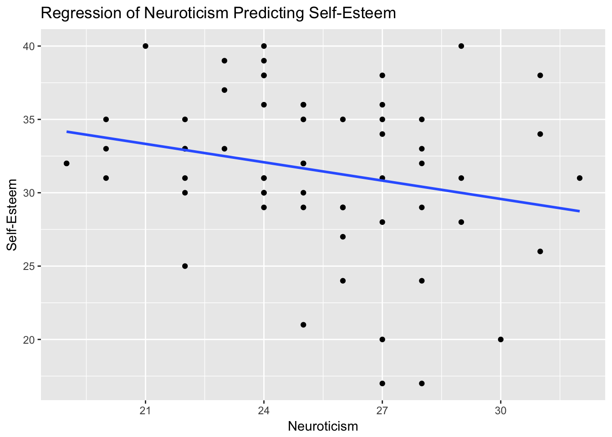

#Free Assignment 4 - Regression and multiple regression in R

This lab will examine how various personality variables predict a person's desire to conform. When completing this assignment, make sure you create a script that has your commands that you type in R, including the ones you paste from the assignment itself.

We will use the data we previously used in Interactive Assignment 2. Here is a key to the variables:


* Participant: a participant number
* E: extraversion score
* A: agreeableness score
* C: conscientiousness score
* N: Neuroticism score
* O: Openness score
* Gender: gender coded F and M
* Age: participant age
* Conformity: their score on a survey about how much they would conform
* RATING: a participant's rating to the question "how much do I think I conform to others' behaviors"
* SelfEsteem: a score on a self-esteem inventory with higher scores indicating more self-esteem

These data are available on Google Sheets and you can input it by using the following commands:

First we need to load the `gsheet` package as well as `ggplot2`


```r
library(gsheet)
library(ggplot2)
```

Now to load the data, we have to use this link. You can paste in this link and then type the command below.


```r
link = 'https://docs.google.com/spreadsheets/d/1zZjEhkT4ROACTM4YsW1LTNn8al_scyu9l4_Qkzqvsew/edit?usp=sharing'
d = gsheet2tbl(link)
```

**Step 1**: Create a regression examining each of the 5 personality variables (extraversion, agreeableness, etc.) as a predictor of conformity.


Question 1: Write the regression equations for each of the 5 regressions below. Are any of the personality variables significant predictors of conformity?


&nbsp;

&nbsp;

&nbsp;

&nbsp;

&nbsp;

&nbsp;

&nbsp;

&nbsp;

&nbsp;

&nbsp;

&nbsp;

&nbsp;

&nbsp;

&nbsp;

&nbsp;

&nbsp;

&nbsp;

&nbsp;

&nbsp;

&nbsp;

&nbsp;

**Step 2**: Repeat the same step that you used in Step 1 but instead of having Conformity be your outcome variable, use SelfEsteem. In this case, we want to see whether personality predicts self-esteem.

Question 2: Write the regression equations for each of the 5 regressions below. Are any of the personality variables significant predictors of conformity?


&nbsp;

&nbsp;

&nbsp;

&nbsp;

&nbsp;

&nbsp;

&nbsp;

&nbsp;

&nbsp;

&nbsp;

&nbsp;

&nbsp;

&nbsp;

&nbsp;

&nbsp;

&nbsp;

&nbsp;

&nbsp;

&nbsp;

&nbsp;

&nbsp;


**Step 3**: For the three personality variables which either significantly predict self-esteem (or marginally predict self-esteem), create scatterplots using ggplot showing this relationship. Make sure that your scatterplots have a line of best fit. Also make sure that the plots have x axis, y axis, and plot labels that are understandable. An example plot is shown below looking at the relationship between neuroticism and self-esteem.



**Step 4**: Now we want to look at whether the relationship between Extraversion and Self-Esteem is due to Gender. Create a new regression adding Gender as a control variable. 

Question 3: Is the regression between Extraversion and Self-Esteem with Gender as a control variable different than the one that did not include Gender as a control variable?

&nbsp;

&nbsp;

&nbsp;

&nbsp;

&nbsp;

&nbsp;


Question 4: How would you summarize the results from this lab? Do you think there is any evidence that personality affects conformity? How about whether personality affects self-esteem?


&nbsp;

&nbsp;

&nbsp;

&nbsp;

&nbsp;

&nbsp;

&nbsp;

&nbsp;

&nbsp;

&nbsp;

&nbsp;

&nbsp;

&nbsp;

&nbsp;


