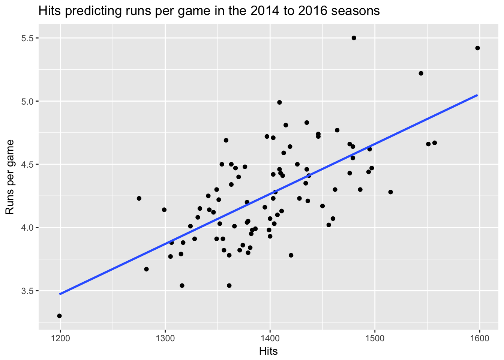

#Free Assignment 5: Regression and Sports

The intersection of statistics and sports has changed how we see sports in the last 40 years. This probably first happened in baseball with statistics articles published by a series of fans in the journal SABR (leading to the term sabrmetrics) and was captured in the book and movie *Moneyball*. 

One idea that comes up a lot in statistics research in sports is how to identify the most important skills in a game. In baseball, the objective is to score runs and keep the other team from scoring runs. There are many ways to score runs, however, and some ways may be better than others. For instance, some batters are good at getting hits, others may be good at getting on base and avoiding getting out. Some get out a lot but hit many home runs. Knowing which of these skills is most important can help teams pick the right players.

In this assignment, we are going to use multiple regression to determine which skills are most likely to lead to team success in offense. The objective of a team is to score runs.

When doing this assignment, make sure you create a script which contains all your R commands. The dataset is FA5_baseball.csv and is listed on Canvas.

**Step 1**: You should import this into R as a dataframe with the name `b` for baseball. I'm lazy and typing b rather than baseball will save some time. Also, load the tidyverse package.

When you load the package, check to make sure it inputted correctly. There should be 90 observations of 31 variables. The observations are for the 2014-2016 seasons and here is a guide to some of the column names. You can find out what all the column names are [here](http://www.baseball-reference.com/leagues/MLB/2016.shtml).

*Tm: team name
*League: League (AL for American League, NL for National League)
Year: year data were collected
BatAge: The average age of the team's batters
RpG: Runs per game (this will be our main outcome variable)
R: total runs in a season
H: Total hits in a season
2B: Total number of doubles
3B: total number of triples
HR: total number of Home Runs
SB: total number of stolen bases
BB: total number of walks
SO: total number of strikeouts
BA: Batting average (number of hits  divided by number of at bats)
OBP: On-base percentage (percent of time a person reaches base)

**Step 2**: First, we want to visualize the relationship between some of our predictor variables and runs per game. Create scatterplots using ggplot which visualize the following relationships. Also add a regression line to each of the plots. Make sure your axes and plot have ap propriate titles:

A. Hits predicting Runs per game
B. HR predicting Runs per game
C. SB predicting Runs per game
D. Batting average predicting Runs per game.

Your first plot should look something like this:

Question 1: When looking at the plots, do you see any outliers? What do you think the plots tell you? 

&nbsp;

&nbsp;

&nbsp;

&nbsp;

&nbsp;

&nbsp;

&nbsp;

&nbsp;

&nbsp;

&nbsp;

&nbsp;

&nbsp;

Now we are going to do a concept called *stepwise regression*. The idea of this is to start out with one variable and add other variables and watch to see how the relationship of each predictor changes as we add more predictors.

**Step 3** Create three regressions, using the following predictors:

A. Hits predicting Runs per game
B. Hits and Walks predicting Runs per game
C. Hits, walks and HR predicting Runs per game

Question 2: When looking at each of these regressions, what do you think the story is? Which do you think is most important in predicting runs per game?

&nbsp;

&nbsp;

&nbsp;

&nbsp;

&nbsp;

&nbsp;

&nbsp;

&nbsp;

&nbsp;

&nbsp;

&nbsp;

&nbsp;

Now we want to look at each league separately. 

**Step 4**: Using what you learned in the tidyverse lab, create two data frames, one data frame containing only NL teams and one data frame containing only AL teams. 

**Step 5**: Repeat the work you did for Step 3 for each of these new data frames and see if there are any differences between the AL and NL in the regressions. 

Question 3: Are there any differences between the AL and NL in the regressions? What differences might there be?

&nbsp;

&nbsp;

&nbsp;

&nbsp;

&nbsp;

&nbsp;

&nbsp;
