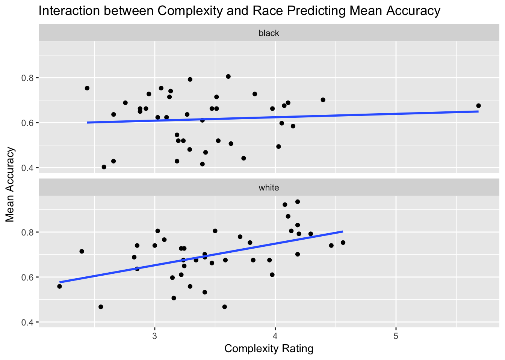

#Interactive Assignment 7: Moderation in Multiple Regression

This assignment covers the following skills:

1. How to conduct a multiple regression with a dichotomous interaction term in R
2. How to interpret the output from a moderation analysis in R
3. How to plot a moderation analysis using ggplot, by dividing groups into different colors and plotting separate regression lines for each group
4. How to use `facet_wrap()` to create figures in ggplot with multiple plots
5. How to break down interactions using simple regression.


The idea of moderation is that the relationship between two variables may be affected (or moderated) by a third variable. In regression, this means that the relationship between the independent variable and the dependent variable varies due to a third variable, called a moderating variable.

The logic of moderation can allow us to test a lot of psychological hypotheses. In this lab, we will walk through how we examine what moderation is on a conceptual level and how it works to test a psychological theory.

The cross-race effect in face memory is the well-established effect that people remember faces of their own race better than other races. People generally report saying faces of other races “all look alike” and do worse in memory tests when trying to remember faces of other races. One possible mechanism for this effect is *mental state complexity*, which is a rating of how much a person seems to be expressing a complex emotion or mental state mental state. Some faces appear to be blank and have no emotional content, some faces appear to have some emotional content, whereas some faces seem to be having complex mental states, which are uniquely human.

The idea of this study was to test three things:

1. Do people think faces of their own race express more complex mental states than faces of other races?
2. Do people remember faces of their own race better?
3. Does face race moderate the relationship between complexity and memory?

In this study, White participants rated the mental state complexity of White and Black faces. Then they were given a memory test of those faces. They saw the faces they rated along with other new faces and had to decide whether each face was a face they saw previously or a new face they had never seen before. 

When completing this lab, make sure you create a script with all your commands as we have done in previousl labs.

**Step 1**: In this lab, we will use the tidyverse package so go ahead and load that package.

**Step 2**: Now load the data from the file 'IA7data.csv' into R to the dataframe 'face'


Face should have the following variables:
face: the filename of the face
race – the race of the face.
mean_acc – the mean of distracter_acc and target_acc
complexity_rating – rating of the mental state complexity of the face on a 7 point scale.

**Step 3**: Create a scatterplot of the data to see how memory relates to mental state complexity. Using ggplot, generate a graph with `complexity_rating` on the X axis and `mean_acc` on the Y axis. Make sure the plot has a title and labels. Also include a regression line of best fit.

1. What does the plot look like? Do you think there is a relationship between the two variables?


&nbsp;

&nbsp;

&nbsp;

&nbsp;

&nbsp;

&nbsp;

&nbsp;

&nbsp;

2.How does the regression look? Does it look like a significant relationship?


&nbsp;

&nbsp;

&nbsp;

&nbsp;

&nbsp;

&nbsp;

&nbsp;

&nbsp;

**Step 4**: Create a regression using complexity_rating as a predictor of mean_acc.

Question 3: What is the regression equation from this regression? What is the t-value of complexity as a predictor? What is the p-value? Is it a significant predictor?


&nbsp;

&nbsp;

&nbsp;

&nbsp;

&nbsp;

&nbsp;

&nbsp;

&nbsp;

**Step 5:** Now let’s see if there is an effect of race on complexity. Conduct a t-test comparing complexity between White and Black individuals. Use race as the grouping variable and complexity_rating as the DV. 

Question 4: Is there a significant effect of complexity? What are the t and p values? What are the means for each group?


&nbsp;

&nbsp;

&nbsp;

&nbsp;

&nbsp;

&nbsp;

&nbsp;

&nbsp;

**Step 6**: Do the same as question 4 looking at if there is a difference in mean_acc for different race groups.

Question 5: Is accuracy higher for White or Black faces? What are the means for each group, the t-value, and the p-value?


&nbsp;

&nbsp;

&nbsp;

&nbsp;

&nbsp;

&nbsp;

&nbsp;

&nbsp;

##Using moderation in regression

Now we’ve found an answer for the first two hypotheses we wanted to test (see page 1). The third hypothesis is that the relationship between complexity and accuracy would be different for Black versus White faces. Now enter in the following to look at the interaction


```r
i = lm(mean_acc~complexity_rating*race, data=face)
summary(i)
```

```
## 
## Call:
## lm(formula = mean_acc ~ complexity_rating * race, data = face)
## 
## Residuals:
##      Min       1Q   Median       3Q      Max 
## -0.24062 -0.06673  0.01484  0.06648  0.18720 
## 
## Coefficients:
##                             Estimate Std. Error t value Pr(>|t|)    
## (Intercept)                  0.56340    0.09710   5.802 1.42e-07 ***
## complexity_rating            0.01512    0.02807   0.539   0.5917    
## racewhite                   -0.19933    0.14269  -1.397   0.1665    
## complexity_rating:racewhite  0.08102    0.04073   1.989   0.0503 .  
## ---
## Signif. codes:  0 '***' 0.001 '**' 0.01 '*' 0.05 '.' 0.1 ' ' 1
## 
## Residual standard error: 0.1054 on 76 degrees of freedom
## Multiple R-squared:  0.2402,	Adjusted R-squared:  0.2103 
## F-statistic: 8.011 on 3 and 76 DF,  p-value: 0.0001045
```

The output here has three variables in addition to the intercept. The first two variables give us the effect of complexity_rating and race as a predictor. In this case, the first two variables are the *main effects* or the effects of the independent variable and the moderator variable itself.

The reason R calls the 'race' variable 'racewhite' is that R uses the group "white" as the default group and compares the Black faces to the White faces. In this case, both of these variables are different than the regressions you listed above. This is because we have added the moderator variable.

In a regression with a moderator variable, the *main effects* are not very important because they are superceded by the effect of the **interaction variable** or the variable which examines whether the relationship between the independent variable and dependent variable varies as a function of the moderator variable.

In this case, the interaction variable is listed as 'complexity_rating:racewhite'. It is marginally significant.

When we have an interaction, what this means is that we expect the relationship between complexity and face memory to be different for the different values of the moderator variable. That is, the relationship between complexity and face memory is different for Black faces than for White faces. It could be that for one group of faces, the relationship is a positive correlation and for the other group it is a negative correlation. Or it could be that for one group there is no correlation and for another group, it is a positive correlation.

One of the best ways to interpret an interaction is to visualize the interaction using ggplot. We can create a plot with ggplot where we divide the data for White faces and for Black faces and plot different regression lines for each group.


```r
ggplot(data = face, aes(x = complexity_rating, y = mean_acc, color = race)) + 
  geom_point() + geom_smooth(method = 'lm', se = F) +
  labs(x = "Complexity Rating", y = "Mean Accuracy", title = "Interaction between Complexity and Race Predicting Mean Accuracy")
```


**Step 7**: Try typing the plot above and seeing if you can change some of the appearance options involved with the plot.

This ggplot code has a few changes from how we have done it before. Instead of putting the `aes()` option inside of the `geom_point()` and `geom_smooth()`, I put it in the main `ggplot()` command. The reason I can do this is that if I put the `aes()` option in the `ggplot()` command, then it automatically adds that option to every `geom` command. It saves some typing.

The other main change is that I added the `color = race` option. This tells ggplot that I want to dide my data by the variable race `geom_point()` and `geom_smooth()` options, it divides the plot bythe 

A second way we can do the same plot is to create two plots, one for Black faces and one for White faces. We can do this by using the `facet_wrap()` option. The following code does this. Notice that the code is the same, except I removed the `color = 'race'` option.


```r
ggplot(data = face, aes(x = complexity_rating, y = mean_acc)) +
  geom_point() + geom_smooth(method = 'lm', se = F) +
  facet_wrap(~race) +
  labs(x = "Complexity Rating", y = "Mean Accuracy", title = "Interaction between Complexity and Race Predicting Mean Accuracy")
```


You may wonder what the `facet_wrap(~race)` means. What this means is that I am grouping the plot by race. If I want to make the plot have the graphs on top of each other, with two rows with one column, I can add this as an option to `facet_wrap()`


```r
ggplot(data = face, aes(x = complexity_rating, y = mean_acc)) +
  geom_point() + geom_smooth(method = 'lm', se = F) +
  facet_wrap(~race, nrow = 2) +
  labs(x = "Complexity Rating", y = "Mean Accuracy", title = "Interaction between Complexity and Race Predicting Mean Accuracy")
```




Another way we can interpret interactions is to divide our data into groups based on the moderator. Then we can do simple linear regressions for each group and see how the coefficients compare. In this case, this would mean dividing our data and Since we have a signficant interaction, we know that the difference between the two groups is different. 

**Step 8**: Using the `filter()` command, create two data frames, one named 'face.black' and one named 'face.white' which contain only Black and White faces respectively.

**Step 9**: With each of these dataframes conduct a simple regression with complexity predicting memory.

Question 6: What are the results you get for the regression? Please note the b-value, t-value, and p-value for each condition. Do these results relate to the results you see in the graph?


&nbsp;

&nbsp;

&nbsp;

&nbsp;

&nbsp;

&nbsp;

&nbsp;

&nbsp;

Question 7: Based on these results, do you think that the data support the hypotheses? What are some potential limitations or cautions with these data? (examples may include: too small sample size, outliers, data are not normally distributed, ceiling or floor effects, and so forth)


&nbsp;

&nbsp;

&nbsp;

&nbsp;

&nbsp;

&nbsp;

&nbsp;

&nbsp;


