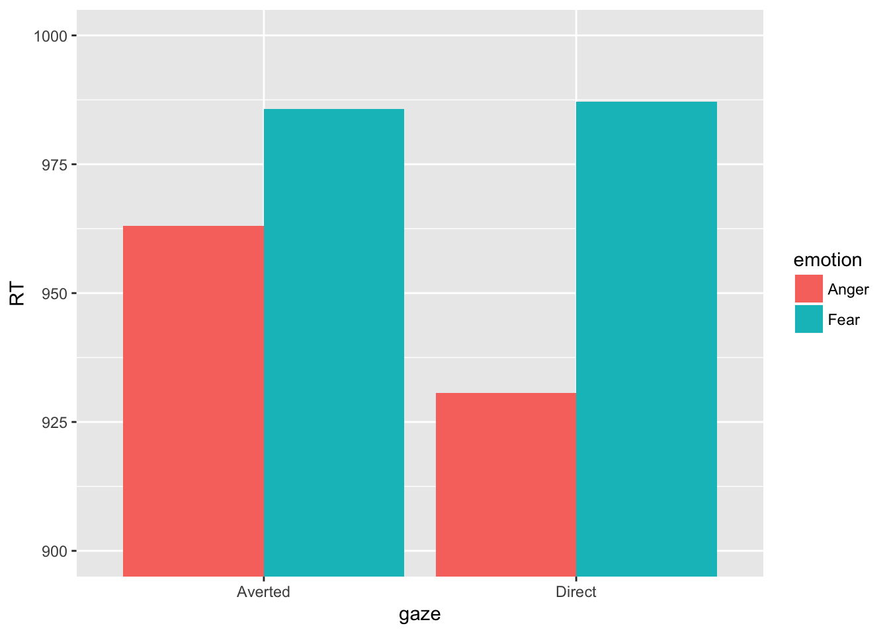

#Interactive Assignment 9: Within-subject ANOVA

Within-subject and mixed-subject ANOVAs are very useful in a lot of experiments, but present some mathematical problems that are outside of the scope of this chapter. The point of this assignment is to accomplish the following:

1. Understand the difference between within-subject and between-subject factors in ANOVA
2. Use the `ez` package to do within-subject and mixed-subject ANOVAs using the `ezANOVA()` command
3. Interpret ANOVA using graphs and learn how to change the scale of the y-axis and add error bars to a bar graph in ggplot.

To do within-subject and mixed-subject ANOVAs, we need to use the `ez` package.

**Step 1**: Install and load the ez package by using the following commands:


```r
install.packages('ez')
library('ez')
```


The data for this experiment are from a study investigating how eye gaze affects emotion recognition

**Step 2** Load the data from the file IA9face.csv into R as a dataframe named "face".


Participants saw a series of faces and had to label whether they were angry or fearful. Participants perceived 240 faces and had to label their emotion as quickly as possible using a button click. The variables are as follows:
subject: subject number
emotion: face emotion, either angry or fearful
gaze: gaze direction: either Direct (looking at the participant) or Averted: (looking away from the participant)
RT: average reaction time for the faces (i.e., the row for participant 1 Anger Direct would be the average reaction time for all the angry faces looking at participant 1)
acc: average accuracy for the faces (i.e., number of correct faces / number of total faces)

The researchers had two possible hypotheses:
1. Direct gaze hypothesis: emotions are faster recognized and more accurately recognized when they are showing direct gaze (i.e., looking at the participant)
2. Shared signal hypothesis: emotions are faster recognized and more accurately recognized when they are showing congruent eye gaze. This means that anger is faster recognized when a person is looking with direct gaze and fear is faster recognized when a person is looking away 

Question 1. Based on this data, if the direct gaze hypothesis is true, what pattern main effects and/or interactions would you expect. (An example answer to this question which is not correct would be: I would expect a main effect of emotion where anger is faster recognized than fear because of X)


&nbsp;

&nbsp;

&nbsp;

&nbsp;

&nbsp;

&nbsp;

&nbsp;

&nbsp;


Question 2. Based on this data, if the shared signal hypothesis is true, what pattern of main effects and/or interactions would you expect.


&nbsp;

&nbsp;

&nbsp;

&nbsp;

&nbsp;

&nbsp;

&nbsp;

&nbsp;


Question 3. If we are looking at eye gaze and emotion as IVs, which variables are within-subject and which are between-subject?


&nbsp;

&nbsp;

&nbsp;

&nbsp;

&nbsp;

&nbsp;

&nbsp;

&nbsp;

To conduct an ANOVA using the ez package, we have to use the format that ez uses for its variables. Here is the command to do the ANOVA using RT as a dependent variable and emotion and gaze as independent variables.


```r
ezANOVA(face, dv = .(RT), wid = .(subject), within = .(gaze,emotion))
```

```
## Warning: Converting "subject" to factor for ANOVA.
```

```
## $ANOVA
##         Effect DFn DFd        F          p p<.05         ges
## 2         gaze   1  59 5.543623 0.02189570     * 0.001110086
## 3      emotion   1  59 6.692092 0.01216943     * 0.007202689
## 4 gaze:emotion   1  59 6.789935 0.01158632     * 0.001329311
```

If we look at the output, we have significant effects for gaze, emotion, and the interaction. The significant main effect tells us that reaction time is different for gaze and different for emotion. Since there are only two levels, there are only two possibilities and all we have to do is look at the means. To see the means, we can use describeBy like we did in Interactive Assignment 8. Or we can use another function called aggregate.

The aggregate function is a powerful function that takes data, breaks it down by variable, and does another R function. In this case, we want to break the data down by gaze and emotion (direct gaze anger, direct gaze fear, averted gaze anger, averted gaze fear) and then get the mean of each group. To do this using aggregate, we would type the following:


```r
aggregate(RT~emotion*gaze, data=face, mean)
```

```
##   emotion    gaze       RT
## 1   Anger Averted 963.1116
## 2    Fear Averted 985.7175
## 3   Anger  Direct 930.6966
## 4    Fear  Direct 987.1787
```

Question 4: Looking at the mean reaction time, how would you explain the main effects? How would you explain the interactions? You should note which groups are bigger than which other groups and what differences could cause the interaction.


&nbsp;

&nbsp;

&nbsp;

&nbsp;

&nbsp;

&nbsp;

&nbsp;

&nbsp;

Question 5: Do the results support the shared signal hypothesis? Do they support the direct eye gaze hypothesis?


&nbsp;

&nbsp;

&nbsp;

&nbsp;

&nbsp;

&nbsp;

&nbsp;

&nbsp;

Another way to look at the data is by using a graph.

**Step 2**: Use what you've learned about ggplot to produce a bar graph to visualize the data. Your output should look something like this:


If you have a graph like this, you might think that the scale is hard to see. We can change the scale of the y-axis by using the `coord_cartesian(xlim = c(900, 1000))`

If you add the above code to your ggplot() output, you should get the following:



**Step 3**: Use the `ezANOVA` command to examine accuracy (variable acc) as a dependent variable. Use the `aggregate()` command in order to investigate what might explain the main effects and/or interactions.

Question 6: Do the results for accuracy support the shared signal hypothesis? Do they support the direct eye gaze hypothesis?


&nbsp;

&nbsp;

&nbsp;

&nbsp;

&nbsp;

&nbsp;

&nbsp;

&nbsp;

##Graphing with error bars

The last thing I'll add to this lab is how to add error bars to a graph. These help us understand the interaction. To graph the accuracy data, we would type the following:


```r
ggplot(face, aes(x = gaze, y = acc, fill = emotion)) + 
  stat_summary(fun.y = mean, geom = 'bar', position = 'dodge') +
  coord_cartesian(ylim = c(.7, 1))
```


If I want to add error bars, I need to add another function to ggplot. These are generally adding geoms, but since my geom is not actually the data itself but some statistic calculated from the data, I will use the `stat_summary()` function again, with the option `mean_se` instead of mean to add the error bars. This gives me error bars with standard error. In addition, I don't want to plot a bar, but an error bar. I would type the following:


```r
ggplot(face, aes(x = gaze, y = acc, fill = emotion)) + 
  stat_summary(fun.y = mean, geom = 'bar', position = 'dodge') +
  stat_summary(fun.data = mean_se, geom = 'errorbar', position = 'dodge') +
  coord_cartesian(ylim = c(.7, 1))
```


A lot of times, we want to plot 95% confidence intervals as our error bars. This is useful because if one bar is greater or less than the 95% confidence interval of another bar, it is usually significantly different (with an $\alpha = .05$) To do this, we would type the following code:

```r
ggplot(face, aes(x = gaze, y = acc, fill = emotion)) + 
  stat_summary(fun.y = mean, geom = 'bar', position = 'dodge') +
  stat_summary(fun.data = mean_cl_normal, geom = 'errorbar', position = 'dodge') +
  coord_cartesian(ylim = c(.7, 1))
```


Notice that the 95% confidence intervals are bigger than the standard error estimates. Either way, the averted anger bar is lower than the rest of the bars, and this difference is statistically significant since none of the means of the other bars are within the averted anger bar.

**Step 4**: Rewrite the code you used to make your graph in Step 2 to add error bars using standard error. Make sure you include this code in the script file you submit when you are done with this lab.
