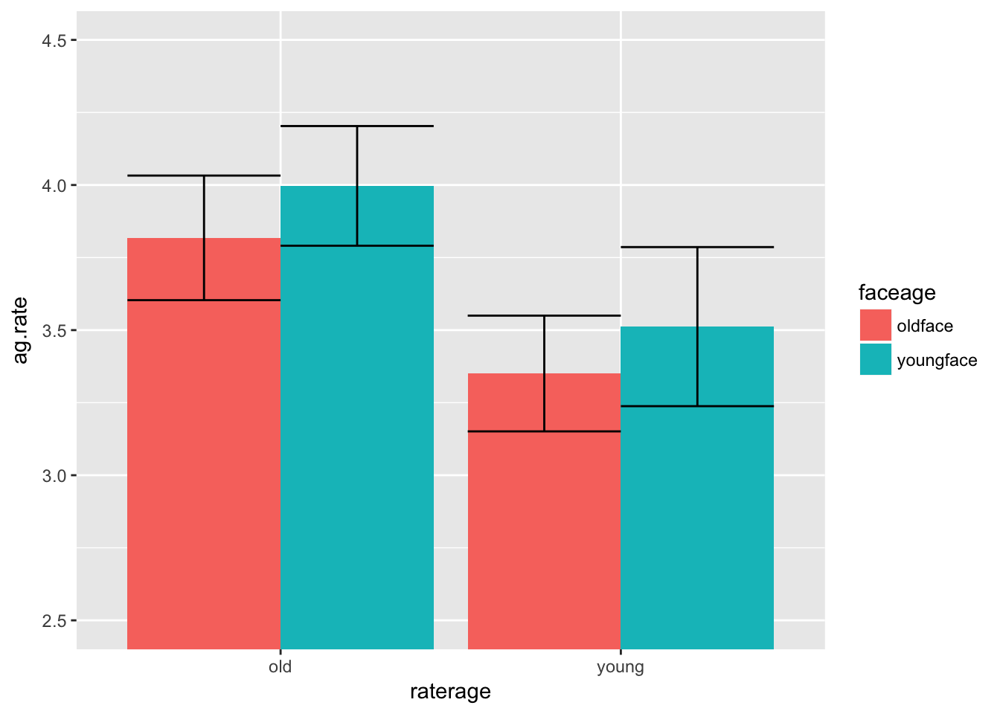

#Free Assignment 8: Within-subject ANOVA

This assignment will cover how to conduct within-subject and mixed-subject ANOVAs in R. It builds on Interactive Assignment 9 which discusses how to use the `ez` package to do ANOVA design.

**Step 1**: Before we get started, load the `ez` package and the `tidyverse` package.

The dataset for this homework investigate how older and younger adults perceive faces and rate them on several characteristics. Older and younger adult participants each rated older and younger faces on the characteristics below. The variables you will need are described below.

ID – participant ID number
raterage – a between-subject factor for participant age, with either “old” or “young”
ratergender – participant gender: either “F” or “M”
ag.rate – average ratings of aggressiveness
at.rate – average rating of attractiveness
ba.rate – average rating of babyfaceness
co.rate – average rating of competence
he.rate – average rating of health
un.rate – average rating of untrustworthiness
faceage – a within-subject variable which indicates the age of the face, with values "oldface" and "youngface"

In this dataset, I have older and younger adult raters rating older and younger adult faces. To simplify things a bit and save me some typing, I will use the abbreviations OR and YR to refer to Older Raters and Younger Raters and OF and YF to refer to Older Faces and Younger Faces, respectively.

They are the same data as we used in Interactive Assignment 4, on graphing, but they are structured a bit differently. In that assignment, I had the ratings for older adults and younger adults in separate columns but in this assignment, the ratings for older adults and for younger adults are in the same column, which is how ez requires us to format the data.

In this assignment, the dependent variables will be the face ratings for aggressiveness, attractiveness, babyfaceness, competence, health, and untrustworthiness.

**Step 2**: Load the data named "FA8rate.csv" into R as the data frame "rate", for ratings.


```r
library(ez)
library(tidyverse)
```

```
## Loading tidyverse: ggplot2
## Loading tidyverse: tibble
## Loading tidyverse: tidyr
## Loading tidyverse: readr
## Loading tidyverse: purrr
## Loading tidyverse: dplyr
```

```
## Conflicts with tidy packages ----------------------------------------------
```

```
## filter(): dplyr, stats
## lag():    dplyr, stats
```

```r
rate = read.csv('data/FA8rate.csv')
```

**Step 3**: Use the `aggregate` command in order to fill out tables with the means for each rating, separating the ratings by face age and by rater age. So you will have four means, the mean for older raters (OR) rating older faces (OF), OR rating younger faces (YF), YR rating OF, and YR rating YF.

To get the means for aggressiveness, you would type:


```r
aggregate(ag.rate~raterage*faceage, data = rate, FUN = mean)
```

```
##   raterage   faceage  ag.rate
## 1      old   oldface 3.817839
## 2    young   oldface 3.350521
## 3      old youngface 3.996978
## 4    young youngface 3.512032
```

Question 1: Using what you get in Step 3, fill out the following tables with the means. I already filled out the Aggressiveness table.

|Aggressiveness|OR|YR|
|:-----------|:-|:-|
|OF|3.82|3.35|
|YF|4.00|3.51|

|Attractiveness|OR|YR|
|:-----------|:-|:-|
|OF|&nbsp; &nbsp; &nbsp;|&nbsp; &nbsp; &nbsp;|
|YF|&nbsp; &nbsp; &nbsp;|&nbsp; &nbsp; &nbsp;|

|Babyfaceness|OR|YR|
|:-----------|:-|:-|
|OF|&nbsp; &nbsp; &nbsp;|&nbsp; &nbsp; &nbsp;|
|YF|&nbsp; &nbsp; &nbsp;|&nbsp; &nbsp; &nbsp;|

|Competence|OR|YR|
|:-----------|:-|:-|
|OF|&nbsp; &nbsp; &nbsp;|&nbsp; &nbsp; &nbsp;|
|YF|&nbsp; &nbsp; &nbsp;|&nbsp; &nbsp; &nbsp;|

|Health|OR|YR|
|:-----------|:-|:-|
|OF|&nbsp; &nbsp; &nbsp;|&nbsp; &nbsp; &nbsp;|
|YF|&nbsp; &nbsp; &nbsp;|&nbsp; &nbsp; &nbsp;|

|Untrustworthiness|OR|YR|
|:-----------|:-|:-|
|OF|&nbsp; &nbsp; &nbsp;|&nbsp; &nbsp; &nbsp;|
|YF|&nbsp; &nbsp; &nbsp;|&nbsp; &nbsp; &nbsp;|

**Step 2**: Use ggplot to create bar graphs of each of the 6 dependent variables with separate bars for face age and rater age (using faceage and raterage as the independent variables). Make sure to add error bars representing standard error. You can also use the `coord_cartesian()` function to change the scale of the y axis.  For instance, your plot for aggressiveness should look like the following:



Question 2: Based on the plots and the tables of the means, do you predict any interactions?


&nbsp;

&nbsp;

&nbsp;

&nbsp;

&nbsp;

&nbsp;

&nbsp;

&nbsp;

Now we are going to conduct the ANOVAs, using face age and rater age as independent variables predicting the dependent variable of aggressiveness ratings (ag.rate). 

Question 4: Which of these independent variables (if any) are between-subject variables? Which are within-subject variables (since this is a lab on within-subject and mixed ANOVA, one of these has to be a within-subject variable).


&nbsp;

&nbsp;

&nbsp;

&nbsp;

&nbsp;

&nbsp;


**Step 3**:Type the following to look at face age (faceage) and rater age (raterage) as independent variables predicting the dependent variable of aggressiveness ratings (ag.rate). 


```r
ezANOVA(rate, dv = .(ag.rate), wid = .(ID), within = .(faceage), between = .(raterage))
```

```
## Warning: Collapsing data to cell means. *IF* the requested effects are a
## subset of the full design, you must use the "within_full" argument, else
## results may be inaccurate.
```

```
## $ANOVA
##             Effect DFn DFd         F          p p<.05          ges
## 2         raterage   1  30 6.2652118 0.01798802     * 1.525502e-01
## 3          faceage   1  30 5.0061221 0.03283715     * 2.251707e-02
## 4 raterage:faceage   1  30 0.0134071 0.90859136       6.168922e-05
```

Question 5: When you type the following, what results do you get?


&nbsp;

&nbsp;

&nbsp;

&nbsp;

&nbsp;

&nbsp;

**Step 4**: Changing the code above, conduct ANOVAs using face age and rater age predicting the other five face ratings, at.rate, ba.rate, co.rate, he.rate, and un.rate.

Question 6: Now I want you to report your results using APA formatting. 

If you have a significant main effect or interaction, you need to explain why you think there was a main effect or interaction. For main effects, all you have to do is indicate which level was higher. For interactions, you should interpret them by eyeballing the graphs and means and trying to explain why there is an interaction.

For instance, this is how I would report the results for aggressiveness rating.

We conducted a 2(face age: older vs younger) X 2(participant age: older versus younger) mixed ANOVA with face age as a within-subject variable and participant age as a between-subject variable. We found a significant main effect of rater age, F(1,30) = 6.27, p = .018, indicating that older participants rated faces more aggressively than  younger participants. We also found a significant main effect of face age, F(1,30) = 5.01, p = .032, as younger faces were rated more aggressively than older faces. There was no significant interaction, F(1,30) = .013, p = .91.

Results for attractiveness:


&nbsp;

&nbsp;

&nbsp;

&nbsp;

&nbsp;

&nbsp;


&nbsp;

&nbsp;

&nbsp;

&nbsp;

&nbsp;

&nbsp;

Results for babyfaceness:


&nbsp;

&nbsp;

&nbsp;

&nbsp;

&nbsp;

&nbsp;


&nbsp;

&nbsp;

&nbsp;

&nbsp;

&nbsp;

&nbsp;

Results for competence:


&nbsp;

&nbsp;

&nbsp;

&nbsp;

&nbsp;

&nbsp;


&nbsp;

&nbsp;

&nbsp;

&nbsp;

&nbsp;

&nbsp;

Results for health:


&nbsp;

&nbsp;

&nbsp;

&nbsp;

&nbsp;

&nbsp;


&nbsp;

&nbsp;

&nbsp;

&nbsp;

&nbsp;

&nbsp;

Results for untrustworthiness:


&nbsp;

&nbsp;

&nbsp;

&nbsp;

&nbsp;

&nbsp;

&nbsp;

&nbsp;

&nbsp;

&nbsp;

&nbsp;

&nbsp;

Question 7: What do you think the story is with this data? Pick one of the rating variables (other than aggressiveness) and try to explain why you think there were these main effects and interactions. I'm not going to grade this based on your interpretation; instead, I want you to try your best to interpret the data using what you know about the world.

For example, I may explain the aggressiveness rating by stating that there is a main effect of face age because overall, people find older faces less aggressive than younger faces. This may be because people have a stereotype that older adults are less aggressive. There is a main effect of rater age because older adults rated faces more aggressively than younger adults. This may be because older adults are more skeptical of people in general.


&nbsp;

&nbsp;

&nbsp;

&nbsp;

&nbsp;

&nbsp;

&nbsp;

&nbsp;

&nbsp;

