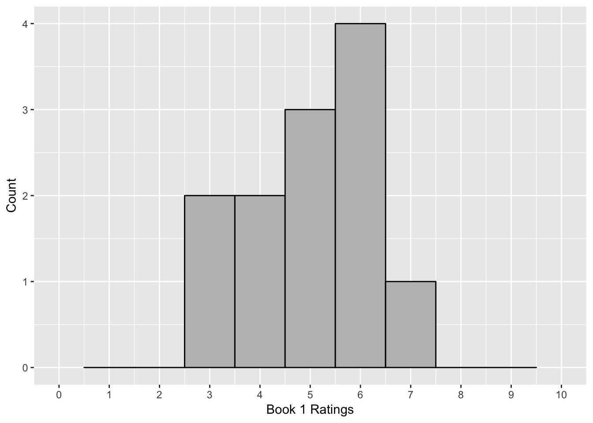

#Data, Distributions and Descriptive Statistics

In this chapter, we will cover

1. How we think about and format data
2. How we can summarize data using distributions
3. Shapes of distributions and percentiles
4. What descriptive statistics are and why we use them
5. How we can summarize central tendency and variance

When you are done with this chapter, you should be able to know or do the following:

##The idea of describing data

One of the most powerful things about the internet is how it has made it so easy to find out information about which products to buy, or things to do, or shows or movies to watch. The ability to seek out hundreds or thousands of other people's reviews means that there is a ton of information at our fingertips.

If I want to find out what movie I should watch this weekend, I may go look up reviews about the movie. I could read through many people's opinions, at the risk that their opinions might spoil the movie's ending, or I could do what I think most people do and look at the movie's ratings. Several internet sites give different opinions about movies and how they are rated. Did this movie get 7 out of 10 stars? Or what percent of experts gave the movie a positive rating?

Or if I wanted to buy a toaster online, I could look at the reviews. I like cheap things, but I don't want cheap things that break easily. So I could read hundreds of reviews on a shopping site online, or just look and see at it's rating. If two toasters each cost $40, and one toaster has a rating of 3 out of 5 stars and the other toaster has a rating of 4.5 out of 5 stars, it's obvious which one I would buy.

These are all concepts of organizing data. When you see that a movie got 77% positive reviews or a toaster got 4.5 out of 5 stars in a rating, you're seeing a lot of data organized to get an important message out of the rating.

Describing data is the art of taking large amounts of data and synthesizing them into a simpler message. Essentially, we are trying to figure out what the story of the data is and answer the question that we are interested in. Datasets can tell many stories, and the key is to find out what story we are interested in and how we will go about finding out the answer by summarizing data.

##Distributions and summarizing data

**Distributions** are a way of representing how frequently a specific value occurs in a data frame. This can tell us about patterns in data very quickly. 

Here's an example. I asked twenty preschool children to tell me what their favorite color was. (This is a great way to get preschoolers to talk). I got a list like this:

<!--html_preserve-->
<table>
  <tr>
    <th>blue &nbsp; &nbsp; &nbsp; </th>
    <th>green &nbsp; &nbsp; &nbsp;  </th>
    <th>blue &nbsp; &nbsp; &nbsp;  </th>
    <th>yellow &nbsp; &nbsp; &nbsp;  </th>
    <th>red &nbsp; &nbsp; &nbsp;  </th>
  </tr>
  <tr>
    <th>blue &nbsp; &nbsp; &nbsp;  </th>
    <th>blue &nbsp; &nbsp; &nbsp;  </th>
    <th>red &nbsp; &nbsp; &nbsp;  </th>
    <th>pink &nbsp; &nbsp; &nbsp;  </th>
    <th>red &nbsp; &nbsp; &nbsp;  </th>
  </tr>
  <tr>    
    <th>black &nbsp; &nbsp; &nbsp;  </th>
    <th>black &nbsp; &nbsp; &nbsp;  </th>
    <th>blue &nbsp; &nbsp; &nbsp;  </th>
    <th>green &nbsp; &nbsp; &nbsp;  </th>
    <th>pink &nbsp; &nbsp; &nbsp;  </th>
    </tr>
  <tr>
    <th>purple &nbsp; &nbsp; &nbsp;  </th>
    <th>yellow &nbsp; &nbsp; &nbsp;  </th>
    <th>red &nbsp; &nbsp; &nbsp;  </th>
    <th>purple &nbsp; &nbsp; &nbsp;  </th>
    <th>blue &nbsp; &nbsp; &nbsp;  </th>
  </tr>
</table>
<!--/html_preserve-->
 
 &nbsp;
 
If you asked children their favorite color, you are probably not interested in only having a list of all the responses. You may be more interested in questions such as which color is most commonly picked or how many different colors are chosen. Each of these questions is more easily answered by a **frequency table**. A frequency table is a table which records each possible response of the variable and then lists how often that response happened. In this case, the table would be:

|  Color  |  Frequency  |
|:-------:|:-----------:|
|  black  |      2      |
|  blue   |      6      |
|  green  |      2      |
|  pink   |      2      |
| purple  |      4      |
|   red   |      4      |

If you look at the list carefully, some patterns become very apparent. Blue is the most common color, followed by purple and red. Also, there are only 6 colors chosen, and certain colors, like white and brown, are not chosen. The frequency table allows us to see all of that at a glance.

Frequency tables work very well for cases where there are only a few possible values for each data point. In this case, there are only a few colors that preschoolers can select. However if I asked art majors this question. I might get responses like “robin’s egg blue” or “cerulean” or “mahogany”. If I had a set of data where 50 people each chose a different color, a frequency table would be useless. 

Sometimes, it helps if we group data into categories that correspond to several different possibilities. We could do the following: with my limited art skill, I grouped colors into the categories cool: (blue, green, purple), hot: (red, yellow, pink), and other (black).

|  Color  |  Frequency  |
|:-------:|:-----------:|
|  Cool |      10      |
|  Hot   |      8      |
|  Other  |      2      |

Frequency data can also work well for outcomes that are numerical. Imagine I have ratings for a new restaurant, and the ratings are a list like this:

_3_, _5_, _2_, _4_, _4_, _4_, _1_, _1_, _3_, _5_, _5_, _4_, _5_, _3_, _5_, _3_, _4_, _5_, _5_, _2_, _5_, _1_, _1_, _1_, _4_, _5_, _1_, _4_, _5_, _3_, _3_, _4_, _1_, _2_, _5_, _2_, _4_, _1_, _5_, _3_, _5_, _3_, _5_, _5_, _5_, _1_, _5_, _1_, _5_, _4_, _4_, _2_, _5_, _4_, _3_, _5_, _3_, _4_, _4_ and _4_

Yuck! That is a long list of numbers. A frequency chart would look like this:

|  Rating  |  Frequency  |
|:--------:|:-----------:|
|    1     |     10      |
|    2     |      5      |
|    3     |     10      |
|    4     |     15      |
|    5     |     20      |

In this case, it's a lot clearer to see what the pattern is. The ratings seem to be higher than average, with most people giving a fairly high rating and only a smaller percentage giving two stars or less.

With numerical data, we have to consider whether our numbers are **discrete** or **continuous**. Data are discrete when there are no possible fractional values. For instance, a person can only have a whole number of children. Money can only be in certain specific chunks. Except for gas stations and stock markets, fractions of a penny are impossible.

Not all data are discrete. For instance, both my wife and I are five feet, eight inches tall. Does that mean we’re exactly the same height? No. One of us is taller than the other (a question that is still up for debate). We say we’re 68 inches tall, but each of us is not 68.0000000 inches tall. In reality, my height is something like 68.24238452... inches tall, if I could measure height that precisely.

Continuous data are data where there are an infinite amount of possible values between each number. Anything we measure, rather than we count, is continuous, because our measurements are never exact. For instance, I can say for sure that I have exactly $34.11 in my wallet. Money is a discrete variable. Even though cents are expressed as decimals, you can't have between 0 and 1 cent (unless you're at a gas station).

However, time is a continuous variable. I ran a mile in 9 minutes, 11 seconds. I run a mile and time myself using a stopwatch, getting a result of 9 minutes, 11 seconds.  If I had a precise timing mechanism, I might be able to say I ran the mile in 9 minutes, 11.42347289 seconds. Even with more precision, I can’t know exactly how long it took me.

When we analyze continuous data, it is often useful to make continuous data into discrete data by **binning** or combining related data into ranges called bins. 

Binning is natural and happens all the time. When I ask anyone how old they are, they don't give me answers like 3.5482828398438. They just say 3 years old. We naturally assume if you are between 3.000000 and 3.99999 years old, you will say 3 years old.

The bins don't have to be whole numbers. Young children often will be very proud of their half years and say "I'm 4 and a half years old". In that case, the range would be anywhere between 4.500000 and 4.9999 years old. Likewise, someone might say "I'm in my 40s", which would mean a range between 40.000000 and 49.999999 (though some people might change the values in that range).

When making frequency charts using continuous data, you have to decide what size of a bin to use. For instance, I could have a chart of times it took a rat to complete a maze:

|  Time (in minutes)  |  Frequency  |
|:-------------------:|:-----------:|
|    0-.99            |      3      |
|    1-1.99           |      8      |
|    2-2.99           |     16      |
|    3-3.99           |     11      |
|    4 or more        |      5      |

The important thing in deciding what size bin to use is to choose a size that allows you to see the pattern. Too few options and the chart may look like this:

|  Time (in minutes)  |  Frequency  |
|:-------------------:|:-----------:|
|    0-2.99           |      27     |
|    3 or more        |      16     |

In this case, the pattern is obscured. We can't see that a few values that are really fast and a few that are really slow and most values are in the middle. Finding the right bin size takes a bit of trial and error.

##Plotting distributions

When we make a frequency table, we can present the data using graphs. Traditionally, bar graphs are the way that frequency tables are presented. A bar graph is used when frequency tables are presented with different categories. Each of the categories are on the x-axis and the frequency of each of the events is on the y-axis. An example of a bar graph is below, plotting out the color data from before:

In a bar graph, each of the bars are separate, with space between them. That is because each bar represents a category. Order is statistically irrelevant in a bar graph; I could have put these bars in any order, but alphabetical order made sense to me.

A bar graph is used when data are discrete: that is, data are broken up into indivisible categories. When looking at class standing, there are only four possibilities and a person fits into only one possibility. All categorical and ordinal data are discrete, as are many forms of interval and ratio data.

When I graph a frequency chart using continuous data, I make something called a histogram. This is different than a bar graph. In a histogram, the bars touch each other, because they are not separate categories, but bins that represent ranges of numbers. An example histogram is below. Each bar represents the number or frequency of observations in a certain range. This histogram goes from 6.5-7.499, 7.5-8.499 and so forth. The tall bar represents observations between 8.5 and 9.499.

If we use a line graph rather than a bar graph, we can create a distribution called a **frequency polygon**. This is made by placing a point at the center of each bar in a histogram and then connecting those points with lines. This gives us an estimate of how many values are at every value.

Here’s an example:

The final way we may graph histograms and frequency polygons is that instead of having an absolute count of how many data points are a certain value, we change that into a percent, and the bar or line represents what percent of the total observations are in each category. This is called a **probability density plot** and is very important for understanding how a distribution is affected by probability, which we'll talk about in another chapter.

Distributions are very important because they help us to interpret what a data point means. For instance, I gave an intelligence test and found that a person scored 138. Is that a good score? It’s impossible to know. Another example: a three-year old weighs 33lbs. Is she underweight, overweight, or a proper weight?

To answer questions like this, we are interested in a value's relative position in a distribution. We use this by the concept of **percentiles**. A percentile is defined as the percentage of the distribution that is below that value? For instance, if I score an 82 on an exam and 40% of the people score below me and 60% score above me, I am in the 40th percentile. Likewise, if a toddler weighs 33 lbs, and 70% of toddlers of the same age weigh less than that toddler, then he is in the 70th percentile.

To calculate what an observation’s percentile rank is, you follow this formula, where $N_{below}$ equals the number of observations below a given observation and $N_{total}$ equals the total number of observations in a variable.

$$Percentile = \frac{N_{below} }{ N_{total} - 1}$$

Here’s an example. For instance, imagine if you took a test and got an 84 on it. You are in a class of 25 people and 11 people did better than you and 12 people did worse than you. One person got the same grade as you. To calculate percentile, you would type: 

$$\frac{12}{ 25 - 1} = 0.522$$

This would be called the 52nd percentile, since percentiles, like percents, are decimals. This person scored better than 52% of the people in the class, which helps us to know more about their relative performance.

##Using Descriptive Statistics to Characterize Distributions

Distributions have characteristics that can tell us about the underlying data and help to answer our questions.

###Central tendency

The first characteristic of a distribution we consider is called central tendency, or a way of trying to determine which value is the most characteristic of a distribution. In essence, this property represents if we take an entire set of data and want to say which value best represents the data. Colloquially, we often call this the "average" of a variable, though the word average often means a specific way of measuring tendency.

The first way we can discuss central tendency is by the **mode** of a variable. This is the value (or values) which are most common in a dataset. Calculating a mode is simple; figure out which value is most common. If two values are equally common, the data is called **bimodal** and both values are the mode. In the example above for ratings, the mode would be 5. In the color example, the mode would be blue, since blue was the most common color. 

The mode is useful because they can be calculated for any kind of data, nominal, ordinal, interval, or ratio. The mode can also be computed for non-numeric data as well.

However, the mode only tells us about the peak of the data, and the mode can be biased if that most common value is not representative of the rest of the data. Here's an example: I have people rate on a 5 point scale how much they like a certain restaurant, with 1 being very low and 5 being very high. I get the following results:

|  Rating  |  Frequency  |
|:--------:|:-----------:|
|    1     |     30      |
|    2     |     28      |
|    3     |      2      |
|    4     |      5      |
|    5     |     31      |

My mode would be 5. Now I take a second restaurant and get the following rating:

|  Rating  |  Frequency  |
|:--------:|:-----------:|
|    1     |      3      |
|    2     |      4      |
|    3     |      8      |
|    4     |     33      |
|    5     |     31      |

In this case, the second restaurant has a mode of 4, which is less than the first restaurant. But would you rather eat at the first restaurant? Probably not, because most people did not rate that restaurant highly. The mode only incorporates some of the data, so it can miss some important trends.

To incorporate all the data, the most common measure of central tendency is the **mean**. This is technically called the arithmetic mean and is colloquially what is meant when people say *average*. To calculate the mean, you would do the following, assuming you have a variable called X with N elements. Simply, this is that you add all the numbers in your variable and divide by the number of values in the variable.

$$\mu = \frac{\sum{X_{i}}}{{N_{i}}}$$

In stats, we refer to the mean of a population by the Greek letter mu, $\mu$ and the mean of a sample by "X bar", or $\bar{x}$. We'll use these symbols a lot in this class.

Means are the most common way to deal with summarizing data but there can be a problem using means in some instances. Means are very susceptible to outliers. Income is a great example of this. Imagine a company with 20 workers who make \$50,000 a year and a CEO who makes \$1 million a year. A person recruiting for the company might say “the average income for a worker is \$95,238”. But does that really reflect reality?

Another example is trying to say “what’s a person’s average income”. In 2014, the mean income for a household is \$72,641. But if you look at data for income, having a household income of \$72,641 would put you in the 62.5th percentile, so that a person with “average” income makes more than 62% of people.

The reason for this is because income data are **skewed**. A skewed distribution is any distribution that is asymmetric and therefore most of the data points are either above the mean or below the mean. A distribution with **positive skew** will have most of the data below the mean and outliers that are above the mean. However, a distribution with **negative skew** will have the reverse, where most of the data are above the mean and a few outliers are below the mean.

The graph below has positive skew, with most of the values below the mean, which is marked with a bright red line.

Compare this to a graph with negative skew, where most of the data are above the mean.

Income is a great example of a distribution with positive skew. A few people make a lot of money and many people make less money. So if we want to quantify how the “average” American is doing, we don’t care if a few people are extremely rich make \$1 million or \$1 billion a year. We are more concerned about a person who is neither rich or poor.

<!-- maybe create an image here of income distribution, like here: https://upload.wikimedia.org/wikipedia/commons/thumb/0/0d/Distribution_of_Annual_Household_Income_in_the_United_States_2010.png/800px-Distribution_of_Annual_Household_Income_in_the_United_States_2010.png -->

The final measure of central tendency we might use is the **median**. The median is defined as the 50th percentile, or which score is at the middle of the distribution. To calculate a median, you do the following steps:

1. Order your scores from least to greatest
2. If you have an odd number of scores, take the middle score. That is the median. 
3. If you have an even number of scores, add the two scores in the middle and divide by two (taking the mean of the two scores).

Medians are robust to outliers. Adding one extremely high score or one extremely low score will not change the median very much. That said, for various mathematical reasons, we usually like to use the mean to describe data unless we have good reason to do otherwise.

### Measures of Variance

Central tendency tells us what the middle or the “average” member of a distribution is. Another important property of distributions is the idea of variance, or how spread out distributions are. Variance tells us if the observations in a distribution are close together or far apart.

Imagine I have two books and wanted to test what people thought about them. I give a series of people the book to read and ask them to rate how good the book was on a 10 point scale. For instance, I might get the following ratings:

|  Rater  |  Book1  |  Book2  |
|:-------:|:-------:|:-------:|
|    A    |    6    |    3    |
|    B    |    4    |    4    |
|    C    |    5    |    6    |
|    D    |    7    |    4    |
|    E    |    4    |    3    |
|    F    |    3    |    5    |
|    G    |    3    |    2    |
|    H    |    5    |   10    |
|    I    |    6    |   10    |
|    J    |    6    |    1    |
|    K    |    6    |    9    |
|    L    |    5    |    3    |

If we look at these data points, the mean for each group is  the same, with the mean for both groups equal to 5. However, it's clear that there is a different story happening here, especially if you look at the distributions.

There is more disagreement in what people thought about the second book. The first book is consistently average, but people have a lot more disagreement about the second book. Some hate it, some like it, and some are in the middle. You’ve probably seen this concept in what people think about stories, whether it’s books, television, or movies. Some stories are consistent where people think the same about them, whereas other ones become “cult” hits, which have a small fanbase who passionately like the movie or book whereas many people either don’t care or may really dislike it.

This disagreement is a concept called **variance** and it reflects the amount of spread in the data. To think about it mathematically, it is a measure of how far the “average” person is from the middle of a dataset, usually defined as the mean. If there is very little variance, then most of the data are alike. For instance, imagine a high school where students wear a uniform. Their clothes are not all alike, because there are subtle things they can do to show their individuality. But there is very little “variance” in the data. On the other hand, a high school with no dress code would have much more variance in how people dress.

One measure of variance is using **range**, or measuring how spread a distribution is. The range is the largest score minus the smallest score. Range gives us a way to understand how spread data are, but range has a few problems. Range is only affected by two scores, and by definition it is taking the highest and the lowest score. If there are outliers in the data, they will either be the highest score, or the lowest score, and so they will affect the range.

Because of this we use another measure of variance, the standard deviation. The standard deviation is a measure that gives us essentially how far on average, each score is from the mean. Standard deviation is defined as the following:

$$s = \sqrt{ \frac {\sum_{i=1}^N (x_i - \overline{x})^2} {N-1}}$$

This is a complicated formula for a simple concept. Here's a step-by-step to explain what this means.

First we calculate the *deviations*, which is taking each score in a distribution and subtracting the mean from each score. A small deviation is close to the mean whereas a large deviation is far from the mean. As you can see in the table below, the deviations tells us a story about the data. There are very small deviations for Book 1 but very large deviations for most of the observations of Book 2. 

|  Rater  |  Book1  |  Book2  |  Book1.deviation  |  Book2.deviation  |
|:-------:|:-------:|:-------:|:-----------------:|:-----------------:|
|    A    |    6    |    3    |         1         |        -2         |
|    B    |    4    |    4    |        -1         |        -1         |
|    C    |    5    |    6    |         0         |         1         |
|    D    |    7    |    4    |         2         |        -1         |
|    E    |    4    |    3    |        -1         |        -2         |
|    F    |    3    |    5    |        -2         |         0         |
|    G    |    3    |    2    |        -2         |        -3         |
|    H    |    5    |   10    |         0         |         5         |
|    I    |    6    |   10    |         1         |         5         |
|    J    |    6    |    1    |         1         |        -4         |
|    K    |    6    |    9    |         1         |         4         |
|    L    |    5    |    3    |         0         |        -2         |

Now we want to combine the deviations into one number. We can't take the mean of the distributions because that would always equal zero. So what we do is we square each of the deviations and take the sum of the squared numbers to create a property called sum of squared deviations or **sums of squares**.  The sums of squares are an interesting mathematical property of a distribution and one that will come up later. However, there is one problem with this property, it’s biased by how many observations we have. As we add more values, sums of squares will always go up. A distribution with twenty observations with the same amount of variance as a distribution with ten observations will have a much higher sums of squares, just because we are adding.

To account for this, we divide sums of squares by the number of observations. For various mathematical reasons which are well beyond the scope of this book, this number is slightly biased when discussing samples, so it is better to divide by the sample size minus 1. In the example of the books, where we have 10 observations, we would divide the sums of squares by 9. This quality is called **variance**, which is defined as the sums of squares divided by the number of observations minus 1. Variance is written as the Greek letter sigma squared, $\sigma^2$, if it is the variance of a population and $s^2$ if it is the variance of a sample.

In the example above, the variance for book one would be:
	
	$$s^2 = \frac{4}{10-1} = .44$$ 

And the variance for Book 2 would be:
	
	$$s^2 = \frac{148}{10 - 1} = 16.4$$

	
Variance is a good measure of deviations, but one problem is that it is not on the same scale as the original units, because we squared the original deviations. To fix that, we often take the square root of the variance to get the quality called standard deviation. Standard deviation is the most common way to measure the amount of spread in data. It represents the average amount that each observation deviates from the mean. Since standard deviation is the square root of variance, it is written as the Greek letter sigma, $\sigma$, if it is the square root of a population and $s$ if it is the standard deviation of a sample.

So in the example of the books, the standard deviation for book 1 would be the square root of .44, or .66 and the standard deviation for book 2 would be the square root of 16.44 or 4.05. In this case, when rating book 1, each person is on average only .66 points from the mean. For book 2, each person is more than 4 points from the mean. 
	
Now, you might wonder why the concept of variance matters for you. Here’s one example. Imagine I want to buy a vacuum cleaner, because those are the important purchases once you settle down. I find two models online and look at their ratings. People give the vacuum between 1 star and 5 stars. Both of these vacuums have ratings of 4 stars. One vacuum has a standard deviation of .1 whereas the other has a standard deviation of .5. What this is telling me is that there’s a lot of agreement about the first vacuum cleaner and that most people give it 4 stars. However, there’s less agreement about vacuum cleaner 2. Vacuum cleaner 2 certainly has more 5 star ratings than the other vacuum cleaner. However it has more lower ratings. What this means is that people are more inconsistent with the second vacuum cleaner. Perhaps vacuum cleaner 2 is better but more customers happen to get a broken model and give it very low ratings. Perhaps vacuum cleaner 2 is harder to use and some people can’t figure it out, whereas those who figure it out really love it. The standard deviation helps to tell the story as to whether I’ll pick a vacuum cleaner that I’ll be sure to like somewhat or should I take the chance and get one I might love.

To summarize, there are several steps involved in getting the standard deviation. I’ll summarize them below:

1. Calculate deviations, or how far each score is from the mean
2. Square the deviations and add these squared deviations to get sums of squares
3. Divide the sums of squares by the number of observations minus 1 to get variance
4. Take the square root of variance to get standard deviation.

## The importance of descriptive statistics

As I mentioned above, distributions and descriptive statistics allow us to *simplify* data and examine what data are telling us. I have described this like a story. All data have a story and your job is to find the story through your analysis. This is what descriptive statistics is about.

There are no right answers when it comes to which statistics to use. This is why statistics is hard. But, there are a lot of wrong answers, and some really wrong answers. This is why I have this section to know what descriptive statistics to have in the behavioral sciences. In this section, I have some common uses of descriptive statistics in behavioral science and a few pointers about what to avoid.

###Summarizing Populations

We use descriptive statistics to summarize characteristics about who participates in our studies. This helps us to know at a glance who is doing a study. For instance, I may have a study where I test whether using light therapy (bright lights) helps people with seasonal affective disorder (SAD). I may have a randomized experiment where I assign some individuals to receive light therapy and other individuals not to receive light therapy. My idea is that the groups who receive the treatment would have a reduction of their symptoms compared to those who do not receive the treatment.

It's important to know the characteristics of each group of participants and descriptive statistics help with this. Central tendency can let us know who the "average" participant is. At a glance, we can use the mean to see what kind of participants are in each group. Are they older? Younger? We can also use frequencies to examine the gender and racial background of the participants. In this case, we can examine if these groups are similar.

Variance is also very important in behavioral science. In some cases, we are interested in variance and we want to encourage higher levels of variance. If I design a memory test, I want it to separate between people who have higher levels of memory versus lower levels of memory. If everyone scores exactly the same, the test has no usefulness.

Like with central tendency, understanding variance lets us know how diverse our sample is. If the sample is very similar, it will have little variance. In some cases, this can be a good thing because it allows us to control for other issues which may affect our studies. However, this has been one of the biggest issues with behavioral science research for many years. The "average" participant is often selected from undergraduate students. College students are not diverse. They are almost always younger and do not reflect the racial and cultural diversity of the world. This lack of diversity has affected many theories.

###Mistakes with descriptive statistics

People misuse descriptive statistics all the time. This is part of the reason that many people think that the word "statistics" is just another synonym for "lies". It's not a coincidence that the most popular statistics book of all time is *How to Lie with Statistics*. 

But we want to be better than that, and so here are some mistakes people make with descriptive statistics and how you can avoid them:

The first mistake is only looking at the mean. This is a mistake a lot of people make when evaluating statistical data. The mean is the most common way to summarize data but when people only look at the mean, they can miss a lot of things.

I was recently looking at buying soccer nets for my daughter's birthday and since I had no idea how good the different products were, I was looking at the reviews on the online shopping website I used. Like most websites, they allow people to review products and you can sort the products for the "highest review first".

This looked like a good idea but it was actually useless. The first product had a mean of 5 stars, but it only had 3 reviewers. Another product buried several pages later had with a mean of 4.5 stars with 1000 reviews. Which one would you choose?

You'd probably be better off choosing the one with more reviews. If you missed how many reviewers there were, you might miss important data. Later in this book, we'll talk about why sample size is important and why we can be more certain of our conclusions if we have larger samples.

Another mistake is ignoring the distribution. Sometimes, we have outliers which can really skew our data. In a lot of psychology studies, people like to use reaction time as a way to understand how the brain works. If a person responds more quickly in one condition than another condition, this can tell us that there's a stronger connection between the concepts in the first condition than the second condition. In one study I did in graduate school, we were investigating whether people recognized anger more quickly if it was a male face that was angry than on a female face that was angry. Part of the reason for this is that there is a stereotype that men are more likely to be angry than women.

In this experiment, it is very easy to recognize anger quickly. It takes participants a mean of 750 milliseconds (3/4 of a second) or so to recognize and label the face. However, reaction time can have serious positive skew. In one trial, a participant took 10,000 milliseconds (or 10 seconds) to label the face. This is such an outlier that it threw off the entire mean for that condition. In our experiment, it looked like people were faster to recognize anger on female faces than on male faces, which is the opposite of our prediction. However, if you removed that one trial, the pattern reversed.

So what happened here? I don't know for sure, but the person took a break during that one face. Maybe they sneezed when that face appeared and was too slow to respond. Or the participant could have fallen asleep for a moment, or yawned, or anything. In this case, it's unthinkable that a person could take 10 seconds to figure out whether a face is angry or fearful, when in all the other trials this person only took less than a second. This is clearly an outlier. This is why in reaction time research, people usually remove trials that take a very long time, like more than 2 or 3 seconds.

The final lesson is this: look at your raw data in addition to your descriptive statistics. I had found an interesting research finding, one that was so interesting, I was scheduled to give a talk when I would discuss this new data. I was excited because it was novel and all the descriptive statistics looked nice. However, I never looked at the raw data until a little while before the talk, when I noticed something odd. I had an outlier in the data. It was hard to notice this outlier from looking at the distribution, but it was a value that was miscoded and was something which is physically impossible. When I fixed this issue, one of my interesting findings was no longer true. I had to report this mistake.

So I was left with a quandary: should I give up my talk, or do the talk and report I made a mistake? This was a nerve wracking decision, but then a miracle happened and I was saved. A snowstorm came the day before I had to fly to my conference, and since snow completely paralyzes airports in the Southern US, my flight was canceled and I couldn't go to the conference. I didn't have to make the talk and I let the mistake be my little secret. Until now, when I give you my story as a warning.

The summary of this section is simple: look at your data. Look at your raw numbers, look at the distributions, look at the histograms, and look at the mean, median, and standard deviation. If there are any oddities, this can be adjusted. However, many people have gotten into trouble because they didn't look at their data.

##Summary

Descriptive statistics allow us to simplify data to understand the main point about a set of data. It allows us to understand at a glance what the properties of data are and what the data are telling us. Here's a summary of a few principles from descriptive statistics.

1. Frequency distributions allow us to see how data are distributed, which values are most common, and what shape the data have. 
2. We can plot frequency distributions on a graph to create bar graphs for categorical data and histograms for other data. When connected with a line, we can create frequency polygons. If the bars represent the percent of values that are in a specific category, we can create probability density plots.
3. Central tendency is a concept representing which value best represents what is the prototypical or "average" observation. We can use the mode, median, or mean to examine this. The mean is most commonly used, but is susceptible to outliers.
4. Variance represents how spread data are and reflects how far on average each score is from the mean. Variance is measured through standard deviation.
5. Whenever you do an analysis, look at all the descriptive statistics and look at the distributions of your variables. This can help you find out interesting stories in your data and tell you about problems which might occur.

