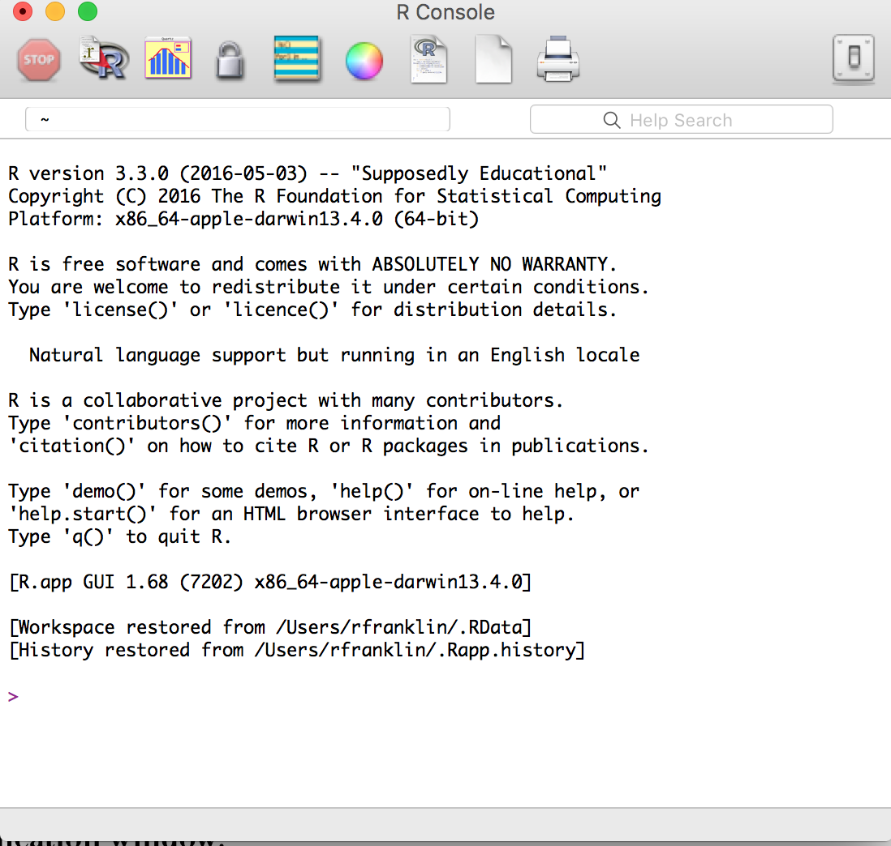
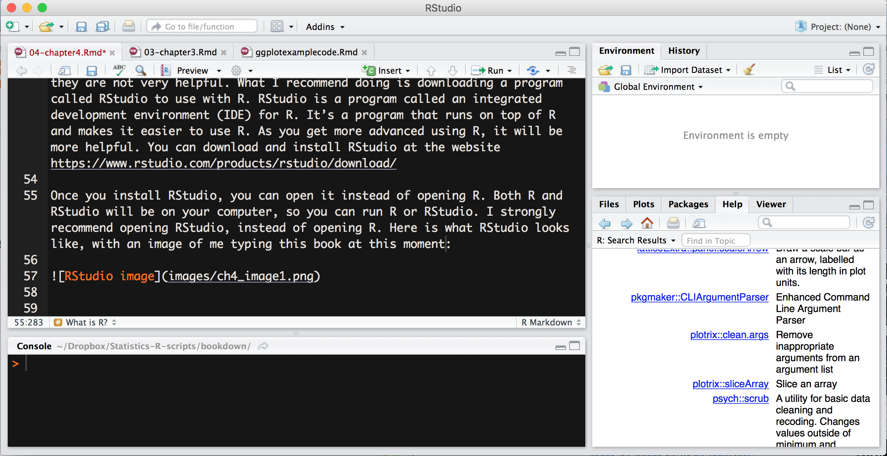
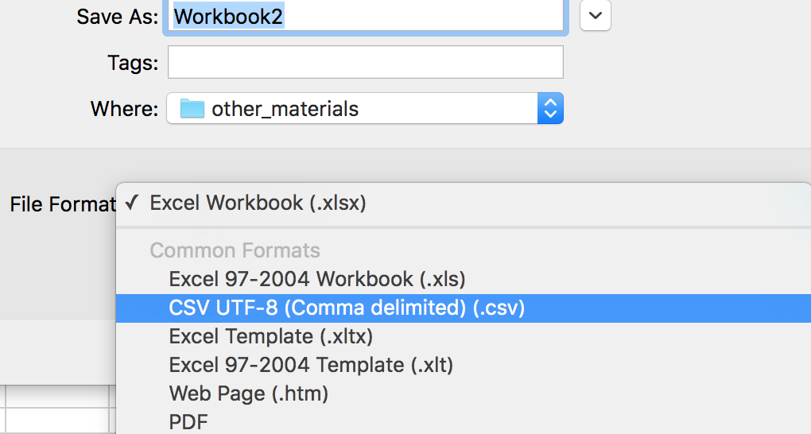
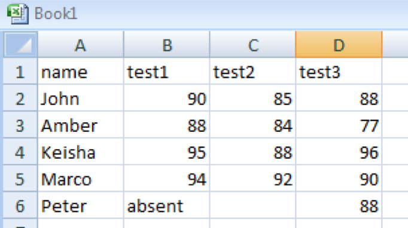
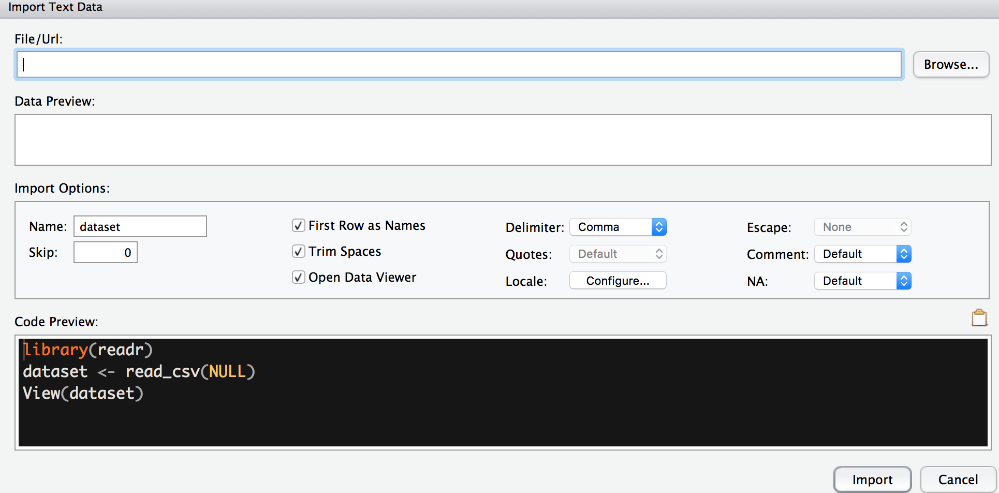

```
## Warning: package 'ggplot2' was built under R version 3.3.2
```

#Introduction to R

In this chapter, you will learn about the R statistical language and how to use it to analyze data. Specifically, we'll cover:

1. What is R and how do we use R and RStudio to do statistical analysis
2. What is the basic structure of R? How does R work? This will include understanding what variables, functions, and packages are.
3. How do we enter data into R? This will involve understanding how to use packages to import data that comes from other sources?
4. How do we do basic analyses in R? This will involve understanding how to use functions to calculate descriptive statistics.


##What is R?

I have a secret to share. I used R to write this book. All the (not so) pretty graphs and functions were generated in R. I even used R to make up some of the data that I "collected" in other chapters. So R is powerful and done right, it can be beautiful.

In this book, I'll discuss how to do some of the statistical tests and calculations by hand, but everyone uses computers to do this today. Once you try to calculate some of these stats by hand, you will start to understand why this is. Since computers are amazing at crunching numbers, there are a lot of different programs which can do statistical analyses. In my experience there are three types of programs you can use:

1.	Spreadsheet programs: Examples include Excel, Google Docs, etc. These are programs where you can enter lists of numbers and do basic calculations. They are good for entering data and I usually use them to enter in numbers. They only have limited statistical capabilities. Once you are beyond means and standard deviations, these programs are not easy to use and can even lead to some big mistakes.

2.	Commercial stats programs. Examples include SAS and SPSS. They are programs written for doing statistical analyses. They can do a lot of different things, and many of them are relatively easy to use. However, they are very expensive, with licenses that can be in the thousands of dollars. Unless you are independently wealthy or work somewhere which has bought one of these programs, you may not get to use them.

3.	Open source programs: Open-source programs are programs where the code is available for anyone to use and modify. Volunteers write these programs and give the code away for free. So, anyone can modify and edit it to make it what they want. This means that most open-source programs are free. Free is good, right? However, there's a downside. Since the people writing the program are volunteers and are not getting paid to write the program directly, these programs can often be hard to use.

R is an open-source statistical programming language. A programming language is a set of commands that are interpreted by an interpreter to do something. What that means is that a user will give R a command, or a list of commands, and get an output. So instead of clicking with a mouse, what a user will do is type a command and get an answer. A command could be something really simple. Here are some commands written below. In this book, the commands will be written in this `blocky font` and will often have the color highlighting that's listed below.


```r
3 + 5
mean(c(22,44,99,311))
numbers = 1:100
t.test(DV~IV, data=mydata)
print("I love R")
```

R comes with a set of commands built into it called the base package. These are the first commands made with R and they cover basic math functions, data entry functions, and statistics functions. But the power of R is that there are functions to do almost anything that any statistician would ever want. And if there is a new stats test or new function that doesn’t exist, you can write your own. The best part is that you usually don’t have to write your own because someone else has probably already done it. People have written thousands of add-on packages you can add to do all sorts of analyses. We will use a lot of these packages this in this class.

So R is free, and has thousands of add-ons. It sounds wonderful, right? If it weren’t free, wouldn’t I be trying to sell it? But there’s a catch. R is a programming language and that’s difficult to use if you don’t have experience programming. Plus, as programming languages go, R is not the easiest to use. So you might struggle with R. However, whenever you struggle with R, just remember you can pay several thousand dollars and get a commercial program which is only slightly easier to use.

Now, how do I get R. You can download R from the cran-r-project website: https://cran.r-project.org. This gives versions for Windows, Mac, and Linux. The website has installation instructions. Once you install R, you should see something like this.

 

If you click around, you may find this hard to use. It has some menus but they are not very helpful. What I recommend doing is downloading a program called RStudio to use with R. RStudio is a program called an integrated development environment (IDE) for R. It’s a program that runs on top of R and makes it easier to use R. As you get more advanced using R, it will be more helpful. You can download and install RStudio at the website https://www.rstudio.com/products/rstudio/download/ 

Once you install RStudio, you can open it instead of opening R. It should look like this:

 

Here is what RStudio looks like, with an image of me typing this book at this moment:

 

It is important to note that both R and RStudio will be on your computer, so you can either of them. RStudio needs R but R does not need RStudio. However, I strongly recommend opening RStudio, instead of opening basic R.

##The basics of R

If you open RStudio, you should see something like this. Let me give you a brief tour of some of the different features of RStudio.

 

RStudio has two different panes. On the left side, you have what is called the console. This is where you can enter in your R commands, which we will do in a minute. On the right side, you have two other windows which are helpful. The top-right window contains something called your **workspace**. This is a list of all the functions, variables, and other things you have in R at one time. And at the bottom right, you will see a window with several tabs, such as files, plots, packages, and help. This contains additional information which may be useful.

###Basic Math Functions

As mentioned in the last section, R is a programming language. You do some input and get some output. The input are called commands and you run them by typing them in the console and pressing enter. At its simplest, R is like a big calculator. For instance, I could type the following:


```r
38 + 74
```

```
## [1] 112
```

As a note, any command I show you in R will be in the shaded box like the box above. Additionally, the output that you would see in the R Console will be listed below the command. In this case, the output says "[1] 112".

Some basic math functions in R are listed here:

|Function|Symbol|
|--------|------|
|Addition|\+|
|Subtraction|\-|
|Multiplication|\*|
|Division|\/ (forward slash)|
|Exponent| \^|

If I wanted to multiply 24 and 8, I would type this:


```r
24*8
```

```
## [1] 192
```

I get 192. You might be wondering what the 1 in brackets means. It means that R is outputting one number and that its value is 192. This is helpful if R outputs a list of numbers. The number in brackets tells me what number in the list is the value immediately to its right. For instance, if it said [33], then I would know that the value immediately to the right of the [33] is the thirty-third element.

With that said, let's try to type some commands and see what the output is. Try typing the following commands: (note that I didn't output the answers below).


```r
45 +39
34562 * 24728
854/2
11^3
```

###Objects

If this was all that R could do, it would be no better than a calculator. The power in R is that we can do a lot more, and the first element of this power is the concept of **objects**. An object (also known as a variable in other programming languages) is something created in R that stores something. An object is like a box. The box stores something and the thing stored in the box can change, depending on the context. 

There are many types of objects depending on what is stored in the object. The simplest object is a variable, which is an object that stores one value. A variable is something that stands for one value, usually a number but it can also be a string of letters.

The simplest variable might be the one you remember from algebra, the letter x. If we want to make x equal 1, we would type:


```r
x = 1
```

That’s because there is nothing to be output. R simply does the command without a word. But if you look to the top right of your RStudio screen, you might see a change to your workspace. It will say under Values, x and 1.


When assigning variables, we always put the variable on the left, then equals, and then the value to assign on the right. If this confuses you, you can use another way to assign values, which uses an arrow, made up with a less-than sign and a dash, which looks like \<\-. 

So you could type:


```r
x <- 1
```

Many R people like this way of assigning variables, but it is a way of assigning variables that is particular to R whereas using equals is something done in many programming language. The choice is up to you, but since I used other programming languages before learning R, I use the equals to assign variables.

Variables can have any name. You could use a single letter, or longer letters. You can also use numbers and some symbols, as long as the variable starts with a letter. However, I recommend sticking with letters. Here are a few examples:


```r
x = 3
y = 11
number = 24
name = "Sarah"
```

Notice in the last example I used letters instead of numbers. If I put letters in quotes, I can assign letters or any other characters to a variable, called a string.

I can also do math with variables. Look at the following:


```r
x = 4
z = 12
z - x
```

```
## [1] 8
```

Notice now I get an output when I type z \- x. This is because R is calculating the value for z minus the value for x and then outputting it in the screen. I can also use this to use one variable to set the value for another variable.


```r
x = 11
y = x
```

In this case, I set the value y to equal what x was, which is 11. Notice that if I mix up the order of x and y, I get an error:


```r
x = 14
x = k
```

```
## Error in eval(expr, envir, enclos): object 'k' not found
```

In this case, I get an error, because R is trying to set the variable x to be what the variable k is, and since there's no variable k, there's no value for x.

Objects can hold more than one number as well. If you type the following, you will get an error:


```r
x = 1, 3, 5, 7, 9
```


That’s because R has no idea what is going on. R assumes you are assigning the value 1 to x, and then there are a bunch of other letters randomly added to the command. Whenever R gets input it doesn't understand it give you an error. So, to enter multiple numbers, you can use something called a function. In R, all functions are a command followed by parenthesis. What is contained in the parenthesis is the input to the function. Each function takes the inputs, does something, and then sends an output, either to the screen (if nothing is given with equals), or to an object.

The simplest command for R is one called concatenate, which means to put more than one item into a list. Since concatenate is a long word and I generally can’t spell it right, R just shortened it to `c()`. So type the following:


```r
x = c(1, 3, 5, 7, 9)
```

This is simply a command that tells R that you’re making a **vector**, or a variable with more than one number. Try typing the following examples:


```r
ages = c( 19, 21, 24, 27)
IQ = c(97, 132, 88, 101, 94, 107)
presidents = c('George','John','Thomas')
```

Vectors are powerful because you can use them to enter variables and do statistics on the variables. 

An important thing to note is that like most computer languages, R is case sensitive. So if you make a variable "Ages", it is different from "ages", or "AGES". If you are like me, you will make many errors by forgetting how you capitalized variables. My solution is to never capitalize anything unless it's a standard abbreviation which is always capitalized, like "IQ".

###Data frames

There are many ways to enter data into R, but the one that I use most commonly is a dataframe. A dataframe is a table with rows and columns. Each column represents a variable and each row represents an observation. This is the same way as we mentioned in Chapter 2. 

A table may look like this:


|   name   |  sex  |  test1  |  test2  |  test3  |
|:--------:|:-----:|:-------:|:-------:|:-------:|
|  April   |   F   |   85    |   79    |   80    |
|   Bret   |   M   |   77    |   80    |   64    |
|  Cassie  |   F   |   69    |   64    |   90    |
| Deshauna |   F   |   98    |   93    |   81    |
|   Egor   |   M   |   89    |   90    |   99    |

Each row corresponds a subject (in psychology, usually this is a person) and each column is a variable. By following each row, we can see all the values for a particular person. If we wanted to see Deshauna's scores, we would follow the fourth row.

This format of data is called tidy data and it makes it much easier to set up data. You can read more about this format in the book linked [here](http://r4ds.had.co.nz/tidy-data.html).

To make a data frame in R, I have to create several variables on their own using the `c()` command and then combine them using the `data.frame()` command. Here is how I would make the data frame in the table above. In this case, I am naming the data frame "grades".


```r
name = c('April','Bret','Cassie','Deshauna','Egor')
sex = c("F","M","F","F","M")
test1 = c(85,77,69,98,89)
test2=c(79,80,64,93,90)
test3=c(80,64,90,81,99)
grades = data.frame(name,sex,test1,test2,test3)
```

If you type the name of the dataframe into R, you will see the dataframe listed, like this:


```r
grades
```

```
##       name sex test1 test2 test3
## 1    April   F    85    79    80
## 2     Bret   M    77    80    64
## 3   Cassie   F    69    64    90
## 4 Deshauna   F    98    93    81
## 5     Egor   M    89    90    99
```


Now, it might be helpful to access various parts of the dataframe. If you want to see just a single variable or column, you can use the following notation: 


```r
dataframe$variable
```

To view the scores for test 1, we would type


```r
grades$test1
```

```
## [1] 85 77 69 98 89
```


We can also create new columns by doing math to other columns. If we want to create a variable that has the total number of points in a class, we would do the following:


```r
grades$total = grades$test1 + grades$test2 + grades$test3
```


Now if we want to see our new variable, we can type:


```r
grades$total
```

```
## [1] 244 221 223 272 278
```

If you want to see a data frame, you can look at them by using the View() command. So you would type the following to view grades:


```r
View(grades)
```

This has to be a capital V. In RStudio, this will pop up a window above your console with the data frame entered. This is how it looks in RStudio.


Notice how RStudio has four windows. The top-right window shows what you are viewing. If you want to close it out, you can click the little x by the tab that says “grades”. With R, you can have many data frames open at once. If you see the top-right window, it should have a tab called “workspace”. The R workspace is the list of all the objects you have, including vectors and dataframes. You can also see all that is in your workspace by typing:


```r
ls()
```

This is a weird command because there are two parentheses with nothing in them. Occasionally we have commands that have no inputs. We put the parentheses () at the end so that R knows this is a command

If you want to back up your workspace, you can save your workspace by going to the Session -> Save Workspace As. menu. You can also load previously saved workspaces by going to Session -> Load Workspace. Loading a workspace doesn’t delete your previous workspace; it just adds to them, like a desk getting more cluttered.

Finally, to remove items, you can use the `rm()` command, putting the name of the object in the parenthesis. So to remove the vector containing names, you could type:
	

```r
rm(name)
```

This is a good way to keep your workspace clean, because the more you have in your workspace, the more memory it uses. If you’re working with big files, workspaces can get very large. 

##Inputting data into R

Inputting data into R by making vectors and using the `data.frame()` command is awkward, especially for a lot of data. It’s much easier to input your data into a spreadsheet and then import the data from the spreadsheet into R. I will discuss two ways to input data: One is using .csv files using a spreadsheet program and the second is using the gsheet package which allows you to input data from a spreadsheet on Google sheets.

###Inputting data from a .csv file

Any spreadsheet program, such as Microsoft Excel or Google Docs, will allow you to export data using the csv file format. CSV stands for comma separated values, and it is a common way to store a table of data. To save data as a .csv file, you should select this as an option when saving a spreadsheet. For instance, you would select the following in Excel:



Before you save the spreadsheet, there are a few steps you can do to make sure the data are imported into R. 

1.	Data frames have data listed so that each column is a different variable and each row is a unique observation. So data must be exactly rectangular. Each row must have a value in all the columns and each column must have a value in all the rows.

2. The first row should contain column names. This isn't necessary, but is a lot easier than doing it without. Column names should be simple names with no spaces or other non-letter characters. If you want to use multiple words, you can separate them with a period or underscore. Examples might be: "reaction_time" or date.of.birth. 

3.	Each column should contain all the same type of data, other than the column names. If a column contains numeric data, *do not mix any other types of characters*. This includes text or other non-numeric symbols except decimal points (like numbers with commas). If a column has both numbers and text, R will assume that variable is all text strings and turn the numbers into the wrong variable.


This is an example of good data. Each column has a value in all the rows and there are all the same type of data.



This is terrible data entry. The Peter row is not full and the word absent is written into the row for test 1. When this dataframe is read into R, it will not read correctly. R will assume that the column for "test1" are strings, rather than numbers.

If you are missing data, you should use the letters NA (capital N and capital A). R uses this for data which are missing. Handling missing data is a pain and beyond the scope of this book, so I will try to avoid it as much as possible.
	
Once you have written your table, you should save it as a .csv file. For instance, this is listed in Excel as “CSV (comma delimited)”. Once you save your data, you can input the data into RStudio by clicking Import Dataset in the environment window (or clicking File -> Import Dataset -> From CSV). This pops up the following window:
	


Here you would select the .csv file you saved and then if you set up the data correctly, it should import into R.

Once you have input your spreadsheet into R, you should make sure it looks right by typing View(x), replacing x with whatever named your dataframe. If it does not look right, you may have to adjust how you put your data into R.

One final note: you might input your data and see a bunch of extra rows or extra columns added to your data. This is because Excel added empty rows or columns to the csv file that it should not have. To fix that, open your file in excel, select only the data you want, just the rectangle containing your rows and columns, and copy that to a new spreadsheet and immediately save it as a csv file.

In this book, many of the examples will be saved as csv files. I like to use these because they are usable on any operating system and don’t require a non-free program like Excel or SPSS to use. You can use several free programs to make csv files, such as LibreOffice or an online program like Google Docs. 

###Importing data from Google Sheets

Many of my students use Google Sheets, a part of Google Drive, to enter their data. We can take data straight from Google Sheets and import it into R by using a package called gsheet. As mentioned above, a package is an set of addon functions that someone wrote for R. To use these addons, we have to first install them. We would do that by using the install.packages() command. To install gsheet, you would type:


```r
install.packages('gsheet')
```

If you do this for the first time, R might ask you to select a mirror, which is a server which holds all the packages for R. You should select one close to your physical location. Then you may see a bunch of characters appear, and hopefully no errors.

You only have to install packages once. However, you need to load a package each time you use R. To do this, you would type:


This loads the package into R. 

Now to import a spreadsheet into R, you will first need to enter the data into Google Sheets just like mentioned above, and then get the shareable link. This link is available by selecting the "Share" icon in Google Sheets, and then clicking the "Get Shareable link" in the dialog box that appears. Once you have the link, you would paste it in the following command. This command saves the spreadsheet at the link below to the data frame d.


```r
d = gsheet2tbl('https://docs.google.com/spreadsheets/d/1zew/edit?usp=sharing')
```

##Descriptive statistics in R

R has some functions which allow for us to get descriptive statistics for variables and dataframes.

The simplest of these are the built-in functions `mean()`, `median()`, and `sd()` which give the mean, median, and standard deviation. These functions take one argument, which is a list of numbers. If we want to calculate the mean of a list of numbers, we would do it this way:


```r
x = c(12,47,92,38,74)
mean(x)
```

```
## [1] 52.6
```

Instead of assigning numbers to a variable, we can **nest** the `c()` function inside of the `mean()` function.


```r
mean(c(12,47,92,38,74))
```

```
## [1] 52.6
```

Both of these do the same thing.

These functions can also be used with data frames to get the means of variables. In this case, to select the use the \$ character, we can select only the column. We would type `dataframe$column`.


```r
mean(grades$test1)
```

```
## [1] 83.6
```

```r
sd(grades$test2)
```

```
## [1] 11.38859
```


If we take the data frame we made in the last section, called grades, we can get some summary statistics by using the `summary()` function that is built into R.


```r
summary(grades)
```

```
##        name   sex       test1          test2          test3     
##  April   :1   F:3   Min.   :69.0   Min.   :64.0   Min.   :64.0  
##  Bret    :1   M:2   1st Qu.:77.0   1st Qu.:79.0   1st Qu.:80.0  
##  Cassie  :1         Median :85.0   Median :80.0   Median :81.0  
##  Deshauna:1         Mean   :83.6   Mean   :81.2   Mean   :82.8  
##  Egor    :1         3rd Qu.:89.0   3rd Qu.:90.0   3rd Qu.:90.0  
##                     Max.   :98.0   Max.   :93.0   Max.   :99.0  
##      total      
##  Min.   :221.0  
##  1st Qu.:223.0  
##  Median :244.0  
##  Mean   :247.6  
##  3rd Qu.:272.0  
##  Max.   :278.0
```

This gives us the mean of every variable, along with the minimum, first quartile (25th percentile), median, third quartile (75th percentile), and maximum. This is helpful but does not include the standard deviation, which is a commonly reported statistic. We can use another function, the `describe()` function, to look at many descriptive statistics for all the data at once. The describe function is in the psych package, so we have to install that first. (See the section on importing data for more about installing packages). We only have to install the psych package once.


```r
install.packages('psych')
```

Then we would type the following:


```r
library(psych)
describe(grades)
```

```
##       vars n  mean    sd median trimmed   mad min max range  skew kurtosis
## name*    1 5   3.0  1.58      3     3.0  1.48   1   5     4  0.00    -1.91
## sex*     2 5   1.4  0.55      1     1.4  0.00   1   2     1  0.29    -2.25
## test1    3 5  83.6 11.13     85    83.6 11.86  69  98    29 -0.04    -1.81
## test2    4 5  81.2 11.39     80    81.2 14.83  64  93    29 -0.38    -1.66
## test3    5 5  82.8 13.03     81    82.8 13.34  64  99    35 -0.19    -1.63
## total    6 5 247.6 26.67    244   247.6 34.10 221 278    57  0.09    -2.18
##          se
## name*  0.71
## sex*   0.24
## test1  4.98
## test2  5.09
## test3  5.83
## total 11.93
```

<!--
##Basic graphs in R

Through the ggplot2 package, R has powerful graphing features. There are whole books written about how to use the ggplot2 package to make graphs. A good primer is at this [website](http://r4ds.had.co.nz/data-visualisation.html).

The ggplot2 package can be installed using this command:


```r
install.packages('ggplot2')
```

Once we install the package, we can load it and create a plot using the qplot() command. In this case, I am creating a histogram of the values for the grades in exam 1.


```r
library(ggplot2)
qplot(x = test1, data=grades)
```

```
## `stat_bin()` using `bins = 30`. Pick better value with `binwidth`.
```


-->

##Summary

This chapter only gives the basics of how to use R. However, we will use R in the rest of this book in order to illustrate the concepts that we will cover. In addition, I will also describe how to do the various statistical tests and procedures in R, along with describing basics about the theory behind the test.

The point of this book is to help you know how to analyze data by knowing which techniques to apply, when to apply them, why you are applying them, and what the results tell us. R helps us tremendously in doing this.

After this chapter, you should be able to do the following:

1. Be able to understand how to install R and open R and RStudio. After this, you should be able to know the main parts of the RStudio window and know how to use R like a calculator.
2. Understand what variables and commands are and how to use them. Know how to make a variable (single number), vector (list of numbers) using the `c()` command, and how to make a dataframe out of a series of vectors.
3. Be able to import data into R using a .csv file and optionally importing data from Google Sheets using the gsheets package.
4. Be able to get basic summary statistics from R using the `mean()`, `median()` and `sd()` command and get summary statistics from a dataframe using the `summary()` command and the `describe()` command from the psych package.
