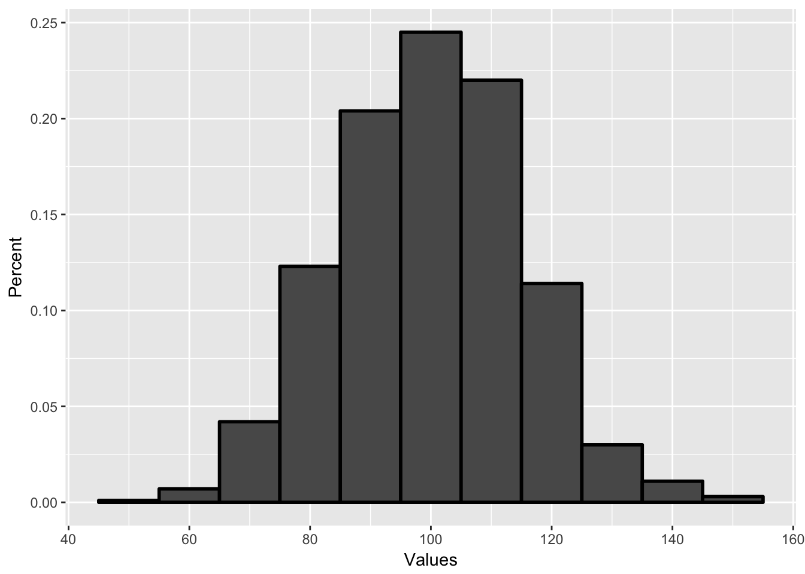
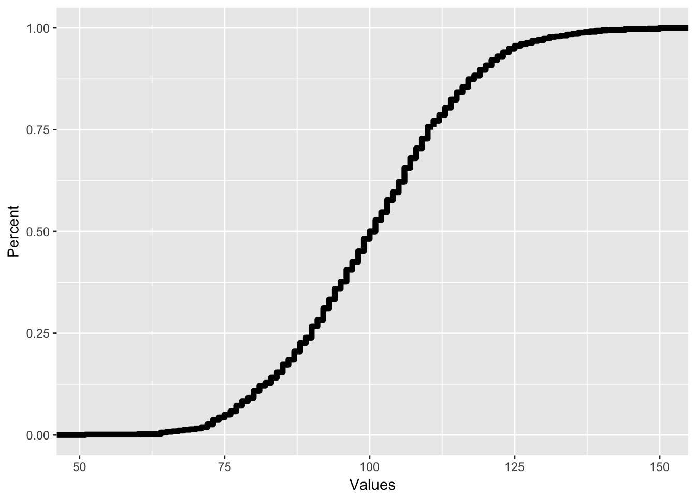
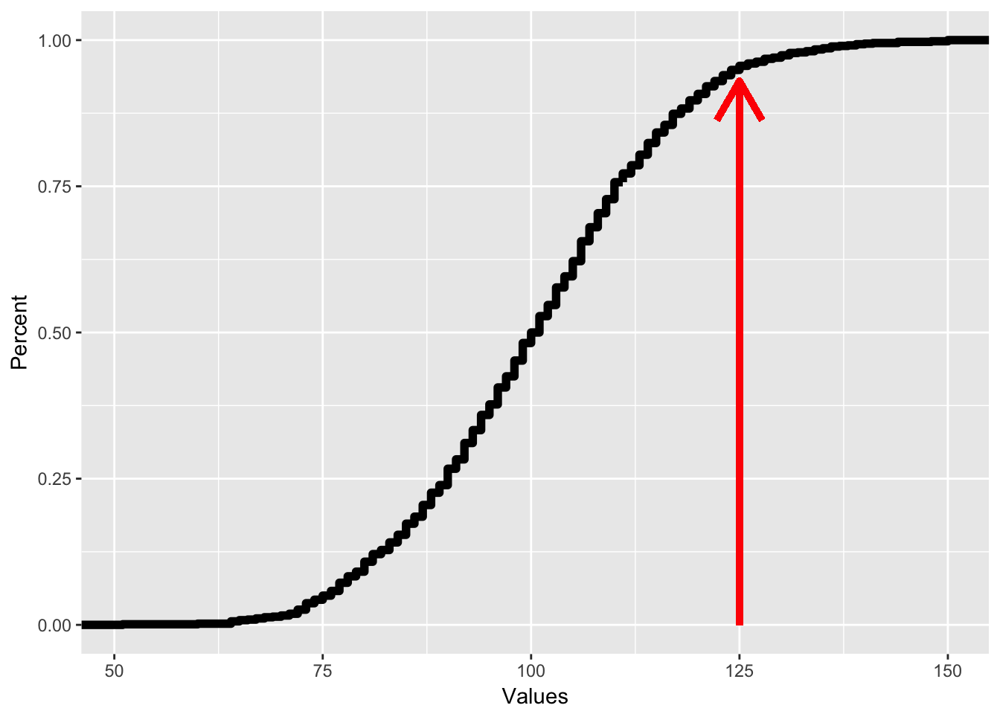
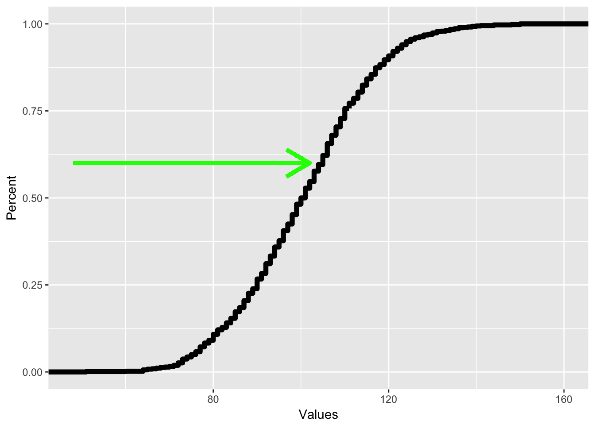

```
## Warning: package 'ggplot2' was built under R version 3.3.2
```


#Probability and Samples

In this chapter, we will cover the following topics:

1. What is probability and what does it represent
2. How probability works, using basic examples of probability problems
3. How we use probability to interface with distributions
4. What sampling is and how probability allows us to sample

##What is probability?

There's a thirty percent chance for rain. A certain horse has 5-1 odds of winning a horse race. You have a fifty/fifty shot of getting heads when you flip a coin. The odds of winning the lottery are one in a million.

We hear probability estimates all the time in our life. But what does probability really mean? When there's a thirty percent chance of rain, what is that saying?

Probability is a branch of math which is involved with studying uncertainty in events, usually future events. Uncertainty is when we do not know what is going to happen, but we have some information about what the truth is going to be. 

I'll start with the complicated definition of probability and then break it down. **Probability** is defined as a subjective estimate of likelihood that something will happen, defined as a decimal from 0 to 1. A probability of 0 indicates an event which will never happen, or is impossible. A probability of 1 indicates an event which is certain. Since few things in life are that certain, almost all estimates of probability are somewhere between zero and one.

There are two ways of thinking about subjective estimates of likelihood. The first is called relative long run frequency of occurrence. Based on this, probability represents the percent of times something would happen, if I did the exact same scenario millions of times (the long run).

For instance, the probability you get heads if you flip a coin is 50%, or 1 in 2. That means you are just as likely to get heads as you are to get tails. If you flipped a coin twice, you won’t always get 1 heads and 1 tails; actually this happens only 50% of the time. However, if you flip a coin ten million times, you would get heads almost exactly 50% of the time. You won't get exactly 5 million heads, but you would be very close to 50%. In fact, you are almost certain to get heads 49.95% and 50.05% of the time. The more often you do an event, the closer the frequency of occurrences (like number of heads) gets to the probability.

In many cases, we can use math to figure out what the relative frequency of occurrence would be in a certain situation. We'll talk about this in the rest of the chapter. However, this is only if we know all the possible information about a situation. For a coin or for lotto tickets or for rolling dice, I know all the possible outcomes and I know (or assume) that the probability of each outcome is equal, so I can calculate the probability.

However, in many cases, we don’t know all the information. For instance, bookmakers set the odds that a team will win a game or the odds a certain horse will win a horse race. Their view of the odds is based on what they know, and their best guess about how good a team is. However, they cannot know all the information. So what probability in this case represents is a subjective belief, or a best guess of the likelihood that something is the case, given what we know.

This second view of probability, or the idea of subjective estimate of belief, is most relevant to behavioral science. In science, we don’t know the full story. We are trying to find information from data, and the more data we get, the more information we have, but we don’t have all the information, so we use the information we have to give a probability about what we don’t know. This class is designed to teach how we use the information we have to give estimates of what we don’t know.

The words “subjective estimate” were not in many examples of definitions of probability that I found when I was looking up what probability meant. So I figure I ought to explain what that is. Probability is based on one's perspective and different observers have different perspectives. Therefore, there is no "right" estimate of probability. Instead it depends on the observer. This can lead to some interesting paradoxes.

Imagine a pregnant woman getting an ultrasound to find out whether her baby is a girl or boy. There is about a 50% chance that the baby is a girl or boy (actually the likelihood of having a girl or boy is 51% boy, 49% girl). Once the ultrasound technician looks at the ultrasound, they see the baby is a girl. To the technician, there is a 99% chance the baby is a girl.

However, the mother does not want to know the sex, so she is not told the sex. Did her probability estimate change? No, because she doesn’t know the information. To the mother, the odds are still 50/50 for a boy or girl, even though to the ultrasound tech, the odds are 99% girl.

Here's another example. The odds makers say there's a 60% chance that a certain team is going to win the World Series. However, you know that the team's best pitcher is sick and will miss the series. So you know that the estimate is too high, because you have additional information.

Since probability is a subjective estimate of how likely something is, more information should change our estimates. In science, we never have all the information about how likely something is, and so probability is a degree of belief about how likely something is and is always changing.

One framework for examining how probabilities change given information is called Bayesian probability or Bayesian statistics. This is a way of using mathematics to determine how information changes probability. The way that Bayesian probability works is beyond the scope of this book, but the way that Bayesian perspectives think about probability can be applied to understanding how we think about information.

Imagine that you are having a picnic this afternoon and you want to know whether it will rain. You figure it rains 25% of the time so that’s your first guess. This is a concept called prior probability, or your initial estimate of probability. You are about to leave and you see big storm clouds overhead. This is more information and so you should change your estimate. In this case, you would probably think that rain is more likely, so you would increase your estimate of the probability of rain, maybe to 50%. This new estimate is called posterior probability, or the probability after more information is added. 

Then the posterior probability can then be a new prior probability as you add more information. After you see the clouds, you look at the weather forecast and you see that there is little chance for rain. So with even more information, you may change your estimate again.

Bayesian statistics gives us a way to use statistics as information to change the likelihood that something is true. When we are doing research, we generally have an idea that we think may be true and a prior probability in our mind. For instance, if I think that coffee may protect against Alzheimer’s disease, I can take all the articles I read about coffee and Alzheimer’s disease and come up with a likelihood that this is true. If there’s a lot of good evidence, I may give a high initial prior probability. If there is not much evidence, I may give a low prior probability

Bayes’s Theorem is a concept that mathematically says how we can change prior probability to posterior probability when given new information. However, for this section it’s important to just know how probability relates to new information.

##Calculating probability of events

Objective estimates of probability can be made by following one of a series of rules. In mathematical treatments of probability, these are called axioms. In this section, we will discuss some of these rules and the concept of independence. 

As mentioned in the last section, probability is defined as the likelihood something will happen, estimated between 0 and 1. So, the notation for this is $P(A)$, which is the probability that A will happen. Because the probabilities add up to 1, we can also know that the probability that A happens or that A does not happen (denoted as $P(A')$), is 1. 

Now, if you have several events, and each event has an equal chance of occurring and only one event can occur, the probability for any one event is $\frac{1} {N_{\text{total}}}$, which is 1 divided by the total number of events.  If you have a fair coin with an equal likelihood of each event, you have two possible events, heads and tails. In this case, the chance for any one event is $\frac{1}{ 2}$. The chance for heads is $\frac{1}{2}$ and the chance for tails is $\frac{1}{2}$.

If you have a six-sided die, you have six possibilities for outcomes, rolling a one, two, three, four, five, or six. In this case, the probability that you roll a 1 is $\frac{1}{6}$. since there are six possible outcomes. If you are playing cards with a 52 card deck, the chance you draw any one card is $\frac{1}{52}$. because there are 52 possibilities. This may seem simple, but it is the first building block to the rest of probability.

The second concept, called the addition law of probability, is that the probability of one or another event is the sum of their probabilities minus the chance that both events would happen. Since we assume that only one event can happen, the chance both events can happen is zero. This is written using the following math-speak: $$P(A \text{ or } B) = P(A) + P(B) – P(A \text{ and } B).$$
	
This can help with calculating more complex questions. The chance you roll either a 1 or a 2 in a six-sided die is: $$P(\text{rolling 1}) + P(\text{rolling 2}) = \frac{1}{6} + \frac{1}{6} = \frac{2}{6}$$. 

The way I remember this is by thinking the chance of something OR something else is adding. So OR leads to adding.

By putting these two concepts together, I can extend probability to calculate multiple outcomes at once. If there are many possible outcomes and I want to know the chance that a subset of those outcomes happen, the chance of that is: $$P(\text{What I want)} = \frac{\text{Number of outcomes I want}}{\text{Total number of outcomes}}$$ 

For instance, if I’m playing a card game and I want to draw a heart and there are 45 cards left in the deck and 11 of them are hearts, the chance of drawing a heart is 11/45. Likewise, if I’m playing bingo, and I have three numbers that can give me a win and there are 20 possible numbers, the chance I will win is 3/20 when the next number is drawn.
	
The final thing to know is that these concepts can be extended to situations where the likelihood of each event is not the same. For instance, imagine if I am playing a game where I roll two six-sided dice. The chance I roll a 2 is different than the chance I roll a 7, for reasons we will discuss later. The chance of rolling a 2 is 1/36 whereas the chance of rolling a 7 is 6/36. So the chance of rolling a 2 or a 6 is just adding those probabilities up, 1/36 + 6/36, or 7/36. 

Probability can be extended to multiple events. For instance, I talked about the probability of getting a number that is the sum of two six-sided dice in the last section. Each die represents its own possible event with its own outcome. Also, I might want to know the outcome that I have two girls as children. The chance of having a boy or girl is roughly 50%, but what about two children, which are two separate outcomes.

When combining probabilities of two or more events, we have to know whether those events are independent. **Statistical independence** means that our knowledge about the outcome of one event or variable does not affect our beliefs about another variable. One’s height and one’s favorite color are probably statistically independent. If I know your height, this does not tell me anything about what your favorite color would be. 

On the other hand, statistical independence is defined if knowledge of one variable or outcome affects the probability of the other outcome or probability. For instance, knowledge about how long someone’s legs are necessarily affects knowledge of how tall someone is because leg length is part of one's height. Leg length does not guarantee height, but it does predict height since it is part of what makes a person tall or short.

In probability, if two events are independent, knowing about one event does not affect our subjective belief of the probability of another event. If I roll two dice, one die being red and the other blue, the outcome of the red die does not have any influence on the outcome of the blue die. Knowing that I rolled a 1 on the red die will not change any estimate I have about the outcome of the blue die. However, the number that is the total of both dice is dependent on the red die. Knowing that I rolled a 1 with the red die affects my view of the probability that the sum of both dice is a certain number.

Another example might be playing a game where I roll two dice repeatedly. Each roll of two dice is independent of the next roll. If I roll a high number several times in a row, I might think I’m on a lucky streak and more likely to do better. This is not the case because the probability of each roll is not affected by the other probabilities. However, this is an example of the **gambler’s fallacy**. The gambler's fallacy is a bias of thinking where people think that prior outcomes have influence on subsequent outcomes even though they are independent, and thus unrelated. A person may think they are on a lucky streak and that they will keep getting good rolls. Or they might think that they have had a lot of bad rolls in a row and are due for a good roll. This bias of thinking is the erroneous belief that one roll affects another roll.
	
However, there are many cases where probability is dependent, or where knowing the outcome of one event changes the probability of the subsequent events. Imagine I have a deck of 52 playing cards and I draw one card, look at it, and then draw a second card. When I see the first card, my estimate of probability about the second card changes, because I have more information. If I draw a king of clubs for the first card, I know that the second card cannot be the king of clubs. The chance of any other card has changed. After drawing the king of clubs, there are 51 possibilities, not 52. So the chance of drawing a different card, like say the eight of hearts, is 1/51, not 1/52. Likewise, the chance for drawing a club is different. Since a card deck starts with 13 clubs, the original chance of drawing a club is 13/52, or 1/4. Now, after drawing a king of clubs, the chance is 12/51, since there are only 12 clubs remaining in the 51 card deck.

The idea of statistical independence and dependence is a very important one because it helps us to determine the types of statistics we can do. Since dependence adds information, it helps us to be more accurate about our probability estimates. For instance, if you and a friend are playing this card game and you draw a king of clubs without showing your friend and your friend is supposed to draw the next card, you have a different view of the probability than your friend. Since your friend knows nothing about what you draw, from her perspective, there is a 1/52 chance to draw any card. The fact you drew a card and didn’t show her is irrelevant.

The chance that two separate outcomes both happen from two separate trials is $P(A)*P(B)$, or the product of the probability of each of those events. If the two events are independent, it is easy to find out the probability of each event, because you calculate it on your own. For instance, if you have a blue six-sided die and a red six-sided die and you roll them, the probability you roll two even numbers is the chance you roll an even number with the red die multiplied  by the chance you roll an even number with the blue die. As we discussed above, the chance of rolling an even number is 1/2, so the probability is $1/2 * 1/2 = 1/4$. Likewise, the chance a person will have two girls is $1/2 * 1/2 = 1/4$, since the chance of having a girl is 1/2.

I call this the “and” rule of probability. Assuming A and B are independent, the chance that A **and** B happen is A multiplied by B. Or: $P(A \text{ and } B) = P(A) \cdot P(B)$ This is contrast to the “or” rule discussed earlier. The chance A or B happen, is the sum of A and B (minus the probability that A and B both happen).

##Probability and sampling

The final thing is how we can apply what we know about probability to answer questions about sampling. Sampling is when we take a subset of a population and the simplest form of sampling is to take one individual.

Imagine I had a study where I asked people to rate their mood on a 5 point scale, with one being very negative and 5 being very positive. I might get results like this, in a frequency chart:

|  Rating  |  Frequency  |
|:--------:|:-----------:|
|    1     |      5      |
|    2     |     10      |
|    3     |     20      |
|    4     |     20      |
|    5     |     15      |

If I select one person at random, what is the chance that they have a rating of 4? The way to answer that is to use the simple probability formula above. I take the number of outcomes I want, which is how many people had a rating of 4. Then I divide by the total number of outcomes. This gives me: $$\frac{20}{70} = .29 $$ 

There's a 29% chance that if I select one observation at random, it would be a rating of 4. If I wanted to find the chance that I select someone who gave a rating of over 3, I would use the AND rule above. I would just add the chance I select someone with a rating of 4 with the chance I select someone with a rating of 5. $$\frac{20}{70} + \frac{15}{70}= .5 $$

There's a 50% chance I select someone with a rating of above 3. By combining the probability rules, I can make these calculations.

In chapter 3, we talked about something called a **probability density plot**. This was a plot which plotted the percent of observations with a certain value. The reason we call this a probability density plot is because the percent of observations with a certain value is equal to the probability of selecting a certain value, if we select a value at random.

This can be helpful if we have very large samples. Imagine I gave 1000 people an IQ test and I found the following histogram, plotting the number of people in ranges of 10 (45 to 54, 55 to 64, etc.)


This plot gives me the number of people in a certain range. For instance, there are 245 people who have an IQ between 95 and 104, which is reflected by the big center bar. If I want to know the probability of selecting an individual in any range, all I have to do is create a probability density plot. The only difference is that the y-axis now has percent rather than a count.



Each bar represents the percent of observations that are in each range. With this, I can answer very quickly the probability of selecting a person at random with an IQ between 105 and 115. It would be about 20 percent.

There are also two different plots using probabilities that can be useful. Instead of plotting the percent of values that are in a certain range, it may be useful to plot the percent of values that are below a certain value. For instance, what percent of people's IQs are below 90? This is the exact same as a percentile, and a plot of this is called a **cumulative density plot** or CDP. Though we can use bar graphs to do cumulative density plots, these are traditionally done using line graphs, like a frequency polygon. In this case, I would have the following:



All CDFs have this shape where they start with zero on the left and end with 1 on the right. The way we read a CDF is that for each X value, the corresponding Y value reflects the percent of observations that are below a certain number. So if I want to know what percent of people have an IQ less than 125, I would see which Y value corresponds with an x value of 125, like on the plot below, where if I trace the red line, I can see that for an x value of 125, the corresponding y value is .95, reflecting that 95% of people have an IQ of less than 125.


As mentioned above, tracing the y value gives me the percentile for each x value. To find out which X value corresponds with the 60th percentile, I just trace from the y axis like so:



##Summary

This chapter covered a lot! It gave a brief overview of probability and then applied it to sampling. In this chapter, we learned about the following:

1. How is probability expressed and what does it mean? You should know that probability is a number that ranges from 0 to 1 and that it represents a subjective estimate of likelihood
2. How is probability calculated? You should know what prior and posterior probabilities represent and how probability estimates are always changing based on new evidence. You should also know how we calculate probability using the AND and OR rule
3. How does probability apply to sampling: You should know how we can use probability to calculate the likelihood of selecting an observation and what a probability density plot is. You should also know what a cumulative density plot is and how it corresponds to percentile ranks


