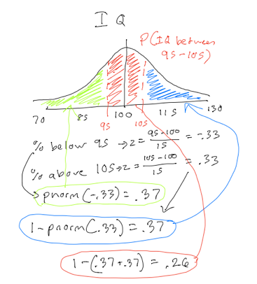

#The Normal Distribution and Sampling

In this chapter, you will learn:

1. What the central limit theorem is and how it explains why the normal distribution is so common in nature
2. The properties of the normal distribution, including its shape
3. What Z-scoring (or scaling) data is and why it is important
4. How to use z-scores to calculate percentiles based on the normal distribution
5. What sample distributions are, what the law of large numbers means, what standard error is, and how to calculate standard error

##The Central Limit Theorem

If we measure a population and plot the distribution of the values we measured, what we find is many distributions in nature have the same shape. For instance, if you think about a person’s height or IQ, or how introverted a person is, or how anxious they are, the distribution will have the same shape. There will be a few values that are low, most values are in the middle, close to average, and a few are well above average.

Why do they all have the same shape? There are two critical theorems in statistics, which we will discuss in this module. They are the foundations for why we can even do statistics at all, which is why they are so profound. The first principle we’ll discuss is the central limit theorem.

The **central limit theorem** indicates that if you take the sum of many distributions, then that resulting distribution will have the same shape, regardless of the shapes of the underlying distributions that are added together. No matter what the shape of the original distributions, they will fit this new shape, called the normal distribution, or colloquially, a bell curve.

So what does this mean? Take a person’s height. Whatever a person’s height will be is the product of many, many different processes. There are hundreds of genes which can make a person tall or short. There are hormonal factors, there are dietary factors (did you eat your vegetables?), and so forth. Each of those factors is its own distribution with an individual having different numbers for each of these factors. Whatever your height ends up being is the sum of all these variables put together.

The central limit theorem shows up in all sorts of places. For instance, if you flip a coin, you have two possibilities, each with a 50% chance of happening. This would lead to a uniform distribution, in which all the possibilities have the same chance of happening. However, if you assign heads as 1 and tails as 0 and flip ten coins and add them up, each time leading to its own distribution, your new distribution will look normal.

That’s what I did in the table below. I flipped ten coins, ten times, assigning 1 for heads and 0 for tails (since I’m lazy, I had a computer do it for me). Then I took the sum of the ten coins in each trial. Even though the outcomes were either 0 or 1, almost every time the mean of the 10 coin flips was in the middle. Most of the sums or means were around the middle value with a couple which were farther away. If you graph a histogram of the sum, it has a shape where most values are in the middle with only a few values on each side.

| Trial | 1 | 2 | 3 | 4 | 5 | 6 | 7 | 8 | 9 | 10 | Sum | Mean |
|:-------|:---|:---|:---|:---|:---|:---|:---|:---|:---|:----|:-----|:---------|
| 1     | 1 | 1 | 1 | 1 | 1 | 0 | 0 | 1 | 1 | 1  | 8   | 0.8     |
| 2     | 1 | 1 | 1 | 0 | 0 | 0 | 1 | 1 | 0 | 1  | 6   | 0.6     |
| 3     | 0 | 1 | 0 | 1 | 0 | 0 | 0 | 0 | 0 | 1  | 3   | 0.3     |
| 4     | 1 | 1 | 1 | 1 | 0 | 1 | 0 | 1 | 0 | 0  | 6   | 0.6     |
| 5     | 0 | 0 | 0 | 0 | 1 | 1 | 1 | 0 | 1 | 1  | 5   | 0.5     |
| 6     | 0 | 1 | 0 | 1 | 1 | 0 | 1 | 0 | 1 | 0  | 5   | 0.5     |
| 7     | 0 | 0 | 1 | 0 | 1 | 1 | 1 | 1 | 0 | 0  | 5   | 0.5     |
| 8     | 0 | 1 | 0 | 0 | 0 | 1 | 1 | 0 | 0 | 1  | 4   | 0.4     |
| 9     | 0 | 1 | 1 | 0 | 1 | 0 | 1 | 1 | 0 | 0  | 5   | 0.5     |
| 10    | 1 | 0 | 0 | 0 | 0 | 1 | 0 | 0 | 0 | 1  | 3   | 0.3     |


There are a few points to add about the central limit theorem. What it means is that as you take the sum of many distributions, the result will approach a normal distribution. It won’t look exactly like a normal distribution, unless there are many distributions added together with many different observations.  This is why if you graph the histogram of the example above, it won’t look precisely like a normal distribution.

The power of the central limit theorem is in how general it is. We don’t have to know the underlying variables which make up a distribution. We also do not have to know how many variables there are. In the example of height or IQ, we don’t know all the genes and environmental factors which influence these variables. However we can know they will fit a normal distribution because we know there are a lot of variables.

There are some cases where normal distributions may not occur. In some cases, a normal distribution will be skewed. For instance, we discussed in Module 3 about how grades tend to be negatively skewed, with most people having high grades and a few people having very low grades. This is caused by a ceiling effect. A **ceiling effect** is when a distribution is constrained from having very high values. Essentially, there is a maximum grade you can score. You can’t do better than perfect on any assignment.

The reverse of this is called a **floor effect**. A floor effect is the idea that there is a minimum value that you can’t get below. We talked about income as having a positive skew, with most people having relatively low incomes and a few people having very high incomes. This is because it is impossible to make less than zero dollars as income. However, there is no maximum income.
	
Distributions that have ceiling and floor effects are often normal distributions but the ceiling or floor is preventing the normal distribution from happening. So if the ceiling or floor were removed, the distribution would approach a normal distribution. If for instance my assignments in a class did not have a maximum grade of an 100, I might get a more normal distribution in a class. But this is impossible in many cases, such as income, so those distributions always end up skewed.

In the next sections, we’ll talk about this normal distribution and precisely why it is so powerful.

##Properties of the Normal Distribution

The beauty of the central limit theorem is that, with a few exceptions, the sum of distributions will always approach the same distribution, which we call the normal distribution. So what that means is that if we know about the normal distribution, we can know a lot about a population’s, even without measuring all the population.

The normal distribution is a very interesting distribution. It is symmetrical, with the mean, median, and mode all being the same value. It will always have the same symmetrical shape. Because it has the same shape, we can figure out the entire distribution if we only have two numbers, the mean and the standard deviation. 

Since we know the shape of the normal distribution, we can generate percentiles for the distribution, by just knowing the population’s mean and standard deviation. Since the normal distribution is always the same shape, and the area beneath a distribution reflects the percentage of observations which are in a certain range, we can know what percentile a specific value is as well as what percent of the distribution are between two values.

The easiest way to do this is by using an idea called z-scoring or standardizing. Since all normal distributions are the same shape, we can convert one distribution to another distribution by just varying the mean and the standard deviation. In order to calculate information about a distribution, we often convert a specific distribution to one where the mean is zero and the standard deviation is 1. This distribution is called the standard normal distribution.

Look at the example below. For instance, IQ is a normal distribution with a mean of 100 and a standard deviation of 15. Likewise, SAT subtest scores are a normal distribution with a mean of roughly 500 and a standard deviation of 100. If we wanted to compare IQ scores with SAT scores, we need to put them in the same scale. That way, we can compare the scores. 

In order to put scores on a z-score distribution or the standard normal distribution, we do the following formula: $$z = \frac{x - \mu}{\sigma}$$

For each score, take that value and subtract the mean from it. Then we divide that value by the distribution’s standard deviation. If we do this for each item on a distribution, this creates a new distribution with new values. The new distribution will have a mean of 0 and a standard deviation of 1. Every observation is still in the same relative place, but the new distribution is now on a standard scale. 

| Original SAT Score|Original IQ Score|Z-score SAT Score |Z-score IQ Score|
|:----------------|:----|:---------|:------|
| 620             | 105 | 1.2      | 0.33  |
| 520             | 95  | 0.2      | -0.33 |
| 470             | 90  | -0.3     | -0.67 |
| 580             | 120 | 0.8      | 1.33  |
| 630             | 125 | 1.3      | 1.67  |
| 440             | 98  | -0.6     | -0.13 |
| 540             | 100 | 0.4      | 0     |
| 380             | 90  | -1.2     | -0.67 |
| 500             | 120 | 0        | 1.33  |
| 510             | 88  | 0.1      | -0.8  |
| 490             | 100 | -0.1     | 0     |
| 520             | 96  | 0.2      | -0.27 |
| 460             | 90  | -0.4     | -0.67 |

The z-score essentially tells me how many standard deviations a score is from the mean. A z-score of 2 is two standard deviations above the mean. A z-score of -1.5 is 1.5 standard deviations below the mean. With z-scores it is a simple step to then find out one’s relative percentile rank. Since we have the z-score, we know where someone is on the distribution. Percentile is the percent of people below a certain score, so all we have to do is calculate the percent of people below a certain score. This is equal to the area under the standard normal distribution  below a certain value. For instance, in the figure below, the z-score is -1.5. The area below -1.5 is shaded in red and reflects the percentage of observations below a z-score of -1.5.

Now calculating this area under a curve involves finding an approximation of the integral of the normal distribution function, which are extremely hard to calculate. Traditionally, we would look up these calculations in a table. However, we can do this easily using R. We can do this easily in R using the `pnorm()` function. We just type `pnorm(z)`, replacing z with our z-score. and that gives us the area below a certain value on the normal distribution. This is equal to the z-score.

For example, to get the probability of a z-score of -1.5 or less, we would type:


```r
pnorm(-1.5)
```

```
## [1] 0.0668072
```

	
This indicates that a z-score of -1.5 is in the 6.7th percentile. 6.7% of observations are below this value. If we want to know the percent of observations which are above this value, we can just do the following:

```r
1-pnorm(-1.5)
```

```
## [1] 0.9331928
```


Since the area under the normal distribution is equal to 1, 1-pnorm(z) gives us the percent of observations that are above a certain value. 

When people calculate percentile ranks, this is often the method they use. Most distributions, such as height, follow roughly normal distributions. So using this method, you can calculate the percentile rank of any value if you know the mean and standard deviation of the distribution, using the following steps:

1.	Calculate the score to a z-score using the distribution’s mean and SD
2.	Type `pnorm(z)` to find out the percent of the distribution below a certain value.

Percentile rank comes up in a lot of settings. For instance, many standardized tests will report a student's performance in terms of their percentile rank. Rather than knowing that a student scored a 142 on a standardized test, it is much more informative to know that they scored in the 74th percentile.

Another instance is determining what is normal weight for a newborn baby. It's important to know whether a newborn is a healthy weight. Since, there is no absolute standard for what constitutes a healthy weight, what doctors do is use studies where they collect the weight and height of lots of babies and determine what the average weight and height of newborns born at a certain week in pregnancy would be. Then they can use this to determine how big a certain newborn is.

The average weight of a newborn girl is approximately 7.5 pounds, with a standard deviation of .6 pounds. If I assume that newborn baby weights are normally distributed, I can answer the question as to what percentile rank a certain newborn is. For instance, if a newborn girl is 6 pounds, 8 ounces (6.5 lbs), what percentile rank is she? 

Using what we learned before, first we would figure out the z-score associated with that weight.

$$z = \frac{x - \mu}{\sigma} = \frac{6.5 - 7.5}{.6} = -1.67$$

Now to find the area under the normal curve for a z-score of -1.67 or below, we would type the following into R:


```r
pnorm(-1.67)
```

```
## [1] 0.04745968
```

So we get .048, or the 4.8th percentile. This means that 4.8% of newborn girls have a weight lower than this newborn girl.

The things we give us a way to solve another problem. If we take a distribution and select one observation by chance, what is the chance that this observation is above a certain value, or below a certain value, or in a certain range.

The mean IQ is 100, with a standard deviation of 15. If I select a person from random, what is the chance that this person has an IQ above 115? We can use what we learned in the last module to answer this question.

Remember, when every outcome has an equal chance of being selected, probability is the number of outcomes we want divided by the total number of outcomes. Another way of saying this is by saying that probability is the percent of the outcomes we want, if all outcomes have an equal chance of being selected. In the example above, this would mean that the probability of selecting a person with an IQ above 115 is equal to the percent of people who have an IQ above 115.

<!--This part needs some work -->

From what we learned above, we can figure this out. To find out the percent of the distribution with an IQ above 115, what we have to do is to take the z-score of an IQ of 115. This z-score equals: $$\frac{115-100}{15} = 1$$ 

Now we need to find the percent of the normal distribution with a z-score above 1. We can use the pnorm command to do this. Remember that the total area of the distribution is 1, and that `pnorm(z)` gives the area of the distribution below a certain value. If we know that, we can figure out that the area above a specific z-score is `1-pnorm(z)`. In this case, we would type in `1-pnorm(1)` into R, and that would give us the answer, .159. 

So 15.9% of the population has an IQ above 115, which means that we have a 15.9% chance of selecting an individual with an IQ above 115.

We can use this logic to answer other questions as well. For instance, what’s the chance we select a person with an IQ between 95 and 105? This problem might seem hard at first, but we can use a couple of tricks to solve it. To solve this, we just need to figure out the area under the normal distribution of an IQ between 95 and 105. Remember again that the total area under the total distribution is 1. So what we can do is find out the percent of the distribution that has an IQ below 95 and the percent of the distribution with an IQ above 105. Then, the rest of the distribution is the percent with an IQ between 95 and 105. 



I worked out this problem above. If you look at the figure, I have the normal distribution broken into three parts. The green area is the percent with an IQ below 95. The red area is the percent with an IQ between 95 and 105. The blue area is the percent with an IQ above 105. First I find out the area of the green part, which I get by getting the z-score of an IQ of 95, which equals -.33. Typing `pnorm(-.33)` leads to 37% of the distribution. Then I find out the area of the red part. I find the z-score of 105, which is .33. Then I have to do `1-pnorm(.33)` because I want to find the area with a z-score above .33. This leads also to 37% of the distribution, which is not surprising since the normal distribution is symmetrical. Now what’s left is the red part of the distribution, or 26%. If 26% of the distribution has an IQ between 95 and 105, then I have a 26% chance of selecting a person with an IQ between 95 and 105, given that I select a person randomly.

##Sampling and Sample Means

This is where we can start to talk about the idea of sampling and sampling distributions. A sample is selecting one or more observations from a population. In the section above, we learned how to calculate the probability of selecting a single sample with a certain value. However, most of our samples are samples of more than a single observation.

Here’s an example. Above, we discussed the chance of selecting a single person with an IQ above 115. We might want to answer a different question: what is the chance of selecting four people whose mean IQ is 115 or above? This is a different question.

First, let’s think about this conceptually. Which is more likely: I select four people who have a mean IQ of 115 or greater between all four of them or the chance I select one person with an IQ of 115 or greater? 

It's much more likely to select one person with an IQ of 115 or greater than to select four people with a mean IQ of 115 or greater. No, because instead of just selecting one person, I have to select four people. The probability I select one person at random with an IQ greater than 115 is 15.9%; But to select four people with a mean IQ of 115 or greater, I have to select people with very high IQs more than once. If I randomly selected one person with an IQ below 115, the other three people need to have a mean IQ even higher than 115 so that the overall mean is still 115 or greater.

To calculate the exact probability of selecting 4 people with a mean IQ of 115 or greater, we are going to consider a new distribution, called a distribution of sample means. Every distribution we’ve seen so far involves the distribution of single scores. However, what happens when instead of taking a distribution of single numbers, we take a distribution that is made up of the mean of repeated samples. So, I take a sample, take the mean of that sample, and then do that again and again. This makes a new distribution.

The **distribution of sample means** is a theoretical distribution that would occur if we took an infinite number of samples of a certain size from a population, took the mean of each sample, and plotted the frequency of getting each value for the mean. We can’t take an infinite number of samples, but we can use math and probability to know what would happen if we did take an infinite number of samples and calculated the sample mean.

To go back to my example above, instead of taking the sample of a single person’s IQ, I am taking the sample of the means of groups of four individuals and looking at their mean IQ. When I do this, several different things happen.

1.	Each sample mean is different. If I take four people at random, I will get a different mean IQ every time. Sometimes I’ll select four people and each of their IQ will be high, and the mean will be high. Sometimes, I’ll select four people and each of their IQs will be low, and so the mean will be low. But most of the time, I’ll select some people with high IQs, some with low, and some in the middle, which leads to a mean IQ in the middle.
2.	This new sample distribution will be normally distributed. This is the central limit theorem in action. Remember, the mean of several distributions will be normally distributed, regardless of the individual distributions. In this case, the sample distribution is the mean of the same distribution taken repeatedly. So the new sample mean distribution will be normally distributed.
3.	The new sample mean distribution will have the same mean as the mean of the original distribution. This is called the law of large numbers. As we take more samples, of any size, the mean of the samples will approach the population mean. This can be shown with a nice mathematical proof, but here’s a way to think about it. When selecting samples, some of the samples will be above the original mean and some will be below the original mean. Over time, the mean of the sample means will have the same mean as the original distribution. 
4.	The sample mean distribution will have a new standard deviation that is different than the original distribution. This standard deviation will be smaller than the original distribution. This relates to the point discussed above. If I take a sample of four people, their average IQ is more likely to be closer to 100 than if I take a single person at random. For instance, to select four people with an IQ of above 115, I’d have to randomly select four pretty smart people. Or I might select three very smart people and one average person. Either way, this is much less likely than just selecting one pretty smart person. The new standard deviation of the sample distribution is smaller than the original distribution’s standard deviation, and the standard deviation gets smaller with larger samples.  

The new distribution has two important properties to know based on what is discussed above. The sample mean distribution is a normal distribution that has the same mean as the original distribution, but a different standard deviation. This new standard deviation is called the standard error and it is the calculated by taking the standard deviation of the old distribution and dividing it by the square root of the sample size.

$$SE = \frac{\sigma}{\sqrt{n}}$$

Since standard error is calculated by dividing by the square root of the sample size, the sample mean distribution shape changes with different size samples, getting smaller as samples get larger. The sample mean distribution becomes narrower with larger sample sizes.


As the size of the sample gets bigger, the sample mean distribution gets smaller, and is normal, regardless of the shape of the original distribution.

Back to IQ, if we take samples of 4 individuals, we will create a new distribution of sample means. This distribution of sample means will have a mean of 100, which is the same mean of the original distribution. However, the standard deviation of this distribution of sample means, the standard error, will be 7.5, or 15 divided by the square root of 4. If we take samples of 9 individuals, the standard error is now 5, or 15 divided by the square root of 9.

So now we get to answer the problem we started with. What is the chance that we select a sample of 4 people with a mean IQ of 115? What we have to do is calculate a new z-score, based on the sample mean distribution. The sample mean distribution of a 4-person sample has a mean of 100 because the sample mean distribution mean equals the original distribution's mean. The standard error is as follows:

$$SE = \frac{15}{\sqrt{4}} = 7.5$$. 

Now to find the chance of selecting 4 people with a mean IQ of above 115, we use the same ideas we used for selecting 1 person, only with a different distribution, using the standard error instead of the standard deviation.

In this case, we have to find the z-score of 115 from a distribution with a mean of 100 and a standard deviation of 7.5. In this case, the z-score would be 2. Then we would take the chance of selecting a z score above 2, which would be `1-pnorm(2)` or .022. So there is a 2.2% chance if we select three people, their mean IQ will be above 115. This is much lower chance than the chance of selecting just one person, which is 15.9%.

To summarize, here is how we calculate the chance of selecting a sample of of $n$ individuals with a mean of $\bar{x}$ or greater (or less) from a distribution with a population mean of $\mu$ and a population standard deviation of $\sigma$.

1. We find the z-score of the sample distribution. We can do this with the following formula:

$$Z = \frac{\bar{x} - \mu}{\frac{\sigma}{\sqrt{n}}}$$
This combines the z-score formula and the standard error formulas indicated above.

2. Then we find the likelihood of getting $\bar{x}$ or above by using the `1-pnorm(z)` command in R or the likelihood of getting $\bar{x}$ or below


<!-- Maybe to include this section
##Sampling and Inferential Statistics
-->

##Summary

This section covered a lot of important theory for statistics. The reason this is important is because we almost always deal with samples when we do research in behavioral sciences. It is rare to actually evaluate every member of a population, so we want to use samples to allow us to *infer* information about the population.

The central limit theorem allows us to theorize that normal distributions will happen in a lot of places in nature. This allows us to know things about populations even though we never measure the entire population. Because we know the information about the normal distribution, then we can apply the techniques in this chapter to know about samples.

After reading this chapter, you should be able to:

1. Articulate what the central limit theorem is and why it is important
2. Know properties about the normal distribution, including its shape
3. Apply what you know about the normal distribution and z-scores to calculate the probability of drawing an observation with a certain value from a normal distribution
4. Know what sample mean distributions are and how the law of large numbers applies to them
5. Be able to determine standard error, or the standard deviation of the sample mean and calculate the z-score and the probability of selecting a sample with a certain value, given a certain sample size.

