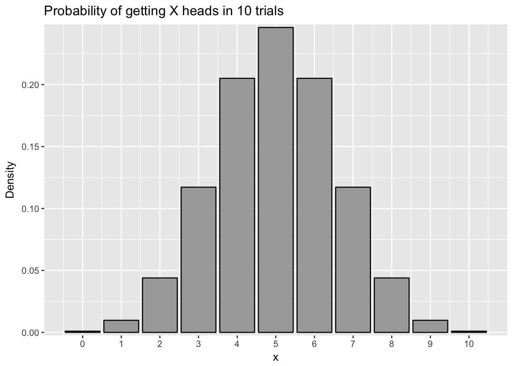

#Frequency claims


In this chapter, we will learn about frequency claims. This will cover:

1. What are frequency claims and when do we use them to evaluate hypotheses?
2. What is the binomial test and how can we use it to test the likelihood that a sample proportion is from a given population?
3. What is a chi-square test and how do we use it to generate hypotheses about whether two sample proportions are from the same population?
4. How do we apply the principles of null hypothesis testing to binomial tests and chi-square tests in order to generate null and alternative hypotheses based on freuqency claims?

##What are frequency claims?

If you read a lot of news, like I do, you will often see an article about a scientific study that says that group X is more likely to get some sort of disease than group Y. Or something like "people who do X are so many times less likely to suffer from Y than other people". These frequency claims are everywhere in research, in psychology, biostatistics, and in lots of other fields as well.

A **frequency claim** is a claim, or a hypothesis, about the frequency that something happens in a sample. It may involve questions like if something is more frequent in one group versus another group. Or it could be a claim that a frequency of events is so unlikely to happen by chance, that something special is going on.

What makes something a question involving frequency is that the outcome or dependent variable (the variable we measure) is a **categorical variable**. A categorical variable is a variable where the different levels, or possibilities for the variable, are unordered and do not have **cardinality**, i.e., no group is more than any other group. In many cases, the outcome variable is **dichotomous**, which means there are only two possible outcomes. Many variables end up this way: yes/no, hit/miss, dead/alive, in/out. All of these involve frequency claims, which we will consider in this module.

In this module, we will consider two types of statistical techniques to evaluate frequency claims. The first is a binomial test. This is a test which examines the chance a given outcome will happen, given a baseline probability. The second technique is a chi-square test. This is a case which investigates proportions given one (or more) variables.

The binomial test is what we would consider if we want to see if a sample came from a population. For instance, we may know that in a population, 7% of people are diagnosed with depression in a given year. We may want to know the likelihood it would happen, that if we selected 30 people, what is the chance we would find that 6 or more (20% or greater) would be diagnosed with depression in the last year? In the binomial test, the critical comparison is comparing a sample to a population.

The chi-square test is most often used as a way of comparing whether two proportions are equal to one another. For instance, I may want to examine if children who watch a certain violent TV show are more likely to get in trouble than children who do not watch a certain popular violent TV show. I find that of the 80 children who watch the violent TV show, 60 did not get in trouble whereas 20 did. However, of the 125 children who did not watch the violent TV show, 118 did not get in trouble whereas only 7 did. As described below, in the case of the chi-square test, we are testing the likelihood that those two proportions (the children who watch the show versus the children who did not watch the show) are from the same population.

##Binomial tests

I did a study recently when I wanted to investigate whether court judges who were running for election were more likely to get elected if they looked more competent than their opponent. I had participants who did not know who these judges were see the faces of two candidates running in a judicial election and determine which judge they thought was the more competent-looking judge. If given a pair of people to evaluate, people generally agree as to which person looks more competent, even if people are unable to describe what specific facial features make a person look more competent.

For each pair of elections, one candidate was perceived as more competent than the other candidate. If facial competence did not play a role in how judges get elected, then we would expect that 50% of the time, the more competent judge would be elected and 50% of the time the less competent judge would be elected. However, if more competent judges are more likely to be elected, then they would get elected more than 50% of the time. They would not get elected 100% of the time because there are other factors at play, such as their stances on issues, their campaigning, and so forth.

To analyze this, I could do what is called a **binomial test**. A binomial test is a test which examines the likelihood of getting a sample of a certain size with a certain number of successes from a population where there is a certain chance of success. People use the word "success" to refer to the outcome they want to investigate, and it does not necessarily mean a good outcome. So for instance, I may investigate the chance that I get 8 or more heads (successes) if I flip a coin ten times with a 50% chance of heads. 

Then I apply null hypothesis testing to this logic. The idea is that if the probability of getting that sample is sufficiently low, below the alpha level, then I would conclude that the sample did not come from the population. I set the null hypothesis to be that my sample came from the same population and that the proportion of successes in my sample is not significantly different from the population. The alternative hypothesis is that the proportion of successes is significantly different from the population.

For instance, I might test whether the coin I mentioned in the last paragraph is biased and lands on heads greater than 50% of the time. Since I got heads 8 out of 10 times, I would find the probability I would get 8 or more heads when flipping a coin ten times. To find out the chance that I would get 8 or more heads if I flip a coin ten times, I would need to find out all the possible outcomes of flipping a coin 10 times and then count how many of those outcomes involve 8 heads. I could start out by listing them, with H indicating heads and T indicating tails. I could list HHHHHHHHHH, HHHHHHHHHT and so on. However, with $2^8$ or 256 possible outcomes, this would take forever.

Fortunately, I can use the binomial distribution to calculate this for me. Like we mention in module 6, a probability distribution plot is a plot showing each outcome on the X axis and the probability of that outcome on the y-axis. There is a formula which calculates the chance of getting X successes in n trials given a p chance of success. However, using R, we can just calculate this using the `dbinom()` command. For example, the chance we get 8 heads in 10 trials, with a likelihood of success of .5 would be:


```r
dbinom(8,10,.5)
```

```
## [1] 0.04394531
```
There is a $p = .044$ or 4.4% chance of getting 8 heads if we flip a coin ten times. We can plot the results for each coin flip below:




To find out the chance I would get 8 or more heads from a coin, I can add up the chance I would get 8 heads, the chance I would get 9 heads, and the chance I would get 10 heads. This would add to $p = .055$, or 5.5%. This would be greater than the traditionally accepted alpha of $p = .05$, so I would fail to reject the null hypothesis. Even though I fail to reject the null hypothesis, the p value is practically very close to significant, so I would still be wary of the coin. As noted in the module on null hypothesis testing, failing to reject the null is not proof of the null hypothesis being correct.

With all of this, there is a simpler way to do a binomial test in R using the `binom.test()` command. This command has four parts:


```r
binom.test(x, n, p, alternative = ("two-sided", "less", "greater"))
```
The first part is x, or the number of successes. The second is n, or the number of trials. The third is p, or the probability of success.

The last part is alternative and it is where I list one of three options for the alternative hypothesis. If I want to test what the chance is I get x or *more* successes, I would use "greater". For instance, to see the chance I get 8 or more heads out of 10 trials, I would type:


```r
binom.test(8,10,.5,alternative = "greater")
```

```
## 
## 	Exact binomial test
## 
## data:  8 and 10
## number of successes = 8, number of trials = 10, p-value = 0.05469
## alternative hypothesis: true probability of success is greater than 0.5
## 95 percent confidence interval:
##  0.4930987 1.0000000
## sample estimates:
## probability of success 
##                    0.8
```

In the output above, I can see the p-value in the second line, which is the p-value of success. Note in the third line, my alternative hypothesis is that the probability of success is *greater than .05*. If I want to see the chance I get 2 or fewer heads, I would type the following:


```r
binom.test(2,10,.5,alternative = "less")
```

```
## 
## 	Exact binomial test
## 
## data:  2 and 10
## number of successes = 2, number of trials = 10, p-value = 0.05469
## alternative hypothesis: true probability of success is less than 0.5
## 95 percent confidence interval:
##  0.0000000 0.5069013
## sample estimates:
## probability of success 
##                    0.2
```
Notice in the output, that the chance to get 2 or fewer heads is the same as getting 8 or more heads. This is because the binomial distribution is symmetrical if $p=.5$.

The final option is called a **two-tailed test**. This is the probability that I get significantly different than the population probability, whether it is higher or lower than the original probability. For instance, I may suspect that a coin is biased but not know what direction it is biased, whether it gives more heads or more tails than normal. In this case, my null hypothesis is *significantly different from .05* though I do not care whether it is higher or lower.

If I do a two-tailed test, I am computing the probability I would get a result of a certain probability or more extreme in either direction. For instance, if want to do a two-tailed test with my coin that gave me 8 or more heads in 10 trials, I would calculate the probability of getting 8 heads in 10 trials *and* the probability of getting 2 or fewer heads in 10 trials. See the plot below, noticing the red bars:


A two-tailed test is appropriate if you want to examine whether a sample is different from a probability but you have no hypothesis whether the sample probability is more likely or less likely than the baseline probability. It is more conservative than a one-tailed test, meaning is less likely to reject the null hypothesis given the same circumstances. For instance, if I calculate a two-tailed test using the `binom.test()` command, I would get the following:


```r
binom.test(2,10,.5,alternative = "two.sided")
```

```
## 
## 	Exact binomial test
## 
## data:  2 and 10
## number of successes = 2, number of trials = 10, p-value = 0.1094
## alternative hypothesis: true probability of success is not equal to 0.5
## 95 percent confidence interval:
##  0.02521073 0.55609546
## sample estimates:
## probability of success 
##                    0.2
```

Notice how the probability is $p = .109$, which is double of the one-sided test.


So I can take this logic back to my study on whether competence affected electoral outcomes. For example, I may have found that in 200 elections, the more competent judge won 120 elections. Since I have the hypothesis that competent judges are more likely to win elections, a one-sided test testing whether the probability is greater than $p = .05$ is most appropriate. I would type the following:


```r
binom.test(120,200,.5,alternative="greater")
```

```
## 
## 	Exact binomial test
## 
## data:  120 and 200
## number of successes = 120, number of trials = 200, p-value =
## 0.002843
## alternative hypothesis: true probability of success is greater than 0.5
## 95 percent confidence interval:
##  0.5396838 1.0000000
## sample estimates:
## probability of success 
##                    0.6
```

In this case, there is a $p=.003$ chance that more competent judges would win elections 120 or more times if facial competence plays no role in electoral outcomes.

###Using different probabilities

All of the above examples have a probability of $p = .5$ for the outcome. However, this is not always the case. For instance, I may want to investigate the probability that individuals in a certain town are more likely to suffer from depression than the population at large. In the example above I note that in a population 7% of people are diagnosed with depression each year. However, in a certain stressful company, 6 of the 30 individuals working there suffer from depression. I want to test if that rate is significantly larger than the population.

I would set the null hypothesis as the rate of depression in that company as being not significantly more than the population and the alternative hypothesis is that the rate of depression in that company is significantly more than the population. I could test this using the binom.test function, with 6 successes (note again successes does not mean good things in this context) out of 30 trials and a probability of success in the population of .07. As noted by tradition, I set my alpha level as .05, and would reject the null if the probability is below alpha.


```r
binom.test(6,30,.07,alternative = "greater")
```

```
## 
## 	Exact binomial test
## 
## data:  6 and 30
## number of successes = 6, number of trials = 30, p-value = 0.01623
## alternative hypothesis: true probability of success is greater than 0.07
## 95 percent confidence interval:
##  0.09087406 1.00000000
## sample estimates:
## probability of success 
##                    0.2
```
In this case, I would reject the null hypothesis because the p-value is less than .05 and conclude that workers in this company are significantly more likely to suffer from depression than the population at large.

##Chi-square tests

The binomial test works well if we want to know whether a sample's proportion fits a population's proportion. However, in some cases we want to compare the proportion of two or more groups. This might occur because we don't know the population's proportion or because we are specifically interested in two groups that might be different from the population.

For instance, I may want to test two interventions designed to keep at-risk children from trying illegal drugs. I randomly assign children to be in one program or the other program. I have one program which I call the Danger Program that uses a class to teach children about the dangers of drug use. The second program I call the Mentor Program which does not focus on the negatives of drug use but instead encourages children to have a positive, healthy life without drugs, and pairs children with teenage mentors who do not use drugs. After doing the programs, I wait a year and then I have a survey where I ask each child whether or not they tried illegal drugs in the last year. I find the data below:

|Program|Used drugs|Did not use drugs|Percent who used drugs|
|:-|:-|:-|
|Danger|28|57|32.9%|
|Mentor|11|58|15.9%|

Based on this table, I might think that my program worked. Drug use is lower in the Mentor Program. However, this could have happened by chance that I by chance randomly assigned the children more likely to use drugs to the Danger program.

The chi-square test analyzes this problem. In the chi-square test, the null hypothesis is that the proportions in each of the groups are statistically the same. That would mean that my predictor variable (the program the child was assigned to) is unrelated to my outcome variable (whether or not a child used drugs). This is called **independence** and means that the two variables are independent. The alternative hypothesis is that the proportions in the two different groups are not statistically the same. This would imply the variables are **dependent** or that the predictor variable and the outcome variable. This means the two variables are related, but does not say how they are related.

When we do a chi-square test, we usually have the idea that one variable is the one which is "causing" the change on the other variable. In this case, I think the program causes a change in drug use. I usually call the "causing" variable the predictor variable and the other variable as the outcome variable. However, based on the math about how a chi-square test works, it does not matter which variable is the predictor and which one is the outcome, or which order I enter the data. 

To do a chi-square test, we have to enter the data into R as a data frame with the frequencies for each condition. To do this, we have to make a variable for each predictor variable, with the values for each of the different outcomes, and then put them into a data frame. Then I do the chi-square test by typing `chisq.test()`. I would type the following:


```r
danger = c(28,57)
mentor = c(11,58)
d = data.frame(danger,mentor)
chisq.test(d)
```

```
## 
## 	Pearson's Chi-squared test with Yates' continuity correction
## 
## data:  d
## X-squared = 4.9553, df = 1, p-value = 0.02601
```

The chi-square test gives me my chi-square statistic, the degrees of freedom, and the p-value. As with the other null hypothesis tests, the p-value is testing whether the probability I would get these frequencies if the null hypothesis is true. If that probability is below alpha (usually .05), then I reject the null hypothesis. In this case, I would reject the null hypothesis and conclude that the two variables, program and drug use are related. A significant chi-square statistic does not say in which way they are related, but in this case, we can clearly see that it is because fewer children who did the mentor program used drugs than the danger program.

###Chi-square tests with more than two outcomes

We do not have to have dichotomous data when doing a chi-square test. We can have variables where there are  more than two possible outcomes. In one example of a student experiment, the investigators wanted to see whether people preferred birth order personalities that were similar to their own or different from their own. There is a controversial idea that dates back to the psychologist Alfred Adler that first-born children will have a different personality than middle-born children and last-born children. The idea of this study was that participants would read personality profiles of people and pick which one they were most likely to date. The people had first-born and last-born children pick which personality they liked and found the following:


|Participant Birth Order|First|Middle|Last|
|:-|:-|:-|:-|
|First-born|32|40|11|
|Last-born|20|54|29|

To analyze this, we have a participant's birth order as the predictor and the type of personality they preferred as the outcome variable. I set up my null hypothesis that one's birth order has no effect on the personality they pick and the alternate hypothesis that one's birth order does have an effect on the personality they pick. To do a chi-square test, I have to enter the data like before, but instead of entering in two numbers for each condition of the predictor variable, I will enter three, the number who preferred the first-born personality, the middle child personality, and the last-born personality.


```r
first = c(32,40,11)
last = c(20,54,29)
d = data.frame(first,last)
chisq.test(d)
```

```
## 
## 	Pearson's Chi-squared test
## 
## data:  d
## X-squared = 10.93, df = 2, p-value = 0.004232
```

I find here that the p-value is less than .05, which leads me to reject the null hypothesis. That just means I conclude there is a relationship between one's birth order and the personality they pick. Now, what I am really interested is in what that relationship may be. It could be the case that people are more likely to prefer the birth order most similar to their own. Or it could be that people are more likely to prefer the birth order that is different from their own. In order to interpret the data, then I look at the numbers themselves and try to figure out the story. In this case, it is clear that people tend to prefer the middle-born personality, probably because that personality is said to be laid-back and good at relating with people. However, people who do not prefer the middle-child personality tend to like their own birth order, suggesting that  similarity is what matters.

Interpreting the data like this may be subjective and the more variables and possibilities I have, the more complicated and subjective this gets. For instance, if I had middle-children and only-children in this study, I could have  four different levels for my predictor variable. In this study, we omitted those variables because there were not many participants who fit that category, but it did make things simpler.

##Summary

In this chapter, we covered the idea of frequency claims. A frequency claim is a claim where we assert that how often something occurs in a population. The two types covered here are binomial tests and chi-square tests. Binomial tests examine whether the frequency something occurs in a sample is the same or different than in a populaton. Chi-square tests examine whether the frequency something occurs in one sample is the same or different than in another sample.

After this chapter, you should be able to:

1. Know what is meant by a frequency claim
2. Know how to apply null hypothesis testing to binomial tests and generate null hypotheses and alternative hypotheses
3. Know how to conduct a binomial test using R and how to interpret the output
4. Know how to set up null and alternative hypotheses for a chi-square test and know when to conduct these tests
5. Know how to do a chi-square test in R

