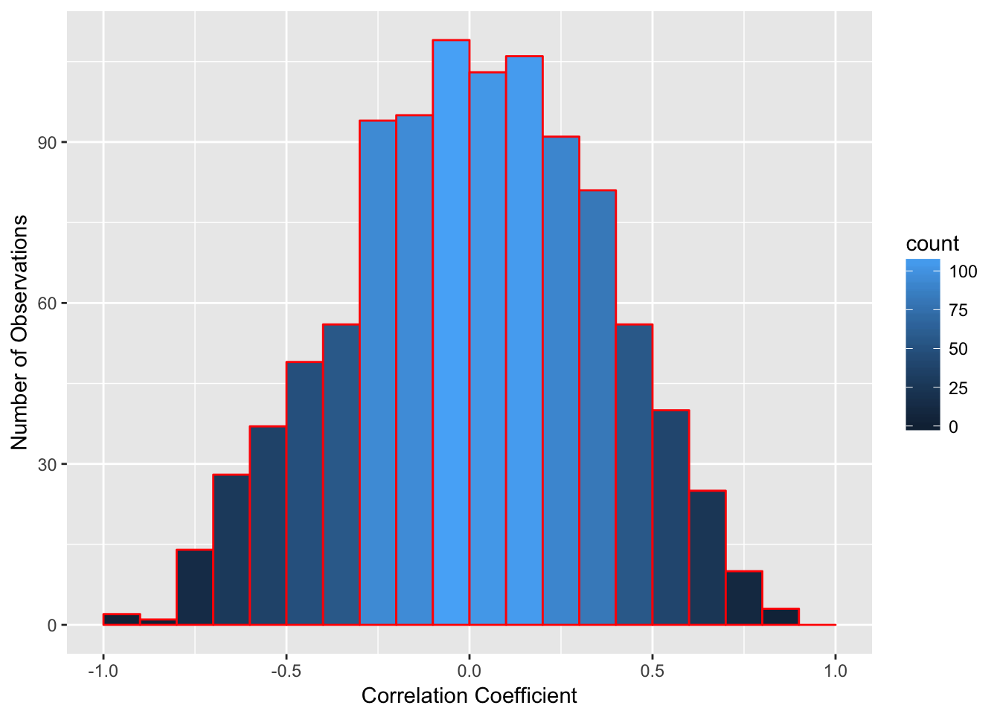
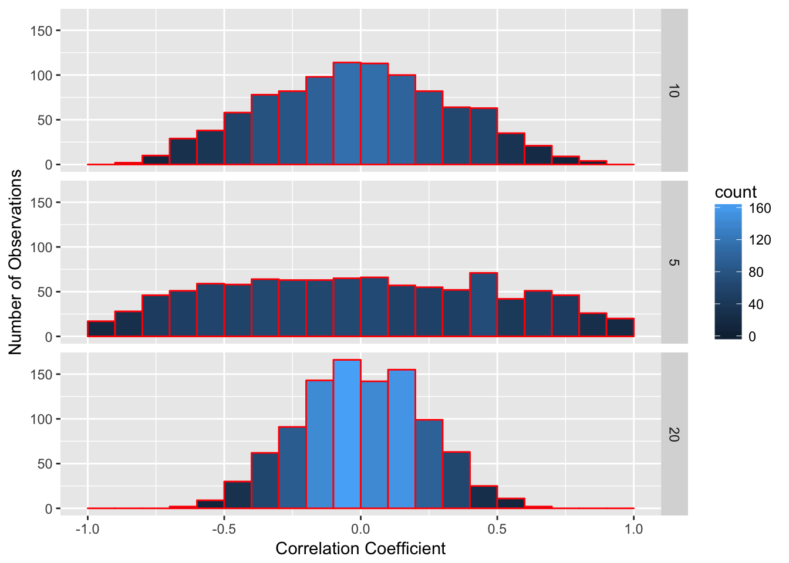
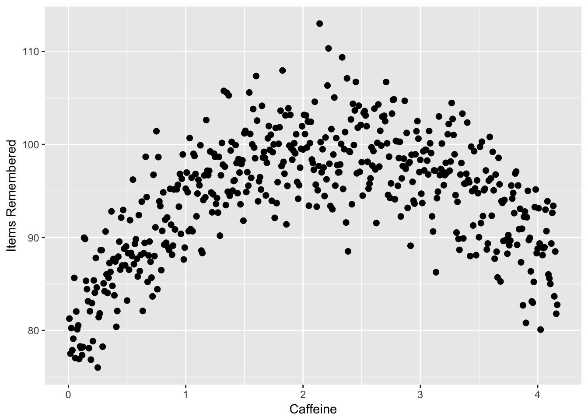
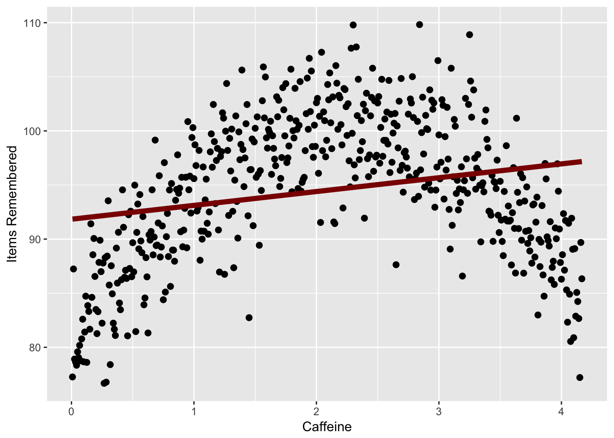
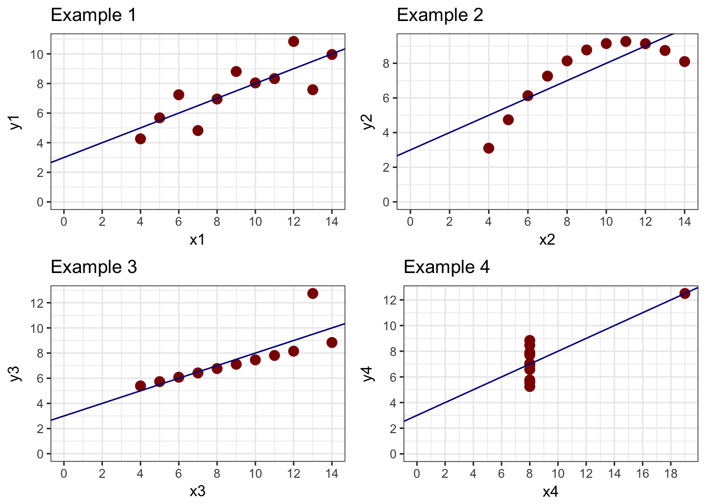

<!-- Function that generates random correlations used below -->


#Association Claims

In this chapter, you will learn:

1. What an association claim is and how to give examples of association claims
2. What a correlation represents and how to calculate a correlation in R
3. How to apply null hypothesis testing to run a correlation test, including generating null and alternative hypotheses, running the test in R, interpreting the output, and reporting a correlation using APA formatting
4. What a linear a regression is, including what a regression represents, and how to use a regression equation to predict a dependent variable given an independent variable
5. How to conduct a regression test in R, and understand the output to get the regression equation, the R-squared value, and the residuals
6. What some limitations of correlation and regression are and when to apply these techniques.

##What are association claims

In many cases, we have experiments or data where we want to examine the relationship between two variables. Is one variable related with another? Does a change in one variable lead to a change in another variable?

For example, a researcher might want to know if increased time studying leads to better grades in a class. Another researcher might want to see if there is a relationship between how much people exercises and their blood pressure. Or we may want to see if there is a correlation between a person’s education and their income.

Association claims are very powerful because we can measure them in situations where we cannot do experiments. We might have the hypothesis that two variables are related but we cannot manipulate those variables. Therefore, to test these hypotheses, we would measure those two variables and see if they are associated.

Claims of association only indicate that two variables are related. They *do not say whether one variable causes another variable*. Statisticians like to shout "correlation does not imply causation" for good reason, because a correlation or regression does not mean that one variable causes another variable.

One example where this has happened in research is the association between violence on television and violent behavior in children. Several studies showed there was an association between these two variables. Children who watched more television violence behaved more violently. Many observers assumed that meant that television violence caused violent behavior. But they neglected other ideas. Whenever there is an association between two variables, there are three possible relationships:

1. Variable one causes variable two. In this case, this is the assumption that watching television violence causes children to behave more violently.
2. Variable two causes variable one. This is called *reverse causality* and many researchers miss this. In the example above, reverse causality would be the idea that violent behavior in children cause children to watch more television violence. This might sound like a strange idea at first, but it may be the case that children who are more likely to be violent also like to watch violent television.
3. A third outside variable causes both variable one and variable two. Many other variables could cause both violent behavior and children to watch violent television. One possibility is parental neglect. Parents who neglect their children may be more likely to cause them to behave more violently because they are not disciplining their children and to be more likely to watch violent television because they are not preventing their children from watching violent television.

Even though correlation does not imply causation, correlation and regression are very powerful because they can suggest a causal link. There are many experiments we can't do because they are not ethical and so we have to do correlations to examine them.

One example of this is the very strong correlation between how much someone has smoked and their likelihood to get cancer (many different kinds). We can't do an experiment to test whether how much someone smokes causes them to get cancer because it's unethical to assign some people to smoke for a long period of time. In this case we're limited to correlation studies and the head of tobacco companies liked to claim that since all these studies were correlational, scientists could not prove that smoking causes cancer.

However, in this case, correlation may strongly link to causation. We have to go through the three different possibilities here:

1. Smoking causes cancer: this is very likely because there's a lot of evidence that the chemicals in tobacco smoke cause cell damage in precisely the way that may cause cells to be cancerous. In addition, experiments with animals strongly suggested that smoking caused cancer in animals and it is not much of a stretch to say that this would be true in humans.
2. Cancer causes smoking: this isn't very likely. One reason for this is the idea of *temporal precedence*. Causes have to come before the thing they cause. If one variable comes after the second variable, then it is impossible that it caused the variable before it. The smoking occurs after the cancer so it is very, very unlikely this is the case.
3. A third variable causes both smoking and cancer: There is some truth to this idea. People who smoke are more likely to do other behaviors that may lead to cancer, such as exercise less and have a generally unhealthy lifestyle. However, a lot of more advanced studies show that these relationships can't accunt for the increased risk of cancer that comes with smoking.

The two ways we can examine association claims are correlation and regression. Though these are two different techniques, the underlying math is the same so whether you use a correlation or a regression to answer a question, it won't matter.

In this book, I will talk about using correlation to examine the strength of a relationship between two variables and regression to talk about creating a **model** or a mathematical function to use one variable to predict another variable.


##Correlation

If we want to test association claims, we can use the idea of null hypothesis testing we discussed in Chapter 7. In order to do that, we will do the following steps:

1. Set up a null hypothesis
2. Set up an alternative hypothesis
3. Choose our alpha level, or the chance of a type 1 error, that we falsely reject the null hypothesis (usually .05)
4. Test what the probability is that we would get the data we got, if the null hypothesis is true
5. If that probability is below alpha, we reject the null hypothesis.

In Chapter 7, we learned how to complete all of these steps, except how to test the probability that we would get our data by chance if the null hypothesis is true. In order to do that, we can use correlations. 

Correlation is a measure of the co-relationship between two variables. It's been around since the mid-1800s, when it was first discovered by the French mathematician Bravais. But correlations became most prominent when Sir Francis Galton began to use them to examine heredity. One of Galton's biggest questions was the degree to which children took various traits from their parents. In this case, he wanted to see the co-relationship between a parent's trait and a child's trait. 

To do this, he developed the concept of correlation. He gave this quality the name $r$ to stand for "regression" because it is related to regression, as we'll see in the next section. Correlation is a standardized form of the property of covariance and is found using the following formula, assuming two vectors (lists of numbers) named x and y:

$$r = \frac{\text{covariance}(x,y)}{s_xs_y}$$

Correlations range from -1 to 1. Negative correlations imply a negative relationship, that is, an increase in one variable leads to a decrease in another variable. Positive correlations imply a positive relationship, where an increase in one variable leads to an increase in another variable. Negative correlations indicate a negative relationship, where an increase in one variable leads to a *decrease* in another variable.

One researcher suggested the following guidelines for correlations and what kind of relationship they indicated:

|Correlation|Type of Relationship|
|:----------|:-------------------|
|less than -0.7 or greater than 0.7|Strong|
|Between -0.7 and -0.4 or 0.4 to 0.7|Moderate|
|Between -0.4 and 0.4|Weak or no relatonship|

Based on the table above, if we calculated a correlation of $r = 0.8$, then we would assume it is a strong relationship. Likewise, a correlation of $r = -0.2$ would be a weak relationship. As noted in the table, very low negative numbers, or negative numbers with high magnitude, those close to -1 are also strong correlations. They are just strong negative associations.

One example of a negative correlation may be the amount of exercise a person does in a weak and their blood pressure. Research studies show that a person who does more exercise may be more likely to lower their blood pressure.

###Calculating correlations

A correlation is a mathematical property of two sets of numbers. If I took two random sets of numbers that should be unrelated, such as the day of the month each person in a class was born and their shoe size and calculated the correlation between those numbers, it is likely that correlation will be very low, because there should be no association between those two numbers. But as we learned in the other modules, there is a chance that by chance alone, a correlation would between those two numbers. These patterns are even called illusory correlations, or correlations which seem to appear just by chance, even if there is no association between the two variables.

For instance, if I randomly generate two lists of 10 numbers and take the correlation between the two numbers, I would expect a correlation of 0. There is no relationship between the two lists. But if I do this, I don’t always get zero. In the figure below is a histogram of the results of the correlation of two randomly generated lists of 10 numbers. On average, the correlation is zero, but many of the correlations are rather far from zero. From the bars, you can see on average, there are over 150 instances where the correlation is either below -0.5 or above 0.5. So there is a chance that a high correlation could happen just by chance alone, and not because the two variables are related.




So to address this, what we have to do is to find the correlation between two variables and see what the chance is that we would get a correlation that large, or stronger, if there is no relationship between those two variables. If that correlation is high enough, the chance you would get a correlation that strong, or stronger, is very low. If that chance is below the alpha we set, then we reject the null hypothesis.

Imagine if we want to test whether there is a relationship between how long a person studies and their grade on an exam. We can use the logic we discussed with null hypothesis testing to figure this out.

First we would set up null and alternative hypotheses. In this case, the null hypothesis would be “there is no relationship between the number of hours a person studies and their grade on the exam”. The alternative is the opposite of this: “there is a relationship between the number of hours a person studies and their grade on an exam”.

Second, we would choose our alpha level. By tradition, we use an alpha of .05, which indicates a 5% chance we would have a type 1 error and falsely conclude there is a relationship when none is present.

Then we would calculate the correlation between the two numbers. Assume in this example, I found out that there is a .5 correlation between hours studied and the grade on the exam. Now I have to calculate the probability I would get a correlation of .5 or more extreme, given that the null hypothesis is true.

Calculating the probability of getting a certain correlation requires a lot of mathematics which go beyond this book, but fortunately we can find this probability out easily. R has the function `cor.test(x,y)` which gives the correlation and the probability of finding out that correlation. For this function, we give R two lists of numbers and then use this function to get the output. Imagine I have two lists, `x` which is the list of how long a person spent studying and `y` which is their grade on an exam


```r
x = c(3,8,11,4,9,6,8,12,7,5)
y = c(78,85,93,68,79,94,85,93,76,71)
cor.test(x,y)
```

```
## 
## 	Pearson's product-moment correlation
## 
## data:  x and y
## t = 2.6397, df = 8, p-value = 0.02973
## alternative hypothesis: true correlation is not equal to 0
## 95 percent confidence interval:
##  0.09232484 0.91768842
## sample estimates:
##       cor 
## 0.6822895
```

The output above gives me a lot of information. The most important value is the correlation, which is the last number given (the one under "cor"). In this case, $r = .68$. Based on the guidelines above, this is a moderate relationship that is very close to being a strong relationship ($r > 0.7$) The other important information is the degrees of freedom (listed as "df") and p-value, both listed in the second row. In this example, the p-value is .030, which reflects a 3% chance that a correlation of .68 or more extreme would occur by chance alone in a sample of 10 individuals. This is below our alpha of .05, so we would reject the null hypothesis.

The probability of getting a correlation by chance depends on two factors, the strength of the correlation and the number of pairs of observations being correlated, or the sample size. The more observations you have, the less likely you will get a large correlation by chance. 

Look at the figure below. I randomly took two lists of numbers and correlated them 1000 times. Since each list was randomly generated, there should not be a correlation between the two lists. But as I noted above, there is a chance of getting high correlations by chance alone and this chance depends on how many pairs of observations we are correlating. In each list, I varied how many observations were in each list. In the top part, I made the list of numbers 10 observations long and had 10 pairs of observations. In the second, each list only had 5 observations, and on the bottom, each list had 20 observations. As you can see, as the number of observations goes up, the frequency of more extreme values goes down. For lists of 10, there are occasional values that are greater than 0.5 or less than -0.5. For lists of 5, values more extreme than 0.6 are very common. However, there are almost no correlations above 0.6 or below -0.6 when using lists of 20 individuals.



The more observations we have, the less likely it is to get a high correlation by chance alone. However, it is not exactly the number of observations we have that matters. Instead, it is a concept called degrees of freedom. 

If you note the R output from the cor.test() function, it gives degrees of freedom. In the example above, I took the correlation of 10 pairs of values. However, the degrees of freedom are not 10, they are 8. Degrees of freedom are technically defined as the number of possibilities used to compute a statistic that are free to vary. That may sound complicated, so I’ll give you an example. Imagine you take a standard deck of playing cards, which has 52 different cards. If you draw the first card, it can be any card. Let’s say it’s the 5 of spades. Then you draw a second card. It can be any card except the 5 of spades. Each card you draw can be one of many different values. However, when you have drawn 51 cards and there is one card left in the pile, you do not have to turn it over to know what that card will be, if you’ve been paying attention. 

So a 52 card deck of playing cards has 51 degrees of freedom. You can arrange the cards any way you want to, but once you’ve arranged the first 51 cards, you have no freedom to choose a different card for the 52nd card.

A second example is this. Imagine we have a class of students and we know the mean grade for the entire class is a 90. I pick one student and ask their grade. Their grade can be anything; there is no way I can guess this. I write this grade down. I do this for every person in the class except one person. When I get to the last person, I don’t need to ask them their grade. That is, based on all the numbers I’ve been given, there is only one possible grade that will make the entire class’s average equal 90.

With correlations, due to various mathematical reasons, if I know the correlation and I know all but two pairs of observations, I know what the other observations must be. Therefore, the degrees of freedom for correlations is n – 2 with n meaning the number of pairs. Remember this, because this is a test question that most of my students get wrong.

Fortunately, if you use the `cor.test()` function, R will remember this for you and give you the correct degrees of freedom. However, you do need to know this if you report correlation values using APA formatting. You report a correlation using APA formatting using the following format:

*r*(df) = r-value, *p* = p-value

In the example above, I would report

*r*(8) = .69, *p* = .03

##Using Linear Regression

Correlation tells us that variables are associated. Regression is a technique where we use one (or more) predictor variables to predict a variable using a mathematical function. The variable(s) doing the predicting are called predictor or independent variables; the variable being predicted is the outcome or dependent variable.

Regression works by fitting a mathematical function that best approximates the relationship between the predictor variables and the outcome variable. It is based on the following idea:

$$y = f(x_1...x_n) + e$$

In this case, we have a predictor variable y which is the outcome of a function of a series of one or more input variables (the $(x_1...x_n)$) and error. 

Simply, a regression or any model is this: $$\text{outcome} = f(\text{inputs}) + \text{error}$$

For instance, I may want to predict college GPA by using high school GPA and standardized test scores as predictors. I take a student's high school GPA and standardized test score and then "do math" to them and get an output, which is my prediction about the student's performance.

Another example of a model is present when I watch Netflix. Netflix takes a bunch of ratings I've made about various movies I have seen (the inputs), does math to them, and then gives me an output, saying that I am 98% likely to like a certain movie.

However, these functions always have error. The model predicting a person's college GPA will not always get it right. Netflix definitely doesn't get it right all the time when guessing which movies I'll like. The goal of regression is to make a function that minimizes this error.

Whether a model works depends on three factors:

1. Are the inputs good data? The predictor variables should be related to the output variables. If they aren't good data, then the model won't work well. If I use a person's favorite ice cream flavor and their time running a mile as predictors for college GPA, I probably won't do well.

2. Do we have the right number of inputs? More inputs mean better models, as long as they are good inputs. In this chapter, we'll only talk about using one input value, but in multiple regression we can expand our model to have a lot more inputs. If we don't have enough inputs, our predictions won't be very good. However, too many inputs will throw off our model.

3. Do we use the right mathematical function? In this chapter, we'll talk about linear regression. That uses a straight line to predict linear relationships. Not all relationships are linear and in those cases, linear regression is not a good idea.

Linear regression uses one or more input variables to predict an outcome variable if you assume a linear relationship (that is, a straight line). If you remember in algebra class, a line can be modeled as an equation of the form:

$$y = a + bx$$

	In this case, a and b represent constants and x and y represent variables. If you graph this on a Cartesian plane, you will get a line.


For each value x that is on the line, you will get the indicated value of Y. 
	
With linear regression, what we want to do is find a line that best models our data. Imagine we have a scatterplot like the one below. We want to find out which line best fits the data in the scatterplot. Note that the points don’t all fit on the line, so no line is perfect. But we want to find out which line is the closest to capturing these points.


The degree to which a line fits the data is a conceptual question, meaning there is no right answer to it. People disagree as to how to do that. But the way most commonly used is one where a line minimizes the squared deviations from the line. What that means is we want the line that minimizes the total squared distance each point is from the line.
	
There are mathematical ways for doing this. In order to figure out this line, we need to figure out two coefficients, a and b. The coefficient a represents the y-intercept of the line, or the value we would predict for the outcome variable y when the predictor variable x is equal to zero. Then we need to figure out the slope b, which represents how much we would predict y would increase or decrease when x increases by 1. 

Here is an example measuring how many hours a person slept the night before and their score on a 12 question memory test. In this case we predict a positive relationship between the two variables, more sleep equals better memory. 

| Sleep | Items remembered |
|:-------|:------------------|
| 7     | 8                |
| 7     | 6                |
| 6     | 7                |
| 7     | 9                |
| 5     | 3                |
| 9     | 10               |
| 5     | 7                |
| 6     | 5                |
| 9     | 10               |
| 8     | 11               |

If we look at the scatterplot, we see some evidence about this. 


Now, we can calculate a correlation to examine if there is a relationship between the two concepts. If we do this, we would find a correlation of *r*(8) = .81, *p* = .004. If we were testing this using null hypothesis testing, we would reject the null hypothesis that there is no relationship between these two variables. However, we may want to answer the question of: if a person sleeps X number of hours a night, how many items would we predict that they would remember?

To do this, we would use linear regression. In order to do linear regression, we first need to calculate the slope of the line. We know that the slope of the line is the coefficient b. There are mathematical proofs that say

$$b = \frac{\text{cov}(x,y)} {var(x)}$$

In this case, b is the covariance of the two variables divided by the variance of x. We can find the covariance in R by typing `cov(x,y)` In this case, the covariance of x and y is 2.96 and the variance is .81. So:

$$b = \frac{2.96}{.81} = 1.41$$


This gives us the slope. However, what we would need is the y intercept, or the coefficient a. Another mathematical proof tells us that the point $(\bar{x},\bar{y})$, or the mean of x and the mean of y is on the line of best fit. In this case, the mean of x is 7.6 and the mean of y is 6.9. Given that we know this point is on the line, we can do the following and solve for a:
	
	$$y = a + bx$$
	$$\bar{y} = a\bar{x} + b$$
	$$\frac{\bar{y} - a}{\bar{x}} = b$$
	
After solving for b, we can paste in our values and then calculate a:
	
		$$\frac{\bar{y} - b}{\bar{x}} = a$$
	$$\frac{7.6 - 1.41}{6.9} = .90$$
	
Now we have our regression equation:

$$y = .90 + 1.41x + e$$

What this means is that the line indicated by this equation is the best linear predictor of our data. I added the e at the end of this because for each x value, the y value is not exactly right.

## Evaluating linear regressions

The statistician George Box wrote a section of a book called “All models are wrong but some are useful”. This saying is one of the most important in statistics. If after this class you would like to get a stats-themed tattoo, this would be good quote to use.

What this means is that all of our regressions are wrong. They never predict reality exactly. When presenting the linear regression equation in the last section, we used the formula: 

	$$y = a + bx + e$$

The e in this equation refers to error, or the fact that our regression equation does not fit our data. We use math to try to minimize this, but we will still have error. So, how do we measure error and know how good our equation is?

If the predictor variables do not relate to our outcome variables, the error will be high. However, if the predictor variables are very related to outcome variables, the error will be low. For instance, I want to predict someone’s grade in this class. If I use shoe size as a predictor, my regression will not be very good, since shoe size tells me little about stats performance. However, if I use people’s grades in math in high school, that would be a good predictor.

We assess predictors by looking at residuals. Residuals are defined as the difference between the observed value for y or the outcome variable, and our predicted variable. For instance, we calculated the following regression equation in the last section.

$$y = .90 + 1.41x + e$$

In this equation, we would predict that if we have a value of 6 for x, a person who slept six hours the night before, we would get 9.36 for y, our best guess about how many items the person remembered.

Residuals are a measure of how far our predictions are from our data. To examine them, we have to use the regression equation and input every value we have for the x variable and see what we would predict for the y value given our regression line. Then we compare those predictions with the actual values in the y variable by subtracting the predicted value from the observed value

1. For each set of observations or for each person, use the value of x to find out what we would predict for y
2. Find the difference between the observed and predicted value.
3. Do this for all your observations.

Here’s an example: I wanted to correlate grades in the introduction math class in a college with grades in a stats class. I had each person’s grade in the math class scored using a 4 point scale, with an A being a 4, a B being a 3, a C being a 2, and a D being a 1 (a passing grade is required for stats). I have as the outcome variable the grade  in the stats class on a 100 point scale. Based on this, I calculated the following regression:

| Person | Math grade  | Stats grade | Residuals | Squared Residuals | Squared Y Deviations |
|:--------|:-------------|:-------------|:-----------|:-------------------|:----------------------|
| 1      | 3           | 90          | 3         | 9                 | 29.7521              |
| 2      | 4           | 95          | 2         | 4                 | 109.298              |
| 3      | 3           | 85          | -2        | 4                 | 0.20661              |
| 4      | 2           | 80          | -1.2      | 1.44              | 20.6612              |
| 5      | 3           | 90          | 3         | 9                 | 29.7521              |
| 6      | 4           | 95          | 2         | 4                 | 109.298              |
| 7      | 3           | 80          | -7.5      | 56.25             | 20.6612              |
| 8      | 2           | 75          | -6.7      | 44.89             | 91.1157              |
| 9      | 1           | 75          | -0.5      | 0.25              | 91.1157              |
| 10     | 1           | 80          | 4.4       | 19.36             | 20.6612              |
| 11     | 2           | 85          | 3.8       | 14.44             | 0.20661              |
| Mean   | 2.545454545 | 84.545455   | 0         | Sum = 166.6       | Sum = 522.7          |

Notice that the mean of the residuals is zero. This is because for some values, our prediction of their stats grade based on their math grade is higher than they scored, and so they have a negative residual. Some people’s predictions is lower than we expected, and they have a positive residual. So the sum and mean of the residuals will always be zero. But notice that even for the extremes, we are only off by 6 or 7 points and for most people, our prediction is within 5 points of their final grade. This is a good predictor.
	
One way we can assess how good a regression is at predicting data is by calculating the R-squared value. R-squared is also called the coefficient of determination, and it is the percent of variance in the outcome variable that is explained by the predictor variables. For instance, an R-squared value of .25 means that 25% of the variance in the outcome variable is explained by our regression and 75% is not explained, or is error.
	
When we calculate an R-squared value from a regression, we will never be able to have a regression that explains 100% of the variance in the outcome variable. This is why Dr. Box said that all models are wrong. But the better the model explains the variance, the higher the R-squared value is, and the more useful the model is.

R-squared is calculated using the following formula:

$$R^2 = 1 - \frac{SS_e}{SS_y}$$


In this case, the $SS_e$ represents the sums of squares error, which is the sum of the squared residuals. $SS_y$ is the sums of squares of the outcome or y variable and as mentioned in Module 3, can be found by adding the squared deviations of the y variable, which is for each y variable the squared difference between that observation and the mean of all the y variables. 

Alternately, for a single linear regression, with a single x variable predicting a single y variable, the R-squared value is the correlation squared, which is why it is called R-squared.
	In the table above, I have included the squared residuals as the second from the right column and the squared Y deviations as the rightmost column. Based on this, if I do the following, I can find R-squared. 

$$R^2 = 1 - \frac{166.6}{522.7} = .68$$

Based on this example, grades in a math class predict 68% of the variance in performance in a stats class. What this means is that our regression predicts 68% of the variance in the data we provided. What this does not mean, however, is that performance in the math class causes 68% of the variation in the stats class. As with correlation, there are many other causal pathways to consider. For instance, overall intelligence would cause higher scores in both a math class and a stats class. Studying ability can cause higher scores in both. Basically, those factors, called common causal factors, can cause a higher R value as well as the predictors causing a change in the outcome.

Finally, the outcome can cause a predictor as much as the predictor can cause an outcome. When we do a regression, we decide based on our theory which variable we think is the predictor and which one we think is the outcome. If our predictor comes before our outcome in time (like yesterday predicting today), this makes sense. However, sometimes it is hard to consider what variables are causing and what variables are being caused.

This goes back to the quote at the beginning of this section. Models are useful. They can tell us how variables are related but they 
	
## Linear Regression in R

Now, I want to show you how to calculate this in R. Regression is very simple in R and it uses the `lm()` function.

First we enter our data:


```r
sleep = c(7,7,6,7,5,9,5,6,9,8)
items = c(8,6,7,9,3,10,7,5,10,11)
d = data.frame(sleep,items)
```

Now we can use the `lm()` function:


```r
x = lm(items~sleep, data = d)
```

There are a few things to note. First, I save the output of the lm function to the variable x. This is important because the function `lm()` gives us a lot of outputs and we want to use some of it. Second, I enter in the two variables I'm interested in, entering in the dependent variable first, a tilde, and then an independent variable. In this case, I believe that sleep predicts items remembered, so I enter "items~sleep". Finally, I type `data = d`, giving R the data frame I'm interested in.

When you type this into R, you will get no output. To see the regression, I have to type:


```r
summary(x)
```

```
## 
## Call:
## lm(formula = items ~ sleep, data = d)
## 
## Residuals:
##     Min      1Q  Median      3Q     Max 
## -1.9259 -1.1389 -0.1482  1.1111  2.0741 
## 
## Coefficients:
##             Estimate Std. Error t value Pr(>|t|)   
## (Intercept)  -2.1111     2.4916  -0.847   0.4215   
## sleep         1.4074     0.3541   3.974   0.0041 **
## ---
## Signif. codes:  0 '***' 0.001 '**' 0.01 '*' 0.05 '.' 0.1 ' ' 1
## 
## Residual standard error: 1.54 on 8 degrees of freedom
## Multiple R-squared:  0.6638,	Adjusted R-squared:  0.6217 
## F-statistic: 15.79 on 1 and 8 DF,  p-value: 0.004095
```

This gives us all sorts of information! The first line tells us the regression equation we used. The second part tells us about the residuals. Instead of giving all the residuals, it gives us the minimum, first quartile (25th percentile), median, third quartile (75th percentile), and maximum. If we want to see the actual residuals, we can type `x$residuals`.

The next section tells us about the coefficients. The first row is the intercept, reflecting the $a$ value we talked about above. The first column, labeled "Estimate", is the value of the y-intercept. Then the other columns tell us more information about the estimate, which we will talk about in a future chapter. The final row tells us the estimate for b, which is the sleep variable. The first column tells us the value for b.

Finally, in the next to last row of text, we can find the R-squared value. R also gives an adjusted R-squared value, which takes into account some limitations about regression and how linear regression should only be used in certain contexts, which we'll talk about in the last section.

##Limitations to linear regression and correlation

There are several warnings where you shouldn't use linear regression. Linear regression assumes that both of your variables are normally distributed. Even if this might be the case, there are several caveats where linear regression may not be a good idea.

1. Linear regression and correlation assume a linear relationship, assuming the relationship should fit a straight line. However, not all data fit a straight line. If the relationship is **curvilinear**, a linear regression doesn't work. For instance, the relationship between caffeine and performance may be curvilinear. A little bit of caffeine causes performance to go up, but then too much may cause performance to go down, causing an inverted U shape. A linear regression can't fit this kind of curvilinear relatinonship.

Look at the following graph, from a hypothetical study where I tested how caffeine (measured as cups of coffee over the 4 hours before a test) affected memory on a test. As you can see, as a person drinks more caffeine, their memory improves up unto a point, where the caffeine starts to impair memory.


```r
Caffeine = (1:500)/120
Items = (-4*Caffeine^2 + 18*Caffeine + 80) + rnorm(500)*4
d = data.frame(Caffeine,Items)
graph = ggplot(d, aes(x = Caffeine, y = Items))
graph + geom_point(size = 2) + 
labs(x = "Caffeine", y = "Items Remembered")
```



```r
rm(Caffeine,Items,d)
```

If I did a linear regression, I would have a line that fits this data like the following, which suggests almost no relationship.


```r
Caffeine = (1:500)/120
Items = (-4*Caffeine^2 + 18*Caffeine + 80) + rnorm(500)*4
d = data.frame(Caffeine,Items)
graph = ggplot(d, aes(x = Caffeine, y = Items))
graph + geom_point(size = 2) + 
labs(x = "Caffeine", y = "Items Remembered") + geom_smooth(method = lm, se=F, size = 2, color = 'darkred')
```



```r
rm(Caffeine,Items,d)
```

In this case you could use a different function to predict your data, which is beyond the scope of this chapter.

2. Outliers can have too much effect on correlation and regression. An outlier can make a regression be much more significant than it already is. If your relationship disappears if one data point is removed, then it may not be a real relationship.

3. A regression line can only give valid predictions in the range of data that it is given. If I am looking for the relationship between hours of sleep and exam performance, I might get a regression like like $y = 65 + 3x$. When calculating the regression my participants slept between 5 and 9 hours. I can't say then "if I get 15 hours of sleep the night before the exam, I should predict a 100". I can only make valid predictions for values of sleep between 5 and 9 hours.

\cite{Anscombe1973} created a series of datasets that illustrate how regression can get conclusions wrong. Here are four datasets which all have the same regression line:



In this example, the first plot shows a basic linear relationship. The second shows a curvilinear relationship where the line does not fit the curve very well at all. The third and fourth examples show what outliers can do to data. In example 3, there is a perfect linear relationship between X and Y except for one point. In Example 4, there is no relationship between X and Y except for one point. In both cases, the line does not reflect the data.

The important thing with regression is to visualize your data. Look to see if there are outliers in your data which might throw things off.


##Summary

Correlation and regression are powerful ways to examine the relationship between two or more variables. After reading this chapter, you should be able to:


1. Know what an association claim is provide examples of possible association claims
2. Know what a correlation represents and be able to calculate a correlation in R
3. Be able to apply null hypothesis testing to run a correlation test, including generating null and alternative hypotheses, running the test in R, interpreting the output, and reporting a correlation using APA formatting
4. Be able to understand what a regression is, including what a regression represents, and how to use a regression equation to predict a dependent variable given an independent variable
5. Be able to conduct a regression test in R, and understand the output to get the regression equation, the R-squared value, and the residuals
6. Understand some limitations of correlation and regression and when you should not use these techniques.
