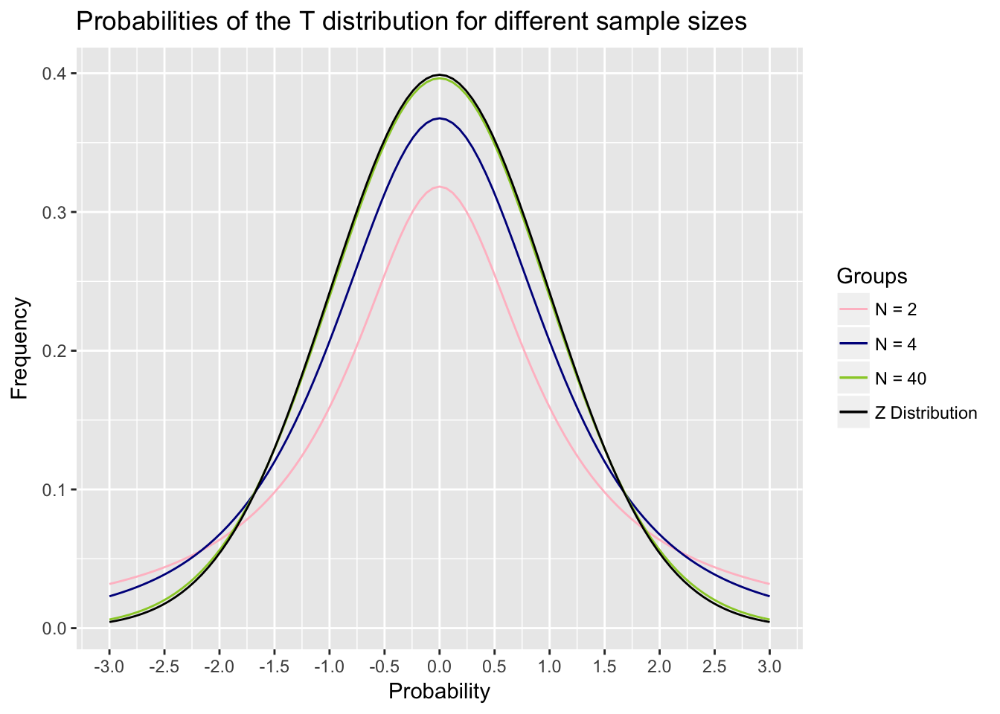

#One Sample Mean Claims

In this chapter, you will learn:

1. What a one-group mean claim is, why we would use it, and be able to give some examples of a one-group mean claim
2. How to apply what you learned in Modules 6 and 7 to calculate a z-test by hand and evaluate the p-value associated with the null hypothesis by using the `pnorm()` command in R
3. What the t-distribution is and how to conduct a one-sample t-test by hand and in R by applying null hypothesis testing
4. What a one-sample confidence interval is and how to calculate it by hand and in R.

##One sample mean claims

I broke up the claims in this book into three categories: frequency claims, association claims, and mean claims. The next three chapters will evaluate different types of mean claims.

A **mean claim** is a claim that we are testing about the mean of a group. I break them down into three types: claims about one mean, claims about two means, and claims about two or more means.

One sample mean claims are claims where we test whether a sample mean is equal to a population mean. This is testing the question of whether a sample is part of a population. If the sample is part of the population, then the sample mean ($\bar{x}$) should be equal to the population mean ($\mu$). Or mathematically:

$$\bar{x} = \mu$$

Two sample mean claims involve comparing whether two sample means are from the same population mean. If the two sample means come from the same population, then the sample means are equal. Mathematically, this is:

$$\bar{x}_1 = \bar{x}_2$$

Two or more sample mean claims involve comparing two groups or more. They test the hypothesis that all of the means are from the same population. Mathematically, this is:

$$\bar{x}_1 = \bar{x}_2 = \bar{x}_3 = \ldots\ = \bar{x}_n$$

Two sample mean claims and two or more sample mean claims will be covered more in Chapters 11 and 12.

In this chapter, we are focusing on claims about a population and a sample. What this means conceptually is that we have a sample and we want to test whether that sample came from the population by comparing the sample mean to the population mean. 

Here are some examples of a one sample mean claim. For instance, I may know that the average life expectancy of females in a certain country is 78 years. I may want to test whether people in a coastal village (the sample) lives significantly longer on average than the population.

Another example: I know that the mean IQ in the population is 100 (in fact the IQ test is defined so that this is the case). I want to test whether preschoolers at a certain preschool (the sample) have a higher IQ than the population at large.

A third example: I know that the mean number of items that people can remember on a certain memory test is 30 items. I want to test whether people who learned a mnemonic technique can increase their performance on the test. I teach a sample of people the technique and then test whether they remember more than 30 items. 

In each of these examples, I am comparing a sample to see whether that sample came from the a population. Combining this with null hypothesis testing and decision theory, I can apply this technique to examine inferences about experiments. The logic of this section will be a bit weird, so be warned. The concepts I am going to talk about here are not hard, but they tend to be complicated because they seem backward and counter-intuitive. We'll talk about this with the z-test

##The Z-test

In the module on decision theories, we talked about the idea of a null hypothesis and an alternative hypothesis. This logic can be used to make decisions about data. It uses the following logic: we set up a null and alternative hypothesis, we examine our data to determine the chance our data would occur if the null hypothesis is true, and if that chance is sufficiently low, we reject the null hypothesis.

We can use this logic to answer other questions as well. Here’s one example. Many researchers have suggested that smoking during pregnancy can reduce birth weight. We can test this by using some of the logic we’ve learned so far. This uses a technique called a z-test. 
	
The z-test is a way of testing the probability that we would get a sample with a certain mean from a population with a certain mean and standard deviation. Combining this with null hypothesis testing, we would assert a null hypothesis that the sample is part of the population. The alternative hypothesis is that the sample is not part of the population. If the chance of getting this sample is sufficiently low, given the null hypothesis, then we reject the null hypothesis.

If I reject the null hypothesis, I conclude that the sample is not likely part of the population. This means that there is some reason that the sample that makes it different from the population, and if I set up an experiment carefully, I can decide that this reason is due to my experiment.

Let’s do an example looking if maternal birth weight affects smoking. Based on data from thousands of babies, full term babies from non-smoking mothers have a birth weight of 3600 g and a standard deviation of 400 g. Assume I measured the birth weight of 25 babies whose mothers smoked during pregnancy and found their birth weight to be 3350 g. If smoking affected birth weight, then the sample of babies born to mothers who smoked would not be from the same population as babies born to non-smoking mothers.

Here are the steps of the z-test:

1. I set null and alternative hypotheses. In this case, the null hypothesis is that the sample is part of the population. This means, that the sample is part of the population, which would imply that there is no relationship between maternal smoking and birth weight, since there is no significant difference between smoking and nonsmoking mothers. The alternative hypothesis is that the sample is not part of the population. This would mean that babies born to smoking mothers are a different population than babies born to nonsmoking mothers, which suggests a relationship between smoking and birth weight.

2. Find out the probability of getting a sample with the sample mean or more extreme, given the null hypothesis is true. To do this, we find out the z-score of the sample using the same method we learned about in Module 6. We answer the question: what is the chance we would get a sample of 25 babies whose mean weight is 3400 g, given the population mean is 3600 g and has a population standard deviation of 400g. To do this, we find the z-score using the following formula:

$$ Z = \frac{\bar{X} - \mu}{\text{SE}}$$ where $$\text{SE} = \frac{s}{\sqrt{n}}$$

In this case, we would plug in the numbers and find:


$$Z = \frac{3400 - 3600}{\frac{400}{\sqrt{25}}} = 2.5$$
So we get a z-score of -2.5. Now to find out the probability of getting a z-score of -2.5 or more extreme, we would do the following in R:


```r
pnorm(-2.5) + (1 - pnorm(2.5)) 
```

Why the complicated formula? The first part of this gives us the chance of getting a sample with a z-score below -2.5. The second part gives us the chance of getting a sample with a z-score above 2.5. We want to see the chance we would get a z-score more extreme than 2.5. That could be negative or positive. This is because if the sample is not part of the population, the sample mean could be significantly higher or significantly lower. In order to avoid this complicated formula, we can just do the following, since the z-distribution is symmetrical:


```r
pnorm(-2.5) * 2
```

```
## [1] 0.01241933
```

In this case, we would get a p of .012. That means, if we sampled 25 individuals from the population with a mean birth weight of 3600g  and a standard deviation of 400g, the chance of getting a sample of 25 individuals with a mean birth weight of 3400g is 1.2%. That is pretty unlikely, and would be below $\alpha = .05$, so we would reject the null hypothesis. This gives us the conclusion: smoking mothers have babies with significantly lower birth weights than nonsmoking mothers.

##The One-Sample T-test

The z-test is a useful tool trying to determine whether a sample is part of a population. In order to do it, we must know the population mean and the population standard deviation, as well as the sample mean. In many cases, however, we do not know what the standard deviation is.

Let’s take an example from animal research.  I want to examine if rats can learn to press a blue lever for food and ignore a green lever, that is identical. In this experiment, I train 16 rats to press a blue lever and to ignore a green lever. In order to see if they know color and not location, I place them in a different box with levers in different places and count how many times they press the new blue lever and the new green lever. Since rats press lots of things, I use as my dependent variable the percent of times that the rat pressed the blue lever. For each rat I take the percent of time that rat pressed the blue lever. In this, I find out that the rats pressed the blue lever .58 (58%) of the time with a standard deviation of .14 (14%).

If the rat is only pressing the levers randomly, then the rat should press the blue lever 50% of the time. However, if the rat can tell the difference between blue and green, the rat should press the blue lever a different value than 50% of the time. They will likely press the blue lever more often than the green lever, but there is a chance they will press the green lever more than the blue lever. I want to test whether the rats push the lever 50% of the time or if they press the lever a significantly different amount of time than 50%. 

In this experiment I set the null hypothesis as the rats press the lever at a level no different than expected by chance (50%) and the alternative hypothesis is that the rats press the lever at a rate different than expected by chance, different than 50%.

I want to do a z-test but one thing is missing. I know the population mean, .5 (50%), but not a population standard deviation. In that case, we can use the sample standard deviation as a proxy for the population standard deviation. Using the sample standard deviation can be a good substitute, but there is a problem. Our sample standard deviation, just like the sample mean, is an estimate. The bigger our sample, the more precise the estimate.

This leads to two concepts. First, sample standard deviations are imprecise, so we have to use a different distribution than the z-distribution. Second, that different distribution has to have a different shape with different sample sizes, because the accuracy of the sample standard deviation as an estimate gets bigger as the sample size increases.

The new distribution we use is called the t-distribution. It is like the normal distribution and looks similar, but it has a different shape given different sample sizes. The smaller the sample size, the flatter and wider the t-distribution is. As the sample size goes up, the t-distribution gets narrower and starts to look more like the normal distribution, such that for very large samples, the t distribution becomes almost identical to the normal distribution. Notice in the figure below that the t-distribution gets closer to normal 



With the exception of the different distribution, the logic of a one-sample t-test is the same. It uses a very similar formula as the z-test:

$$t = \frac{\bar{X} - \mu}{\frac{s}{\sqrt{n}}}$$

Notice the only difference is that we swapped out the population standard deviation $\sigma$ for the sample standard deviation $s$. 

If we go back to the example with the rats, we have a sample with a mean of .58, a standard deviation of .14, and we want to test whether that is significantly more than the mean of .5 we would expect by chance. We would do the following:

$$t = \frac{.58 - .5}{\frac{.14}{\sqrt{16}}} = 2.29$$

In this case, we get a value of t= 2.29. Now we have to figure out the chance we would get a t of 2.29 or more by chance alone, as predicted by the null hypothesis. We can use the t-distribution to figure this out.

However, as mentioned above, the t-distribution is different with different sample sizes. Our estimate of the population’s standard deviation is more precise with a larger sample. To examine this, we have to determine the degrees of freedom with the t-test. For a t-test, the degrees of freedom are equal to n-1. This is the value we will use for the rest of the t-test. In our example, with a sample size of 16 rats, the degrees of freedom are 15.

I can do this by typing the following command into R, substituting the value I got for t for t and the degrees of freedom for `df`.


```r
(1 – pt(t, df))*2
```

This is a complicated command. If you just want the answer, feel free to skip the next couple of paragraphs, because they may be confusing. The reason this R formula is complicated is for several reasons. We want to calculate the area under the edges of the t-distribution, or the chance we get a value more extreme than 2.29. The R command `pt()` gives us the chance of getting a t-value of less than t. Because of that, we have to calculate `1-pt()` this command because we are interested in values more than t.

But this doesn’t explain why I multiply it all by 2. This is because we use a concept called two-sided hypotheses. When we set an alternative hypothesis, we have set it to say that the value is not equal to a certain value. For instance, in the rat example above, we set the alternative hypothesis that the rats did not push the lever 50% of the time. This could mean that they pressed the lever more than 50% of the time, or less than 50% of the time. In this case, we would consider our results to be significant if it is the case they push the lever more or less than 50% of the time.

This is why we are interested in finding the chance we got a t of more than 2.29, or a t of less than -2.29. However, we might only be interested in setting a null hypothesis that the rats pressed the lever more than 50% of the time and unconcerned if the rats pressed the lever less than 50% of the time. This is called a one-sided hypothesis and is generally more powerful. In this case, you would use the formula


```r
1 – pt(t, df)
```


One sided hypotheses are not often used in psychology so I do not present them here. They make a lot of sense in some cases, but generally, we would be interested if we find results that are very large and opposite of what we expect. For instance, in the rat study, if the rats pressed the green lever more than the blue lever, that would be an interesting hypothesis. So this is why generally most people use two-sided hypotheses regardless.

If this is confusing to you, just stick to the two-sided hypotheses. In this case, if we enter the following into R, we get the p value associated with our test:


```r
(1 - pt(2.29, 15))*2
```

```
## [1] 0.03693081
```

This would equal .037. So we get a p-value of .037, which given it is less than .05, would lead us to reject the null hypothesis.

Now, how do we report this in APA format? APA format, as you may know, is very, very picky and many times doesn't seem to make sense. We use the following format, which is similar to the way we report correlations:

*t*($df$) = t-value, *p* = p-value (note that t and p are italicized)

In this case, we would report: *t*(15) = 2.29, *p* = .037.

##Confidence Intervals with One Sample

The logic of t-tests can be used to assess another important question with samples. If we draw a sample with certain values, what does that tell us about the population? Or another way of putting it: how reliable is our sample as an estimate of the underlying population.

Imagine I want to know the average reaction time of college students is. I conduct a study with a sample of 100 randomly-selected people and find an average reaction time of 450 milliseconds (ms), with a standard deviation of 80 ms. I want to know what this tells me what the mean reaction time of the population of all college students. I know my sample is not an exact estimate, and that the population mean is likely to be different from my estimate. But how much variability should I expect.

Confidence intervals give us a way of determining this. Because of the standard deviation, I can have an idea of a range in which I would expect the population mean to be Based on what we’ve learned before, the best guess of the population mean is the sample mean. However, we know that our sample could have randomly picked people with very fast reaction times and the population mean is a lot slower than 450 ms. Or I could have picked people with very slow reaction times and my real population mean is a lot faster than 450 ms. 

Confidence intervals give me a range of certainty about the estimate. They have two values, a lower bound and an upper bound, that give me a range of certainty about my estimate. For instance, we typically talk about 95% confidence intervals. A 95% confidence interval is a procedure that asserts that if the true population mean is outside of our confidence interval, then the sample that caused that estimate had a 5% or less chance of happening.

A confidence interval gives us certainty about how likely we are to find the population mean in other experiments. 

To calculate a confidence interval, I have to do the following:

1.	I have to get a sample mean and standard deviation.
2.  I have to calculate what is called a critical T-value. That is the t-value that is associated with the confidence interval size. For instance, for a 95% confidence interval, we need to figure out what value of t covers 95% of the t-distribution. This would mean, that the area of the t-distribution between –t and +t would equal .95. To figure this out, we can type the following into R:


```r
-(1*qt((1-p)/2, df))
```

This is another long formula, but all you have to add is the value for p, which is the size of the confidence interval, .95 for a 95% confidence interval, and the degrees of freedom of the sample. In this case, we would type the following


```r
-(1*qt((1-.95)/2, 99))
```

This gives us a value of 1.98. The 95% confidence interval is then solved by doing this:

$$\bar{x} \pm t_\text{crit} \mathbin{\cdot} \text{SE}$$
$$450 \pm 1.98 \mathbin{\cdot} \frac{80}{\sqrt{100}}$$
$$ 450 \pm 15.8 $$

Based on this, we can get a range of values where we are 95% certain by using this method, we would find the population mean. This gives us a degree of certainty we have about our estimate. For instance, we would not be very surprised if the reaction time in the population was really 440 ms, because that is in our confidence interval. However, it is very unlikely the population reaction time is really 500 ms., which is well outside our confidence interval.

Based on this, we can get a range of values where we are 95% certain by using this method, we would find the population mean. This gives us a degree of certainty we have about our estimate. For instance, we would not be very surprised if the reaction time in the population was really 440 ms, because that is in our confidence interval. However, it is very unlikely the population reaction time is really 500 ms., which is well outside our confidence interval.

This would equal .037. So we get a p-value of .037, which given it is less than .05, would lead us to reject the null hypothesis.

## Calculating T-tests and Confidence Intervals in R

R does not have a built-in function to do z-tests. This isn't a bad idea because z-tests are rare. In fact, in my several years of doing research, I can only think of a few times where I did a z-test. Those times, I had to look up the steps and do it by hand.

However, t-tests are much more common, and are very easy to do in R.

For instance, we may have the following numbers representing the number of hours people slept in a class and we want to see if our class slept significantly differently than 8 hours, which might be the average:


```r
sleep = c(4,7,3,9,7,8,5,6,5,9)
```


This enters the data into R. To do a t-test, we would use the `t.test()` command. This command has two parts. The first part is the sample data, given as a list of numbers. In this case, we'll use the sleep data we just entered. The second part is the value we give for mu. Mu is the value we want to test as the population parameter ($\mu$), which is 8 hours of sleep. This gives us the following:


```r
t.test(sleep, mu=8)
```

```
## 
## 	One Sample t-test
## 
## data:  sleep
## t = -2.6128, df = 9, p-value = 0.02814
## alternative hypothesis: true mean is not equal to 8
## 95 percent confidence interval:
##  4.828148 7.771852
## sample estimates:
## mean of x 
##       6.3
```

The second line here gives us our value for t, degrees of freedom, and the p-value. Note in this example that t is negative. R gives negative values for t if the sample mean is below the population mean. However, people usually report t-values as positive and so you can change the sign since t is a symmetrical distribution.

Below this is the 95% confidence interval, which ranges from 4.82 to 7.77. In the last part, it gives the mean amount of hours of sleep, 6.3

##Summary

After reading this chapter, you should know and/or be able to do the following:

1. Know what a one-group mean claim is and why we would use it
2. Know how to calculate a z-test by hand and evaluate the p-value associated with the null hypothesis by using the pnorm() command in R
3. Know what the t-distribution is and how to conduct a one-sample t-test by hand and in R
4. Know how to use null hypothesis testing with a one-sample t-test and how to generate null and alternative hypotheses and make the correct decision given 
5. Know how to calculate the degrees of freedom for a t-test and how to report a t-test statistic using APA formatting
6. Know what a confidence interval is and how to calculate a one-sample confidence interval. Know how to get the critical t-value for a given confidence interval using the qt() command and calculate the confidence interval


